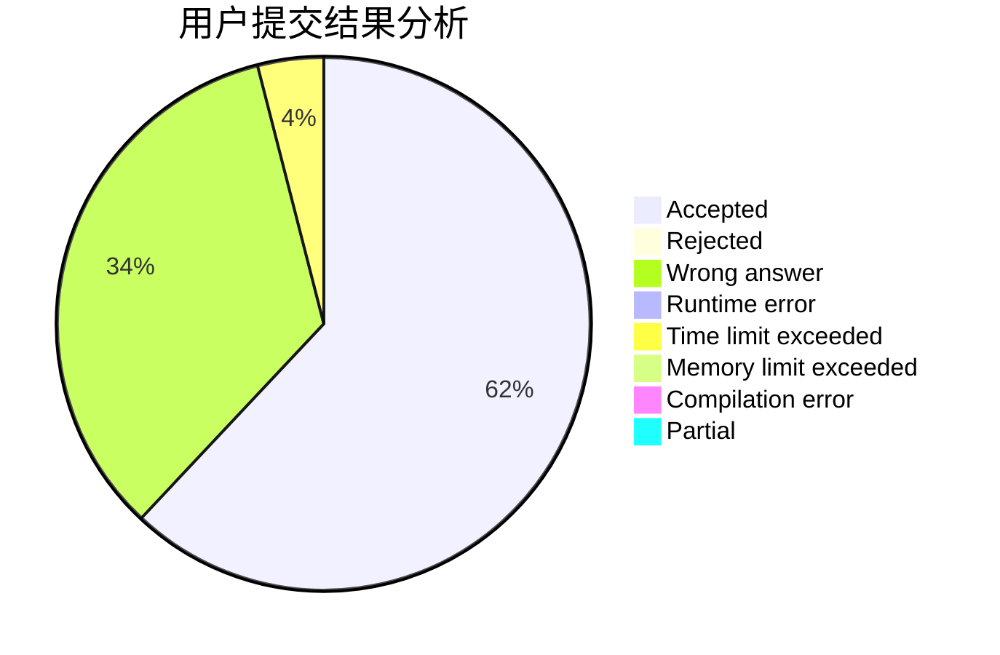
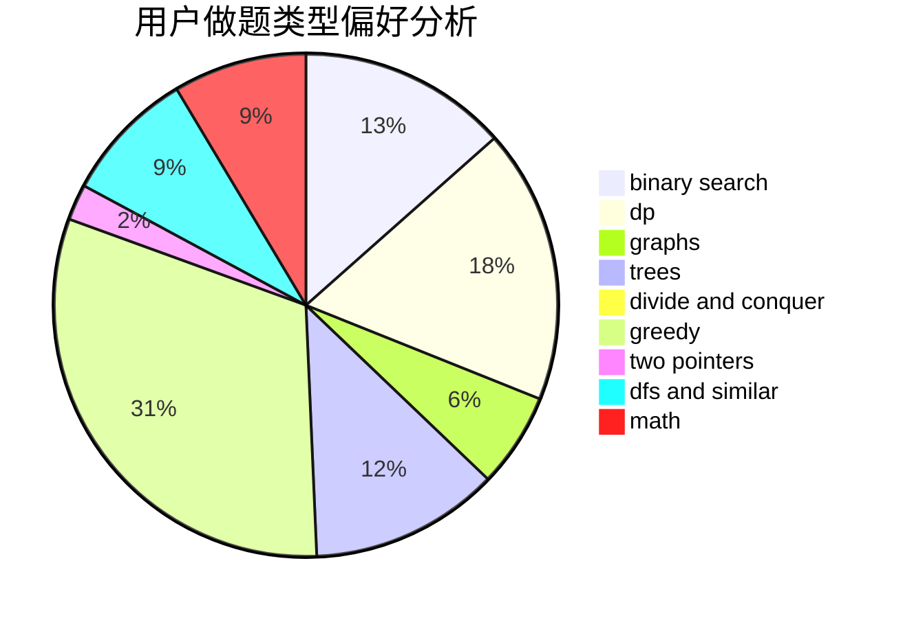

# DougZheng

<!-- tabs:start -->

#### **用户提交结果分析**

#### **用户做题类型偏好分析**

<!-- tabs:end -->
# 推荐题目
[312A](https://codeforces.com/contest/312/problem/A)
[1146A](https://codeforces.com/contest/1146/problem/A)
[803D](https://codeforces.com/contest/803/problem/D)
[1173A](https://codeforces.com/contest/1173/problem/A)
[1099E](https://codeforces.com/contest/1099/problem/E)
[774C](https://codeforces.com/contest/774/problem/C)
[734A](https://codeforces.com/contest/734/problem/A)
[755D](https://codeforces.com/contest/755/problem/D)
[1403A](https://codeforces.com/contest/1403/problem/A)
[268A](https://codeforces.com/contest/268/problem/A)
