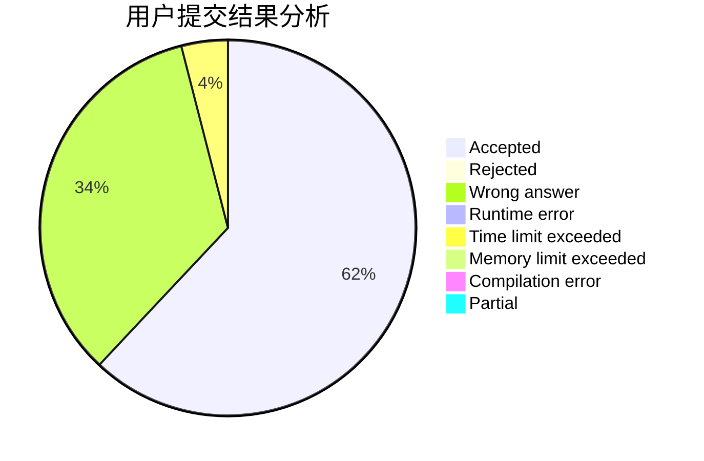
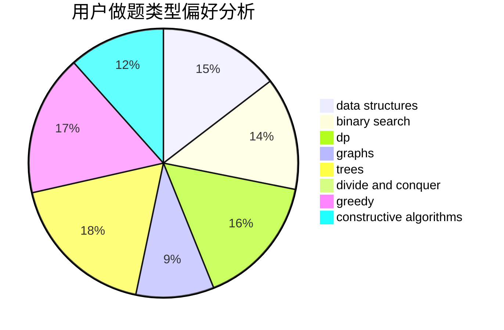
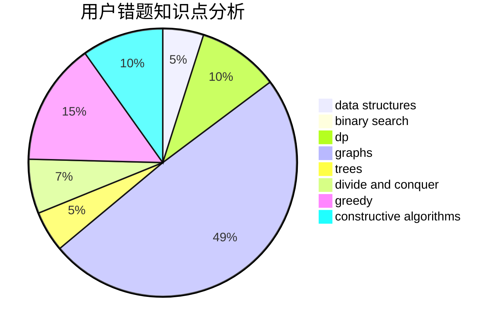

# DougZheng

<!-- tabs:start -->

#### **用户提交结果分析**

#### **用户做题类型偏好分析**

#### **用户错题知识点分析**

<!-- tabs:end -->
# 推荐题目
[312A](https://codeforces.com/contest/312/problem/A)		implementation,
                        strings		  
[1146A](https://codeforces.com/contest/1146/problem/A)		implementation,
                        strings		  
[803D](https://codeforces.com/contest/803/problem/D)		binary search,
                        greedy		  
[1173A](https://codeforces.com/contest/1173/problem/A)		greedy		  
[1099E](https://codeforces.com/contest/1099/problem/E)		dsu,graphs,sortings,trees		  
[774C](https://codeforces.com/contest/774/problem/C)		*special problem,
                        constructive algorithms,
                        greedy,
                        implementation		  
[734A](https://codeforces.com/contest/734/problem/A)		implementation,
                        strings		  
[755D](https://codeforces.com/contest/755/problem/D)		data structures		  
[1403A](https://codeforces.com/contest/1403/problem/A)		*special problem,
                        2-sat,
                        binary search,
                        data structures,
                        graphs,
                        interactive,
                        sortings,
                        two pointers		  
[268A](https://codeforces.com/contest/268/problem/A)		brute force		  
