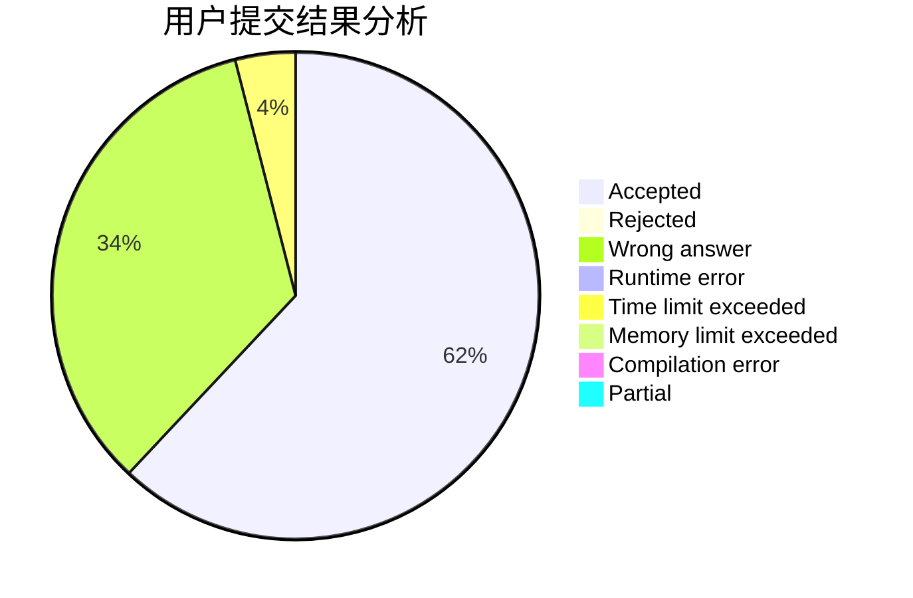
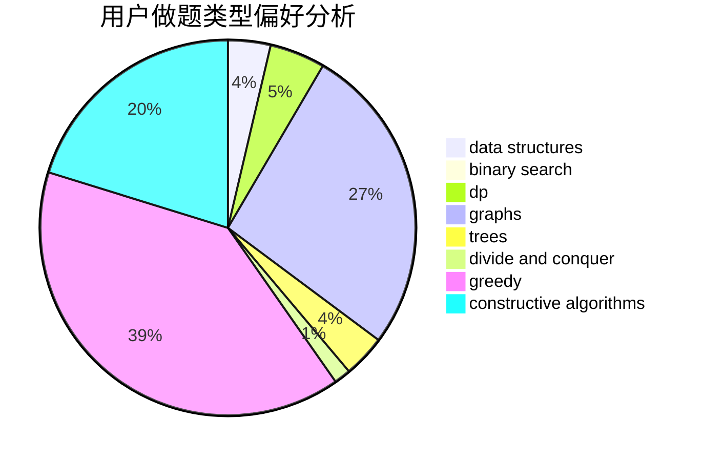
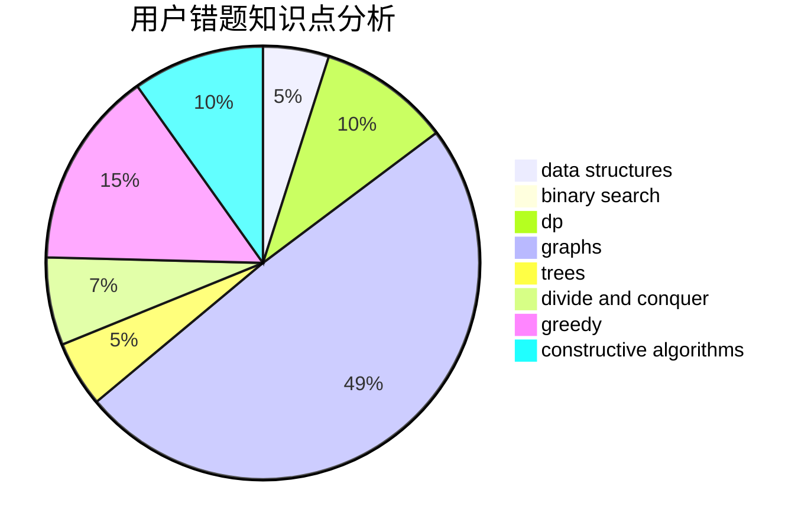

# DougZheng
<!-- tabs:start -->
#### **用户提交结果分析**

#### **用户做题类型偏好分析**

#### **用户错题知识点分析**

<!-- tabs:end -->
# 推荐题目
[Greg and Friends](http://codeforces.com/problemset/problem/295/C)		combinatorics,
                        dp,
                        graphs,
                        shortest paths		  
[Legacy](https://codeforces.com/contest/787/problem/D)		data structures,
                        graphs,
                        shortest paths		  
[Xor Permutations](http://codeforces.com/problemset/problem/1168/E)		constructive algorithms,
                        math		  
[U2](https://codeforces.com/contest/1143/problem/F)		geometry		  
[Not Afraid](http://codeforces.com/problemset/problem/787/B)		greedy,
                        implementation,
                        math		  
[Get Ready for the Battle](http://codeforces.com/problemset/problem/1119/G)		constructive algorithms,
                        implementation		  
[Dasha and Photos](http://codeforces.com/problemset/problem/761/F)		brute force,
                        data structures,
                        dp,
                        implementation		  
[PolandBall and Gifts](http://codeforces.com/problemset/problem/755/F)		bitmasks,
                        dp,
                        greedy		  
[Boboniu and Banknote Collection](http://codeforces.com/problemset/problem/1394/E)		strings		  
[Choose a Square](http://codeforces.com/problemset/problem/1221/F)		binary search,
                        data structures,
                        sortings		  
<!-- tabs:start -->
#### **data structures**
[Legacy](https://codeforces.com/contest/787/problem/D)		data structures,
                        graphs,
                        shortest paths		  
[Dasha and Photos](http://codeforces.com/problemset/problem/761/F)		brute force,
                        data structures,
                        dp,
                        implementation		  
[Choose a Square](http://codeforces.com/problemset/problem/1221/F)		binary search,
                        data structures,
                        sortings		  
[White Lines](http://codeforces.com/problemset/problem/1200/D)		brute force,
                        data structures,
                        dp,
                        implementation,
                        two pointers		  
[Birthday](http://codeforces.com/problemset/problem/494/D)		data structures,
                        dfs and similar,
                        dp,
                        trees		  
[Biathlon Track](http://codeforces.com/problemset/problem/424/D)		binary search,
                        brute force,
                        constructive algorithms,
                        data structures,
                        dp		  
[Blood Cousins Return](http://codeforces.com/problemset/problem/246/E)		binary search,
                        data structures,
                        dfs and similar,
                        dp,
                        sortings		  
[Strange Function](https://codeforces.com/contest/1314/problem/E)		binary search,
                        data structures,
                        dp,
                        greedy		  
[Range Diameter Sum](http://codeforces.com/problemset/problem/1458/F)		data structures,
                        trees		  
[Messenger Simulator](http://codeforces.com/problemset/problem/1288/E)		data structures		  
#### **binary search**
[Choose a Square](http://codeforces.com/problemset/problem/1221/F)		binary search,
                        data structures,
                        sortings		  
[Squares and Segments](http://codeforces.com/problemset/problem/1099/B)		binary search,
                        constructive algorithms,
                        math		  
[Biathlon Track](http://codeforces.com/problemset/problem/424/D)		binary search,
                        brute force,
                        constructive algorithms,
                        data structures,
                        dp		  
[Blood Cousins Return](http://codeforces.com/problemset/problem/246/E)		binary search,
                        data structures,
                        dfs and similar,
                        dp,
                        sortings		  
[Strange Function](https://codeforces.com/contest/1314/problem/E)		binary search,
                        data structures,
                        dp,
                        greedy		  
[Maximum width](http://codeforces.com/problemset/problem/1492/C)		binary search,
                        data structures,
                        dp,
                        greedy,
                        two pointers		  
[Pairs](http://codeforces.com/problemset/problem/1463/D)		binary search,
                        constructive algorithms,
                        greedy,
                        two pointers		  
[Old Floppy Drive](http://codeforces.com/problemset/problem/1490/G)		binary search,
                        data structures,
                        math		  
[Odd Mineral Resource](http://codeforces.com/problemset/problem/1479/D)		binary search,
                        bitmasks,
                        brute force,
                        data structures,
                        probabilities,
                        trees		  
[Complicated Computations](http://codeforces.com/problemset/problem/1436/E)		binary search,
                        data structures,
                        two pointers		  
#### **dp**
[Greg and Friends](http://codeforces.com/problemset/problem/295/C)		combinatorics,
                        dp,
                        graphs,
                        shortest paths		  
[Dasha and Photos](http://codeforces.com/problemset/problem/761/F)		brute force,
                        data structures,
                        dp,
                        implementation		  
[PolandBall and Gifts](http://codeforces.com/problemset/problem/755/F)		bitmasks,
                        dp,
                        greedy		  
[White Lines](http://codeforces.com/problemset/problem/1200/D)		brute force,
                        data structures,
                        dp,
                        implementation,
                        two pointers		  
[Inversion Expectation](http://codeforces.com/problemset/problem/1096/F)		dp,
                        math,
                        probabilities		  
[Birthday](http://codeforces.com/problemset/problem/494/D)		data structures,
                        dfs and similar,
                        dp,
                        trees		  
[The Chocolate Spree](http://codeforces.com/problemset/problem/633/F)		dfs and similar,
                        dp,
                        graphs,
                        trees		  
[Carousel](http://codeforces.com/problemset/problem/1328/D)		constructive algorithms,
                        dp,
                        graphs,
                        greedy,
                        math		  
[Biathlon Track](http://codeforces.com/problemset/problem/424/D)		binary search,
                        brute force,
                        constructive algorithms,
                        data structures,
                        dp		  
[Robot Control](http://codeforces.com/problemset/problem/346/D)		dp,
                        graphs,
                        shortest paths		  
#### **graph**
[Greg and Friends](http://codeforces.com/problemset/problem/295/C)		combinatorics,
                        dp,
                        graphs,
                        shortest paths		  
[Legacy](https://codeforces.com/contest/787/problem/D)		data structures,
                        graphs,
                        shortest paths		  
[Weird journey](http://codeforces.com/problemset/problem/788/B)		combinatorics,
                        constructive algorithms,
                        dfs and similar,
                        dsu,
                        graphs		  
[The Chocolate Spree](http://codeforces.com/problemset/problem/633/F)		dfs and similar,
                        dp,
                        graphs,
                        trees		  
[Carousel](http://codeforces.com/problemset/problem/1328/D)		constructive algorithms,
                        dp,
                        graphs,
                        greedy,
                        math		  
[Robot Control](http://codeforces.com/problemset/problem/346/D)		dp,
                        graphs,
                        shortest paths		  
[Minimum Ties](http://codeforces.com/problemset/problem/1487/C)		brute force,
                        constructive algorithms,
                        dfs and similar,
                        graphs,
                        greedy,
                        implementation,
                        math		  
[Chef Monocarp](http://codeforces.com/problemset/problem/1437/C)		dp,
                        flows,
                        graph matchings,
                        greedy,
                        math,
                        sortings		  
[Strange Housing](http://codeforces.com/problemset/problem/1470/D)		constructive algorithms,
                        dfs and similar,
                        graph matchings,
                        graphs,
                        greedy		  
[Longest Simple Cycle](http://codeforces.com/problemset/problem/1476/C)		dp,
                        graphs,
                        greedy		  
#### **trees**
[Birthday](http://codeforces.com/problemset/problem/494/D)		data structures,
                        dfs and similar,
                        dp,
                        trees		  
[The Chocolate Spree](http://codeforces.com/problemset/problem/633/F)		dfs and similar,
                        dp,
                        graphs,
                        trees		  
[Anton and Tree](http://codeforces.com/problemset/problem/734/E)		dfs and similar,
                        dp,
                        trees		  
[Range Diameter Sum](http://codeforces.com/problemset/problem/1458/F)		data structures,
                        trees		  
[Odd Mineral Resource](http://codeforces.com/problemset/problem/1479/D)		binary search,
                        bitmasks,
                        brute force,
                        data structures,
                        probabilities,
                        trees		  
[Yet Another Card Deck](http://codeforces.com/problemset/problem/1511/C)		brute force,
                        data structures,
                        implementation,
                        trees		  
[Diameter Cuts](http://codeforces.com/problemset/problem/1499/F)		combinatorics,
                        dfs and similar,
                        dp,
                        trees		  
[Fib-tree](http://codeforces.com/problemset/problem/1491/E)		brute force,
                        dfs and similar,
                        divide and conquer,
                        number theory,
                        trees		  
[13th Labour of Heracles](http://codeforces.com/problemset/problem/1466/D)		data structures,
                        greedy,
                        sortings,
                        trees		  
[BFS Trees](http://codeforces.com/problemset/problem/1495/D)		combinatorics,
                        dfs and similar,
                        graphs,
                        math,
                        shortest paths,
                        trees		  
#### **divide and conquer**
[Divide and Summarize](http://codeforces.com/problemset/problem/1461/D)		binary search,
                        brute force,
                        data structures,
                        divide and conquer,
                        implementation,
                        sortings		  
[Song of the Sirens](http://codeforces.com/problemset/problem/1466/G)		combinatorics,
                        divide and conquer,
                        hashing,
                        math,
                        string suffix structures,
                        strings		  
[Permutation Transformation](http://codeforces.com/problemset/problem/1490/D)		dfs and similar,
                        divide and conquer,
                        implementation		  
[Skyline Photo](https://codeforces.com/contest/1483/problem/C)		data structures,
                        divide and conquer,
                        dp		  
[Fib-tree](http://codeforces.com/problemset/problem/1491/E)		brute force,
                        dfs and similar,
                        divide and conquer,
                        number theory,
                        trees		  
[Sum of Prefix Sums](http://codeforces.com/problemset/problem/1303/G)		data structures,
                        divide and conquer,
                        geometry,
                        trees		  
[Dogeforces](http://codeforces.com/problemset/problem/1494/D)		constructive algorithms,
                        data structures,
                        dfs and similar,
                        divide and conquer,
                        dsu,
                        greedy,
                        sortings,
                        trees		  
[Skyline Photo](http://codeforces.com/problemset/problem/1482/E)		data structures,
                        divide and conquer,
                        dp		  
[Logistical Questions](http://codeforces.com/problemset/problem/566/C)		dfs and similar,
                        divide and conquer,
                        trees		  
[Fruit Sequences](http://codeforces.com/problemset/problem/1428/F)		binary search,
                        data structures,
                        divide and conquer,
                        dp,
                        two pointers		  
#### **greedy**
[Not Afraid](http://codeforces.com/problemset/problem/787/B)		greedy,
                        implementation,
                        math		  
[PolandBall and Gifts](http://codeforces.com/problemset/problem/755/F)		bitmasks,
                        dp,
                        greedy		  
[Double Matrix](http://codeforces.com/problemset/problem/1162/B)		brute force,
                        greedy		  
[Is It Rated?](http://codeforces.com/problemset/problem/1510/I)		greedy,
                        interactive,
                        math,
                        probabilities		  
[Carousel](http://codeforces.com/problemset/problem/1328/D)		constructive algorithms,
                        dp,
                        graphs,
                        greedy,
                        math		  
[Two Arrays](http://codeforces.com/problemset/problem/1417/B)		greedy,
                        math,
                        sortings		  
[The Child and Set](http://codeforces.com/problemset/problem/437/B)		bitmasks,
                        greedy,
                        implementation,
                        sortings		  
[Strange Function](https://codeforces.com/contest/1314/problem/E)		binary search,
                        data structures,
                        dp,
                        greedy		  
[Flip the Cards](https://codeforces.com/contest/1504/problem/F)		2-sat,
                        constructive algorithms,
                        data structures,
                        greedy,
                        sortings,
                        two pointers		  
[Berland Poker](http://codeforces.com/problemset/problem/1359/A)		brute force,
                        greedy,
                        math		  
#### **constructive algorithms**
[Xor Permutations](http://codeforces.com/problemset/problem/1168/E)		constructive algorithms,
                        math		  
[Get Ready for the Battle](http://codeforces.com/problemset/problem/1119/G)		constructive algorithms,
                        implementation		  
[Squares and Segments](http://codeforces.com/problemset/problem/1099/B)		binary search,
                        constructive algorithms,
                        math		  
[Weird journey](http://codeforces.com/problemset/problem/788/B)		combinatorics,
                        constructive algorithms,
                        dfs and similar,
                        dsu,
                        graphs		  
[Carousel](http://codeforces.com/problemset/problem/1328/D)		constructive algorithms,
                        dp,
                        graphs,
                        greedy,
                        math		  
[Mysterious numbers - 1](http://codeforces.com/problemset/problem/171/A)		*special problem,
                        constructive algorithms		  
[Biathlon Track](http://codeforces.com/problemset/problem/424/D)		binary search,
                        brute force,
                        constructive algorithms,
                        data structures,
                        dp		  
[Trouble Sort](http://codeforces.com/problemset/problem/1365/B)		constructive algorithms,
                        implementation		  
[Maximum Subsequence Value](http://codeforces.com/problemset/problem/1365/E)		brute force,
                        constructive algorithms		  
[Even Picture](http://codeforces.com/problemset/problem/1368/C)		constructive algorithms		  
#### **sortings**
[Choose a Square](http://codeforces.com/problemset/problem/1221/F)		binary search,
                        data structures,
                        sortings		  
[Two Arrays](http://codeforces.com/problemset/problem/1417/B)		greedy,
                        math,
                        sortings		  
[Blood Cousins Return](http://codeforces.com/problemset/problem/246/E)		binary search,
                        data structures,
                        dfs and similar,
                        dp,
                        sortings		  
[The Child and Set](http://codeforces.com/problemset/problem/437/B)		bitmasks,
                        greedy,
                        implementation,
                        sortings		  
[Cinema](http://codeforces.com/problemset/problem/670/C)		implementation,
                        sortings		  
[Flip the Cards](https://codeforces.com/contest/1504/problem/F)		2-sat,
                        constructive algorithms,
                        data structures,
                        greedy,
                        sortings,
                        two pointers		  
[Swaps Again](http://codeforces.com/problemset/problem/1365/F)		constructive algorithms,
                        implementation,
                        sortings		  
[Diamond Miner](https://codeforces.com/contest/1496/problem/C)		geometry,
                        greedy,
                        math,
                        sortings		  
[Diamond Miner](http://codeforces.com/problemset/problem/1495/A)		geometry,
                        greedy,
                        math,
                        sortings		  
[Meximization](http://codeforces.com/problemset/problem/1497/A)		brute force,
                        data structures,
                        greedy,
                        sortings		  
<!-- tabs:end -->
