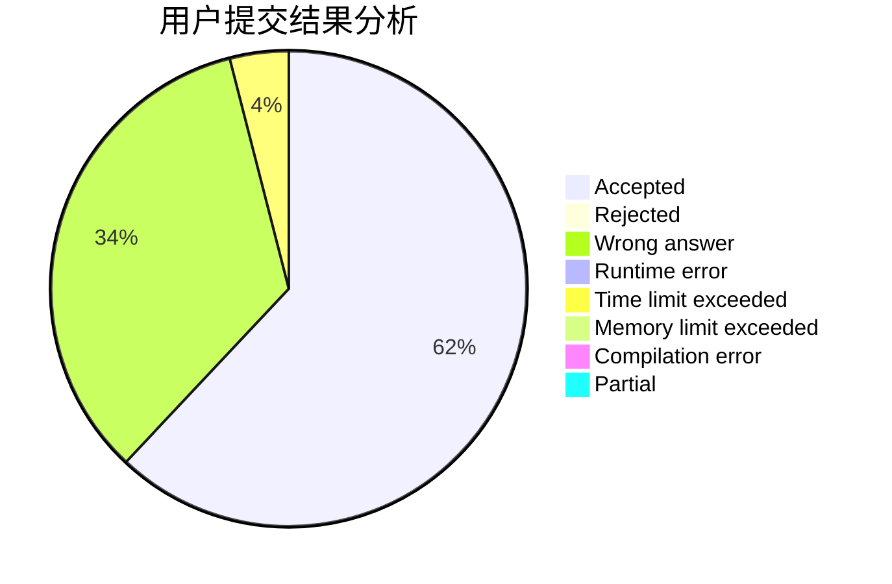
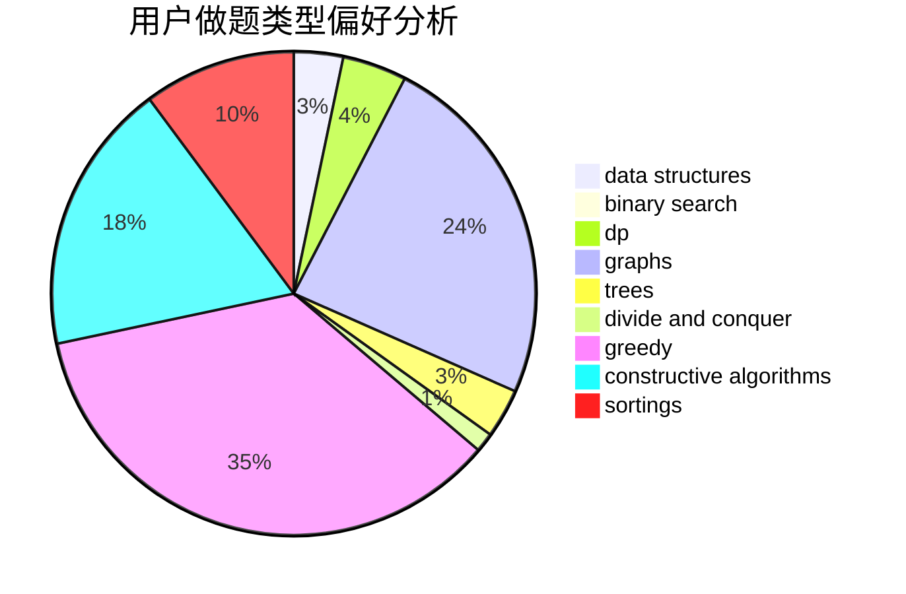
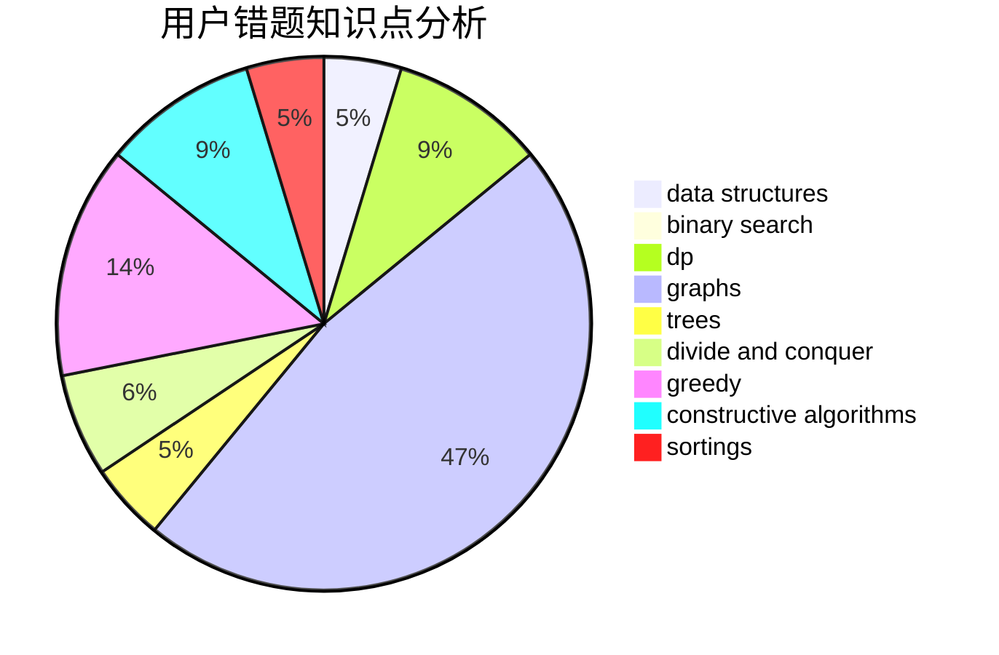

# DougZheng
<!-- tabs:start -->
#### **用户提交结果分析**

#### **用户做题类型偏好分析**

#### **用户错题知识点分析**

<!-- tabs:end -->
# 推荐题目
[295C](http://codeforces.com/problemset/problem/295/C)		combinatorics,
                        dp,
                        graphs,
                        shortest paths		  
[787D](https://codeforces.com/contest/787/problem/D)		data structures,
                        graphs,
                        shortest paths		  
[1168E](http://codeforces.com/problemset/problem/1168/E)		constructive algorithms,
                        math		  
[1143F](https://codeforces.com/contest/1143/problem/F)		geometry		  
[787B](http://codeforces.com/problemset/problem/787/B)		greedy,
                        implementation,
                        math		  
[1119G](http://codeforces.com/problemset/problem/1119/G)		constructive algorithms,
                        implementation		  
[761F](http://codeforces.com/problemset/problem/761/F)		brute force,
                        data structures,
                        dp,
                        implementation		  
[755F](http://codeforces.com/problemset/problem/755/F)		bitmasks,
                        dp,
                        greedy		  
[1394E](http://codeforces.com/problemset/problem/1394/E)		strings		  
[1221F](http://codeforces.com/problemset/problem/1221/F)		binary search,
                        data structures,
                        sortings		  
<!-- tabs:start -->
#### **data structures**
[787D](https://codeforces.com/contest/787/problem/D)		data structures,
                        graphs,
                        shortest paths		  
[761F](http://codeforces.com/problemset/problem/761/F)		brute force,
                        data structures,
                        dp,
                        implementation		  
[1221F](http://codeforces.com/problemset/problem/1221/F)		binary search,
                        data structures,
                        sortings		  
[1200D](http://codeforces.com/problemset/problem/1200/D)		brute force,
                        data structures,
                        dp,
                        implementation,
                        two pointers		  
[494D](http://codeforces.com/problemset/problem/494/D)		data structures,
                        dfs and similar,
                        dp,
                        trees		  
[424D](http://codeforces.com/problemset/problem/424/D)		binary search,
                        brute force,
                        constructive algorithms,
                        data structures,
                        dp		  
[246E](http://codeforces.com/problemset/problem/246/E)		binary search,
                        data structures,
                        dfs and similar,
                        dp,
                        sortings		  
[1314E](https://codeforces.com/contest/1314/problem/E)		binary search,
                        data structures,
                        dp,
                        greedy		  
[1458F](http://codeforces.com/problemset/problem/1458/F)		data structures,
                        trees		  
[1288E](http://codeforces.com/problemset/problem/1288/E)		data structures		  
#### **binary search**
[1221F](http://codeforces.com/problemset/problem/1221/F)		binary search,
                        data structures,
                        sortings		  
[1099B](http://codeforces.com/problemset/problem/1099/B)		binary search,
                        constructive algorithms,
                        math		  
[424D](http://codeforces.com/problemset/problem/424/D)		binary search,
                        brute force,
                        constructive algorithms,
                        data structures,
                        dp		  
[246E](http://codeforces.com/problemset/problem/246/E)		binary search,
                        data structures,
                        dfs and similar,
                        dp,
                        sortings		  
[1314E](https://codeforces.com/contest/1314/problem/E)		binary search,
                        data structures,
                        dp,
                        greedy		  
[1492C](http://codeforces.com/problemset/problem/1492/C)		binary search,
                        data structures,
                        dp,
                        greedy,
                        two pointers		  
[1463D](http://codeforces.com/problemset/problem/1463/D)		binary search,
                        constructive algorithms,
                        greedy,
                        two pointers		  
[1490G](http://codeforces.com/problemset/problem/1490/G)		binary search,
                        data structures,
                        math		  
[1479D](http://codeforces.com/problemset/problem/1479/D)		binary search,
                        bitmasks,
                        brute force,
                        data structures,
                        probabilities,
                        trees		  
[1436E](http://codeforces.com/problemset/problem/1436/E)		binary search,
                        data structures,
                        two pointers		  
#### **dp**
[295C](http://codeforces.com/problemset/problem/295/C)		combinatorics,
                        dp,
                        graphs,
                        shortest paths		  
[761F](http://codeforces.com/problemset/problem/761/F)		brute force,
                        data structures,
                        dp,
                        implementation		  
[755F](http://codeforces.com/problemset/problem/755/F)		bitmasks,
                        dp,
                        greedy		  
[1200D](http://codeforces.com/problemset/problem/1200/D)		brute force,
                        data structures,
                        dp,
                        implementation,
                        two pointers		  
[1096F](http://codeforces.com/problemset/problem/1096/F)		dp,
                        math,
                        probabilities		  
[494D](http://codeforces.com/problemset/problem/494/D)		data structures,
                        dfs and similar,
                        dp,
                        trees		  
[633F](http://codeforces.com/problemset/problem/633/F)		dfs and similar,
                        dp,
                        graphs,
                        trees		  
[1328D](http://codeforces.com/problemset/problem/1328/D)		constructive algorithms,
                        dp,
                        graphs,
                        greedy,
                        math		  
[424D](http://codeforces.com/problemset/problem/424/D)		binary search,
                        brute force,
                        constructive algorithms,
                        data structures,
                        dp		  
[346D](http://codeforces.com/problemset/problem/346/D)		dp,
                        graphs,
                        shortest paths		  
#### **graph**
[295C](http://codeforces.com/problemset/problem/295/C)		combinatorics,
                        dp,
                        graphs,
                        shortest paths		  
[787D](https://codeforces.com/contest/787/problem/D)		data structures,
                        graphs,
                        shortest paths		  
[788B](http://codeforces.com/problemset/problem/788/B)		combinatorics,
                        constructive algorithms,
                        dfs and similar,
                        dsu,
                        graphs		  
[633F](http://codeforces.com/problemset/problem/633/F)		dfs and similar,
                        dp,
                        graphs,
                        trees		  
[1328D](http://codeforces.com/problemset/problem/1328/D)		constructive algorithms,
                        dp,
                        graphs,
                        greedy,
                        math		  
[346D](http://codeforces.com/problemset/problem/346/D)		dp,
                        graphs,
                        shortest paths		  
[1487C](http://codeforces.com/problemset/problem/1487/C)		brute force,
                        constructive algorithms,
                        dfs and similar,
                        graphs,
                        greedy,
                        implementation,
                        math		  
[1437C](http://codeforces.com/problemset/problem/1437/C)		dp,
                        flows,
                        graph matchings,
                        greedy,
                        math,
                        sortings		  
[1470D](http://codeforces.com/problemset/problem/1470/D)		constructive algorithms,
                        dfs and similar,
                        graph matchings,
                        graphs,
                        greedy		  
[1476C](http://codeforces.com/problemset/problem/1476/C)		dp,
                        graphs,
                        greedy		  
#### **trees**
[494D](http://codeforces.com/problemset/problem/494/D)		data structures,
                        dfs and similar,
                        dp,
                        trees		  
[633F](http://codeforces.com/problemset/problem/633/F)		dfs and similar,
                        dp,
                        graphs,
                        trees		  
[734E](http://codeforces.com/problemset/problem/734/E)		dfs and similar,
                        dp,
                        trees		  
[1458F](http://codeforces.com/problemset/problem/1458/F)		data structures,
                        trees		  
[1479D](http://codeforces.com/problemset/problem/1479/D)		binary search,
                        bitmasks,
                        brute force,
                        data structures,
                        probabilities,
                        trees		  
[1511C](http://codeforces.com/problemset/problem/1511/C)		brute force,
                        data structures,
                        implementation,
                        trees		  
[1499F](http://codeforces.com/problemset/problem/1499/F)		combinatorics,
                        dfs and similar,
                        dp,
                        trees		  
[1491E](http://codeforces.com/problemset/problem/1491/E)		brute force,
                        dfs and similar,
                        divide and conquer,
                        number theory,
                        trees		  
[1466D](http://codeforces.com/problemset/problem/1466/D)		data structures,
                        greedy,
                        sortings,
                        trees		  
[1495D](http://codeforces.com/problemset/problem/1495/D)		combinatorics,
                        dfs and similar,
                        graphs,
                        math,
                        shortest paths,
                        trees		  
#### **divide and conquer**
[1461D](http://codeforces.com/problemset/problem/1461/D)		binary search,
                        brute force,
                        data structures,
                        divide and conquer,
                        implementation,
                        sortings		  
[1466G](http://codeforces.com/problemset/problem/1466/G)		combinatorics,
                        divide and conquer,
                        hashing,
                        math,
                        string suffix structures,
                        strings		  
[1490D](http://codeforces.com/problemset/problem/1490/D)		dfs and similar,
                        divide and conquer,
                        implementation		  
[1483C](https://codeforces.com/contest/1483/problem/C)		data structures,
                        divide and conquer,
                        dp		  
[1491E](http://codeforces.com/problemset/problem/1491/E)		brute force,
                        dfs and similar,
                        divide and conquer,
                        number theory,
                        trees		  
[1303G](http://codeforces.com/problemset/problem/1303/G)		data structures,
                        divide and conquer,
                        geometry,
                        trees		  
[1494D](http://codeforces.com/problemset/problem/1494/D)		constructive algorithms,
                        data structures,
                        dfs and similar,
                        divide and conquer,
                        dsu,
                        greedy,
                        sortings,
                        trees		  
[1482E](http://codeforces.com/problemset/problem/1482/E)		data structures,
                        divide and conquer,
                        dp		  
[566C](http://codeforces.com/problemset/problem/566/C)		dfs and similar,
                        divide and conquer,
                        trees		  
[1428F](http://codeforces.com/problemset/problem/1428/F)		binary search,
                        data structures,
                        divide and conquer,
                        dp,
                        two pointers		  
#### **greedy**
[787B](http://codeforces.com/problemset/problem/787/B)		greedy,
                        implementation,
                        math		  
[755F](http://codeforces.com/problemset/problem/755/F)		bitmasks,
                        dp,
                        greedy		  
[1162B](http://codeforces.com/problemset/problem/1162/B)		brute force,
                        greedy		  
[1510I](http://codeforces.com/problemset/problem/1510/I)		greedy,
                        interactive,
                        math,
                        probabilities		  
[1328D](http://codeforces.com/problemset/problem/1328/D)		constructive algorithms,
                        dp,
                        graphs,
                        greedy,
                        math		  
[1417B](http://codeforces.com/problemset/problem/1417/B)		greedy,
                        math,
                        sortings		  
[437B](http://codeforces.com/problemset/problem/437/B)		bitmasks,
                        greedy,
                        implementation,
                        sortings		  
[1314E](https://codeforces.com/contest/1314/problem/E)		binary search,
                        data structures,
                        dp,
                        greedy		  
[1504F](https://codeforces.com/contest/1504/problem/F)		2-sat,
                        constructive algorithms,
                        data structures,
                        greedy,
                        sortings,
                        two pointers		  
[1359A](http://codeforces.com/problemset/problem/1359/A)		brute force,
                        greedy,
                        math		  
#### **constructive algorithms**
[1168E](http://codeforces.com/problemset/problem/1168/E)		constructive algorithms,
                        math		  
[1119G](http://codeforces.com/problemset/problem/1119/G)		constructive algorithms,
                        implementation		  
[1099B](http://codeforces.com/problemset/problem/1099/B)		binary search,
                        constructive algorithms,
                        math		  
[788B](http://codeforces.com/problemset/problem/788/B)		combinatorics,
                        constructive algorithms,
                        dfs and similar,
                        dsu,
                        graphs		  
[1328D](http://codeforces.com/problemset/problem/1328/D)		constructive algorithms,
                        dp,
                        graphs,
                        greedy,
                        math		  
[171A](http://codeforces.com/problemset/problem/171/A)		*special problem,
                        constructive algorithms		  
[424D](http://codeforces.com/problemset/problem/424/D)		binary search,
                        brute force,
                        constructive algorithms,
                        data structures,
                        dp		  
[1365B](http://codeforces.com/problemset/problem/1365/B)		constructive algorithms,
                        implementation		  
[1365E](http://codeforces.com/problemset/problem/1365/E)		brute force,
                        constructive algorithms		  
[1368C](http://codeforces.com/problemset/problem/1368/C)		constructive algorithms		  
#### **sortings**
[1221F](http://codeforces.com/problemset/problem/1221/F)		binary search,
                        data structures,
                        sortings		  
[1417B](http://codeforces.com/problemset/problem/1417/B)		greedy,
                        math,
                        sortings		  
[246E](http://codeforces.com/problemset/problem/246/E)		binary search,
                        data structures,
                        dfs and similar,
                        dp,
                        sortings		  
[437B](http://codeforces.com/problemset/problem/437/B)		bitmasks,
                        greedy,
                        implementation,
                        sortings		  
[670C](http://codeforces.com/problemset/problem/670/C)		implementation,
                        sortings		  
[1504F](https://codeforces.com/contest/1504/problem/F)		2-sat,
                        constructive algorithms,
                        data structures,
                        greedy,
                        sortings,
                        two pointers		  
[1365F](http://codeforces.com/problemset/problem/1365/F)		constructive algorithms,
                        implementation,
                        sortings		  
[1496C](https://codeforces.com/contest/1496/problem/C)		geometry,
                        greedy,
                        math,
                        sortings		  
[1495A](http://codeforces.com/problemset/problem/1495/A)		geometry,
                        greedy,
                        math,
                        sortings		  
[1497A](http://codeforces.com/problemset/problem/1497/A)		brute force,
                        data structures,
                        greedy,
                        sortings		  
<!-- tabs:end -->
