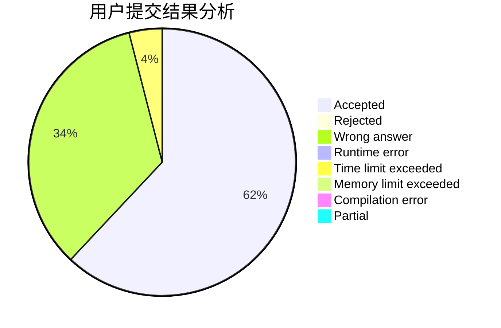
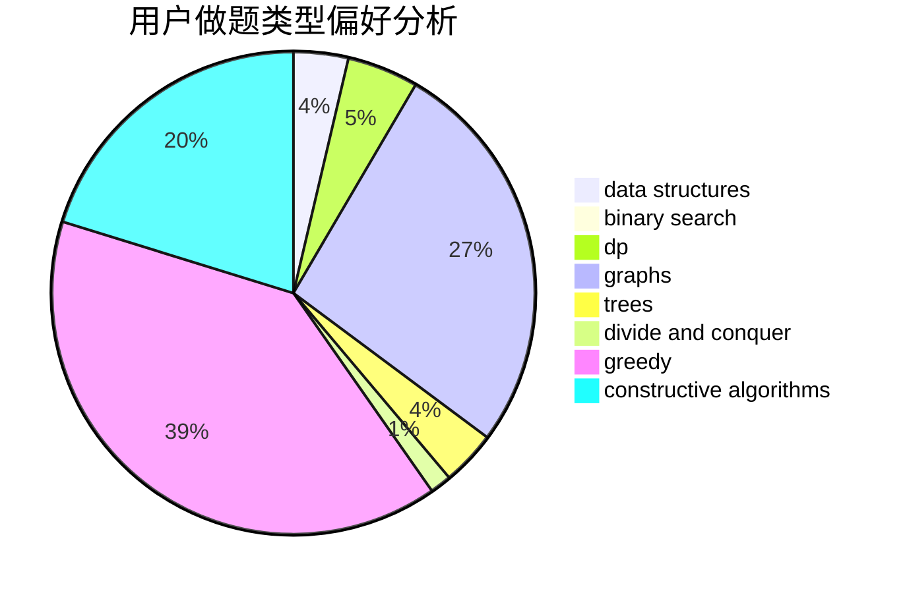
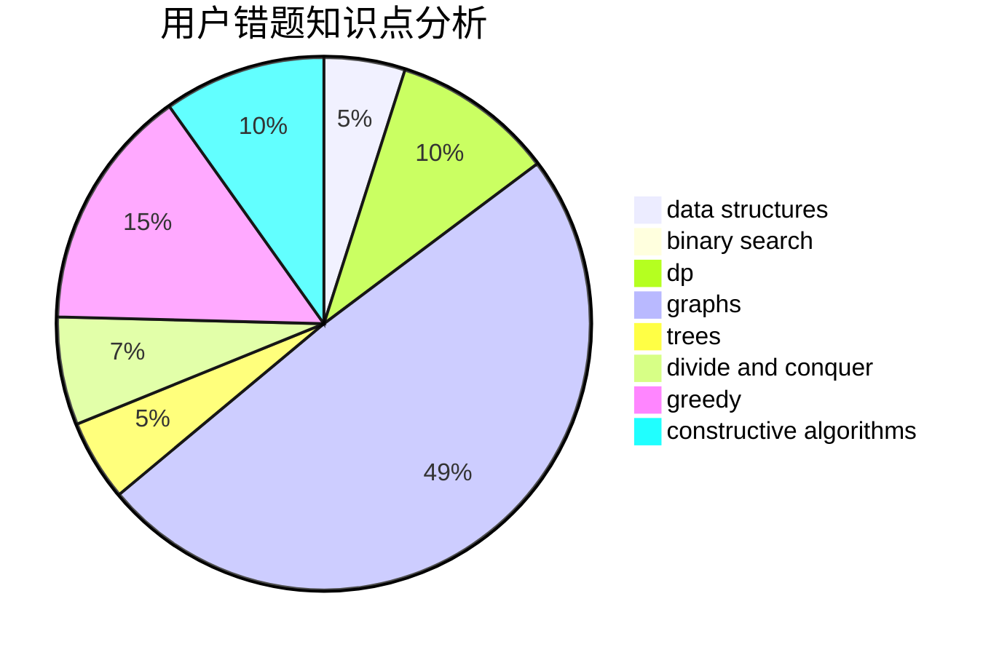

# DougZheng

<!-- tabs:start -->

#### **用户提交结果分析**

#### **用户做题类型偏好分析**

#### **用户错题知识点分析**

<!-- tabs:end -->
# 推荐题目
[295C](https://codeforces.com/contest/295/problem/C)		combinatorics,
                        dp,
                        graphs,
                        shortest paths		  
[1143F](https://codeforces.com/contest/1143/problem/F)		dsu,graphs,sortings,trees		  
[787D](https://codeforces.com/contest/787/problem/D)		dsu,graphs,sortings,trees		  
[1168E](https://codeforces.com/contest/1168/problem/E)		constructive algorithms,
                        math		  
[1099B](https://codeforces.com/contest/1099/problem/B)		binary search,
                        constructive algorithms,
                        math		  
[755F](https://codeforces.com/contest/755/problem/F)		bitmasks,
                        dp,
                        greedy		  
[716A](https://codeforces.com/contest/716/problem/A)		implementation		  
[734E](https://codeforces.com/contest/734/problem/E)		dfs and similar,
                        dp,
                        trees		  
[1394E](https://codeforces.com/contest/1394/problem/E)		strings		  
[246E](https://codeforces.com/contest/246/problem/E)		binary search,
                        data structures,
                        dfs and similar,
                        dp,
                        sortings		  
