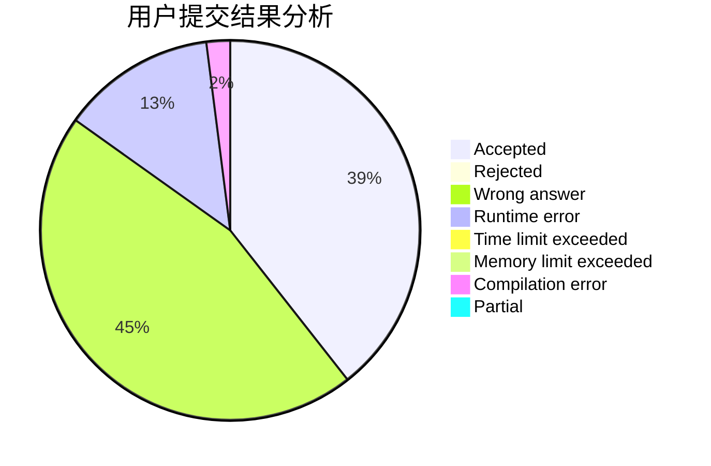
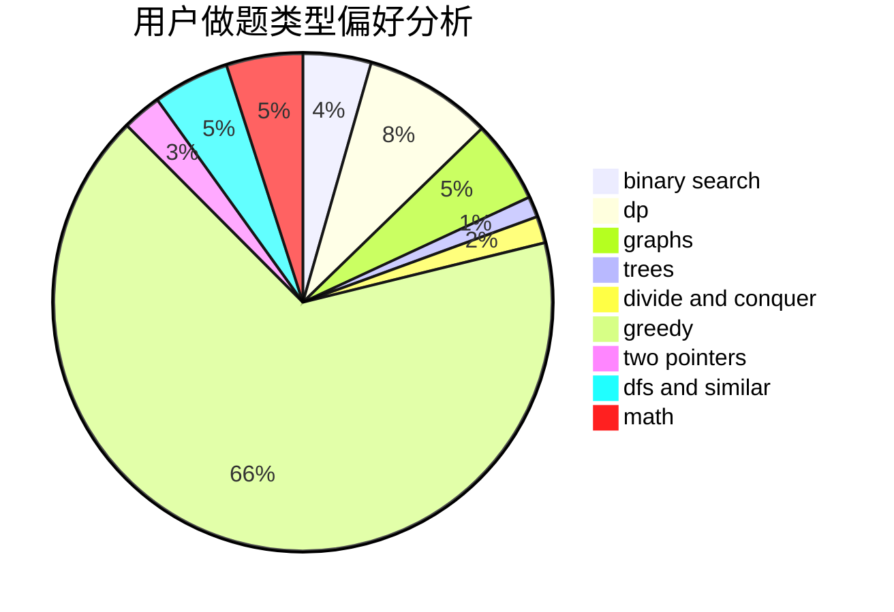

# Dousir9

<!-- tabs:start -->

#### **用户提交结果分析**

#### **用户做题类型偏好分析**

<!-- tabs:end -->
# 推荐题目
[1228B](https://codeforces.com/contest/1228/problem/B)
[1408H](https://codeforces.com/contest/1408/problem/H)
[1243E](https://codeforces.com/contest/1243/problem/E)
[759B](https://codeforces.com/contest/759/problem/B)
[672B](https://codeforces.com/contest/672/problem/B)
[13781](https://codeforces.com/contest/1378/problem/1)
[285A](https://codeforces.com/contest/285/problem/A)
[216D](https://codeforces.com/contest/216/problem/D)
[462B](https://codeforces.com/contest/462/problem/B)
[1375H](https://codeforces.com/contest/1375/problem/H)
