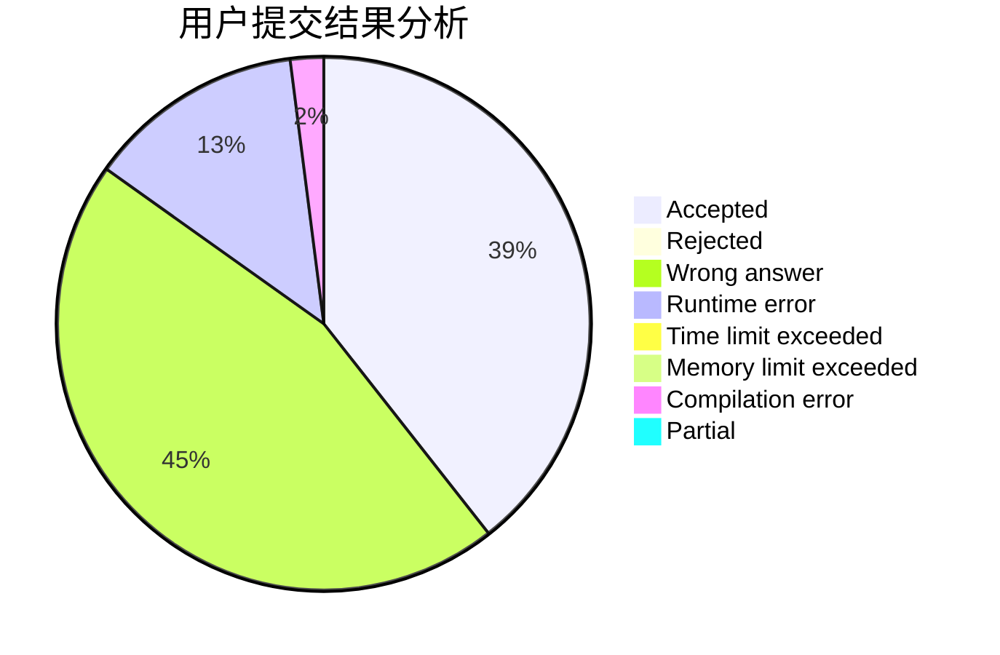
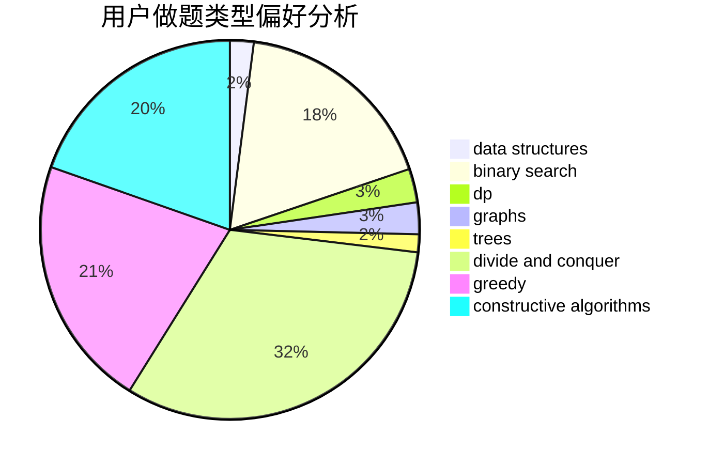

# Dousir9
<!-- tabs:start -->
#### **用户提交结果分析**

#### **用户做题类型偏好分析**

#### **用户错题知识点分析**

<!-- tabs:end -->
# 推荐题目
[You Are Given a WASD-string...](http://codeforces.com/problemset/problem/1202/C)		brute force,
                        data structures,
                        dp,
                        greedy,
                        implementation,
                        math,
                        strings		  
[Multiplication Table](http://codeforces.com/problemset/problem/1220/B)		math,
                        number theory		  
[Keyboard Purchase](http://codeforces.com/problemset/problem/1238/E)		bitmasks,
                        dp		  
[Tanya is 5!](http://codeforces.com/problemset/problem/737/E)		graph matchings,
                        graphs,
                        greedy,
                        schedules		  
[Yet Another Segments Subset](http://codeforces.com/problemset/problem/1399/F)		data structures,
                        dp,
                        graphs,
                        sortings		  
[Adam and Tree](http://codeforces.com/problemset/problem/442/D)		data structures,
                        trees		  
[Cowslip Collections](http://codeforces.com/problemset/problem/645/F)		combinatorics,
                        math,
                        number theory		  
[Flawed Flow](http://codeforces.com/problemset/problem/269/C)		constructive algorithms,
                        flows,
                        graphs,
                        greedy		  
[Valera and Swaps](http://codeforces.com/problemset/problem/441/D)		constructive algorithms,
                        dsu,
                        graphs,
                        implementation,
                        math,
                        string suffix structures		  
[Replacement](https://codeforces.com/contest/136/problem/C)		constructive algorithms,
                        data structures,
                        implementation		  
<!-- tabs:start -->
#### **data structures**
[You Are Given a WASD-string...](http://codeforces.com/problemset/problem/1202/C)		brute force,
                        data structures,
                        dp,
                        greedy,
                        implementation,
                        math,
                        strings		  
[Yet Another Segments Subset](http://codeforces.com/problemset/problem/1399/F)		data structures,
                        dp,
                        graphs,
                        sortings		  
[Adam and Tree](http://codeforces.com/problemset/problem/442/D)		data structures,
                        trees		  
[Replacement](https://codeforces.com/contest/136/problem/C)		constructive algorithms,
                        data structures,
                        implementation		  
[Strange Permutation](http://codeforces.com/problemset/problem/1470/E)		binary search,
                        combinatorics,
                        data structures,
                        dp,
                        graphs,
                        implementation,
                        two pointers		  
[Recommendations](http://codeforces.com/problemset/problem/1310/A)		data structures,
                        greedy,
                        sortings		  
[Maximum width](http://codeforces.com/problemset/problem/1492/C)		binary search,
                        data structures,
                        dp,
                        greedy,
                        two pointers		  
[Old Floppy Drive](http://codeforces.com/problemset/problem/1490/G)		binary search,
                        data structures,
                        math		  
[Odd Mineral Resource](http://codeforces.com/problemset/problem/1479/D)		binary search,
                        bitmasks,
                        brute force,
                        data structures,
                        probabilities,
                        trees		  
[Meximization](http://codeforces.com/problemset/problem/1497/A)		brute force,
                        data structures,
                        greedy,
                        sortings		  
#### **binary search**
[Vasya and String](http://codeforces.com/problemset/problem/676/C)		binary search,
                        dp,
                        strings,
                        two pointers		  
[Strange Permutation](http://codeforces.com/problemset/problem/1470/E)		binary search,
                        combinatorics,
                        data structures,
                        dp,
                        graphs,
                        implementation,
                        two pointers		  
[Maximum width](http://codeforces.com/problemset/problem/1492/C)		binary search,
                        data structures,
                        dp,
                        greedy,
                        two pointers		  
[Pairs](http://codeforces.com/problemset/problem/1463/D)		binary search,
                        constructive algorithms,
                        greedy,
                        two pointers		  
[Old Floppy Drive](http://codeforces.com/problemset/problem/1490/G)		binary search,
                        data structures,
                        math		  
[Odd Mineral Resource](http://codeforces.com/problemset/problem/1479/D)		binary search,
                        bitmasks,
                        brute force,
                        data structures,
                        probabilities,
                        trees		  
[Complicated Computations](http://codeforces.com/problemset/problem/1436/E)		binary search,
                        data structures,
                        two pointers		  
[Divide and Summarize](http://codeforces.com/problemset/problem/1461/D)		binary search,
                        brute force,
                        data structures,
                        divide and conquer,
                        implementation,
                        sortings		  
[K-beautiful Strings](http://codeforces.com/problemset/problem/1493/C)		binary search,
                        brute force,
                        constructive algorithms,
                        greedy,
                        strings		  
[Pythagorean Triples](http://codeforces.com/problemset/problem/1487/D)		binary search,
                        brute force,
                        math,
                        number theory		  
#### **dp**
[You Are Given a WASD-string...](http://codeforces.com/problemset/problem/1202/C)		brute force,
                        data structures,
                        dp,
                        greedy,
                        implementation,
                        math,
                        strings		  
[Keyboard Purchase](http://codeforces.com/problemset/problem/1238/E)		bitmasks,
                        dp		  
[Yet Another Segments Subset](http://codeforces.com/problemset/problem/1399/F)		data structures,
                        dp,
                        graphs,
                        sortings		  
[Valera and Number](http://codeforces.com/problemset/problem/441/E)		bitmasks,
                        dp,
                        math,
                        probabilities		  
[Vasya and String](http://codeforces.com/problemset/problem/676/C)		binary search,
                        dp,
                        strings,
                        two pointers		  
[Strange Permutation](http://codeforces.com/problemset/problem/1470/E)		binary search,
                        combinatorics,
                        data structures,
                        dp,
                        graphs,
                        implementation,
                        two pointers		  
[Maximum width](http://codeforces.com/problemset/problem/1492/C)		binary search,
                        data structures,
                        dp,
                        greedy,
                        two pointers		  
[Bouncing Ball](https://codeforces.com/contest/1457/problem/C)		brute force,
                        dp,
                        implementation		  
[Pekora and Trampoline](http://codeforces.com/problemset/problem/1491/C)		brute force,
                        data structures,
                        dp,
                        greedy,
                        implementation		  
[Chef Monocarp](http://codeforces.com/problemset/problem/1437/C)		dp,
                        flows,
                        graph matchings,
                        greedy,
                        math,
                        sortings		  
#### **graph**
[Tanya is 5!](http://codeforces.com/problemset/problem/737/E)		graph matchings,
                        graphs,
                        greedy,
                        schedules		  
[Yet Another Segments Subset](http://codeforces.com/problemset/problem/1399/F)		data structures,
                        dp,
                        graphs,
                        sortings		  
[Flawed Flow](http://codeforces.com/problemset/problem/269/C)		constructive algorithms,
                        flows,
                        graphs,
                        greedy		  
[Valera and Swaps](http://codeforces.com/problemset/problem/441/D)		constructive algorithms,
                        dsu,
                        graphs,
                        implementation,
                        math,
                        string suffix structures		  
[The Great Mixing](http://codeforces.com/problemset/problem/788/C)		dfs and similar,
                        graphs,
                        shortest paths		  
[Strange Permutation](http://codeforces.com/problemset/problem/1470/E)		binary search,
                        combinatorics,
                        data structures,
                        dp,
                        graphs,
                        implementation,
                        two pointers		  
[Minimum Ties](http://codeforces.com/problemset/problem/1487/C)		brute force,
                        constructive algorithms,
                        dfs and similar,
                        graphs,
                        greedy,
                        implementation,
                        math		  
[Chef Monocarp](http://codeforces.com/problemset/problem/1437/C)		dp,
                        flows,
                        graph matchings,
                        greedy,
                        math,
                        sortings		  
[Strange Housing](http://codeforces.com/problemset/problem/1470/D)		constructive algorithms,
                        dfs and similar,
                        graph matchings,
                        graphs,
                        greedy		  
[Longest Simple Cycle](http://codeforces.com/problemset/problem/1476/C)		dp,
                        graphs,
                        greedy		  
#### **trees**
[Adam and Tree](http://codeforces.com/problemset/problem/442/D)		data structures,
                        trees		  
[Polo the Penguin and Trees](http://codeforces.com/problemset/problem/288/D)		combinatorics,
                        dfs and similar,
                        trees		  
[Odd Mineral Resource](http://codeforces.com/problemset/problem/1479/D)		binary search,
                        bitmasks,
                        brute force,
                        data structures,
                        probabilities,
                        trees		  
[Yet Another Card Deck](http://codeforces.com/problemset/problem/1511/C)		brute force,
                        data structures,
                        implementation,
                        trees		  
[Diameter Cuts](http://codeforces.com/problemset/problem/1499/F)		combinatorics,
                        dfs and similar,
                        dp,
                        trees		  
[Fib-tree](http://codeforces.com/problemset/problem/1491/E)		brute force,
                        dfs and similar,
                        divide and conquer,
                        number theory,
                        trees		  
[13th Labour of Heracles](http://codeforces.com/problemset/problem/1466/D)		data structures,
                        greedy,
                        sortings,
                        trees		  
[BFS Trees](http://codeforces.com/problemset/problem/1495/D)		combinatorics,
                        dfs and similar,
                        graphs,
                        math,
                        shortest paths,
                        trees		  
[Sum of Prefix Sums](http://codeforces.com/problemset/problem/1303/G)		data structures,
                        divide and conquer,
                        geometry,
                        trees		  
[Number of Simple Paths](http://codeforces.com/problemset/problem/1454/E)		combinatorics,
                        dfs and similar,
                        graphs,
                        trees		  
#### **divide and conquer**
[Divide and Summarize](http://codeforces.com/problemset/problem/1461/D)		binary search,
                        brute force,
                        data structures,
                        divide and conquer,
                        implementation,
                        sortings		  
[Song of the Sirens](http://codeforces.com/problemset/problem/1466/G)		combinatorics,
                        divide and conquer,
                        hashing,
                        math,
                        string suffix structures,
                        strings		  
[Permutation Transformation](http://codeforces.com/problemset/problem/1490/D)		dfs and similar,
                        divide and conquer,
                        implementation		  
[Skyline Photo](https://codeforces.com/contest/1483/problem/C)		data structures,
                        divide and conquer,
                        dp		  
[Fib-tree](http://codeforces.com/problemset/problem/1491/E)		brute force,
                        dfs and similar,
                        divide and conquer,
                        number theory,
                        trees		  
[Sum of Prefix Sums](http://codeforces.com/problemset/problem/1303/G)		data structures,
                        divide and conquer,
                        geometry,
                        trees		  
[Dogeforces](http://codeforces.com/problemset/problem/1494/D)		constructive algorithms,
                        data structures,
                        dfs and similar,
                        divide and conquer,
                        dsu,
                        greedy,
                        sortings,
                        trees		  
[Skyline Photo](http://codeforces.com/problemset/problem/1482/E)		data structures,
                        divide and conquer,
                        dp		  
[Logistical Questions](http://codeforces.com/problemset/problem/566/C)		dfs and similar,
                        divide and conquer,
                        trees		  
[Fruit Sequences](http://codeforces.com/problemset/problem/1428/F)		binary search,
                        data structures,
                        divide and conquer,
                        dp,
                        two pointers		  
#### **greedy**
[You Are Given a WASD-string...](http://codeforces.com/problemset/problem/1202/C)		brute force,
                        data structures,
                        dp,
                        greedy,
                        implementation,
                        math,
                        strings		  
[Tanya is 5!](http://codeforces.com/problemset/problem/737/E)		graph matchings,
                        graphs,
                        greedy,
                        schedules		  
[Flawed Flow](http://codeforces.com/problemset/problem/269/C)		constructive algorithms,
                        flows,
                        graphs,
                        greedy		  
[Hamming Distance](http://codeforces.com/problemset/problem/193/C)		constructive algorithms,
                        greedy,
                        math,
                        matrices		  
[Recommendations](http://codeforces.com/problemset/problem/1310/A)		data structures,
                        greedy,
                        sortings		  
[Maximum width](http://codeforces.com/problemset/problem/1492/C)		binary search,
                        data structures,
                        dp,
                        greedy,
                        two pointers		  
[Diamond Miner](https://codeforces.com/contest/1496/problem/C)		geometry,
                        greedy,
                        math,
                        sortings		  
[Anti-knapsack](http://codeforces.com/problemset/problem/1493/A)		constructive algorithms,
                        greedy		  
[Pairs](http://codeforces.com/problemset/problem/1463/D)		binary search,
                        constructive algorithms,
                        greedy,
                        two pointers		  
[Unique Number](http://codeforces.com/problemset/problem/1462/C)		brute force,
                        greedy,
                        math		  
#### **constructive algorithms**
[Flawed Flow](http://codeforces.com/problemset/problem/269/C)		constructive algorithms,
                        flows,
                        graphs,
                        greedy		  
[Valera and Swaps](http://codeforces.com/problemset/problem/441/D)		constructive algorithms,
                        dsu,
                        graphs,
                        implementation,
                        math,
                        string suffix structures		  
[Replacement](https://codeforces.com/contest/136/problem/C)		constructive algorithms,
                        data structures,
                        implementation		  
[Hamming Distance](http://codeforces.com/problemset/problem/193/C)		constructive algorithms,
                        greedy,
                        math,
                        matrices		  
[Anti-knapsack](http://codeforces.com/problemset/problem/1493/A)		constructive algorithms,
                        greedy		  
[Pairs](http://codeforces.com/problemset/problem/1463/D)		binary search,
                        constructive algorithms,
                        greedy,
                        two pointers		  
[XOR-gun](https://codeforces.com/contest/1456/problem/B)		bitmasks,
                        brute force,
                        constructive algorithms		  
[Genius's Gambit](http://codeforces.com/problemset/problem/1492/D)		bitmasks,
                        constructive algorithms,
                        greedy,
                        math		  
[3-Coloring](https://codeforces.com/contest/1504/problem/D)		constructive algorithms,
                        games,
                        interactive		  
[Basic Diplomacy](https://codeforces.com/contest/1483/problem/A)		brute force,
                        constructive algorithms,
                        greedy,
                        implementation		  
#### **sortings**
[Yet Another Segments Subset](http://codeforces.com/problemset/problem/1399/F)		data structures,
                        dp,
                        graphs,
                        sortings		  
[Recommendations](http://codeforces.com/problemset/problem/1310/A)		data structures,
                        greedy,
                        sortings		  
[Diamond Miner](https://codeforces.com/contest/1496/problem/C)		geometry,
                        greedy,
                        math,
                        sortings		  
[Diamond Miner](http://codeforces.com/problemset/problem/1495/A)		geometry,
                        greedy,
                        math,
                        sortings		  
[Meximization](http://codeforces.com/problemset/problem/1497/A)		brute force,
                        data structures,
                        greedy,
                        sortings		  
[Avoiding Zero](http://codeforces.com/problemset/problem/1427/A)		math,
                        sortings		  
[Divide and Summarize](http://codeforces.com/problemset/problem/1461/D)		binary search,
                        brute force,
                        data structures,
                        divide and conquer,
                        implementation,
                        sortings		  
[Chef Monocarp](http://codeforces.com/problemset/problem/1437/C)		dp,
                        flows,
                        graph matchings,
                        greedy,
                        math,
                        sortings		  
[Replacing Elements](http://codeforces.com/problemset/problem/1473/A)		greedy,
                        implementation,
                        math,
                        sortings		  
[Eastern Exhibition](http://codeforces.com/problemset/problem/1486/B)		binary search,
                        geometry,
                        shortest paths,
                        sortings		  
<!-- tabs:end -->
