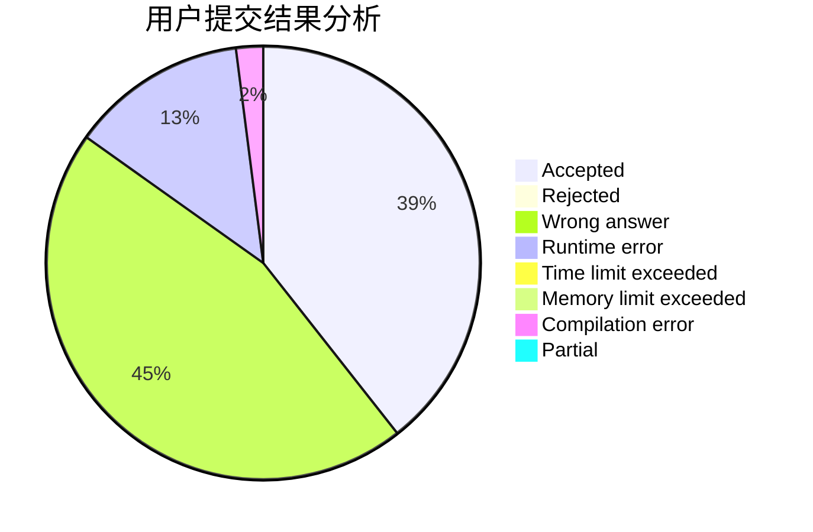
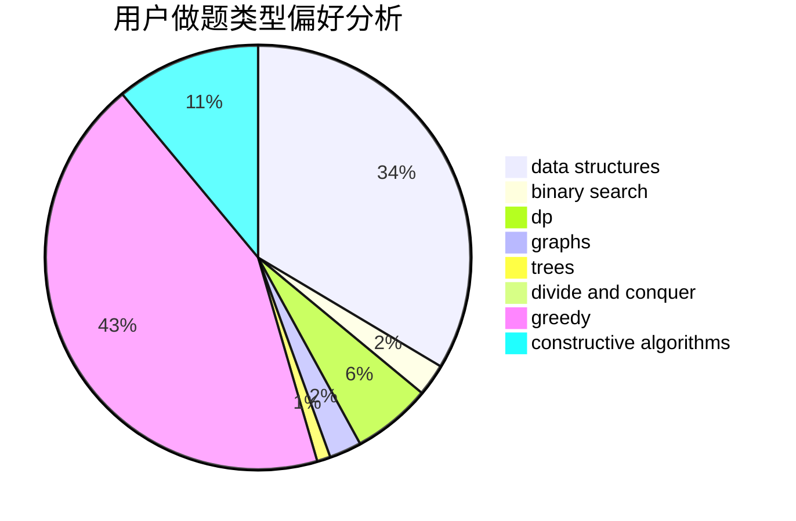

# Dousir9

<!-- tabs:start -->

#### **用户提交结果分析**

#### **用户做题类型偏好分析**

#### **用户错题知识点分析**

<!-- tabs:end -->
# 推荐题目
[1228B](https://codeforces.com/contest/1228/problem/B)		implementation,
                        math		  
[1408H](https://codeforces.com/contest/1408/problem/H)		binary search,
                        data structures,
                        flows,
                        greedy		  
[1243E](https://codeforces.com/contest/1243/problem/E)		dsu,graphs,sortings,trees		  
[759B](https://codeforces.com/contest/759/problem/B)		dsu,graphs,sortings,trees		  
[672B](https://codeforces.com/contest/672/problem/B)		constructive algorithms,
                        implementation,
                        strings		  
[13781](https://codeforces.com/contest/1378/problem/1)		dsu,graphs,sortings,trees		  
[285A](https://codeforces.com/contest/285/problem/A)		greedy,
                        implementation		  
[216D](https://codeforces.com/contest/216/problem/D)		binary search,
                        sortings,
                        two pointers		  
[462B](https://codeforces.com/contest/462/problem/B)		greedy		  
[1375H](https://codeforces.com/contest/1375/problem/H)		constructive algorithms,
                        divide and conquer		  
