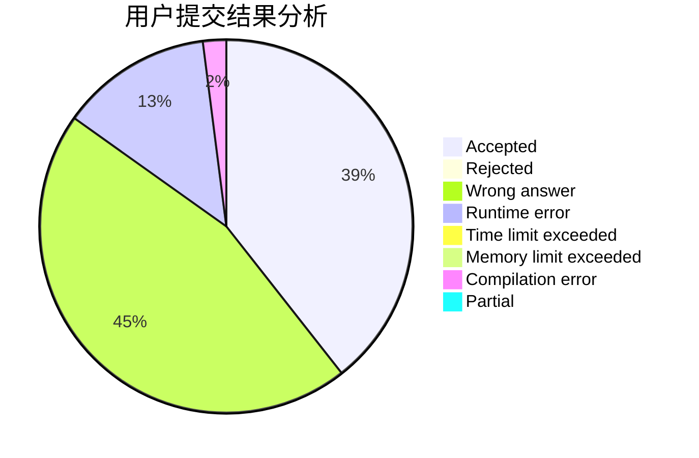
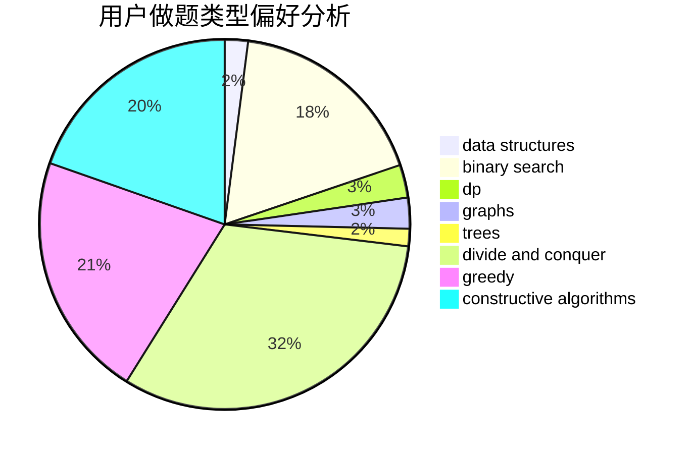

# Dousir9

<!-- tabs:start -->

#### **用户提交结果分析**

#### **用户做题类型偏好分析**

#### **用户错题知识点分析**

<!-- tabs:end -->
# 推荐题目
[1220B](https://codeforces.com/contest/1220/problem/B)		math,
                        number theory		  
[1399F](https://codeforces.com/contest/1399/problem/F)		data structures,
                        dp,
                        graphs,
                        sortings		  
[1238E](https://codeforces.com/contest/1238/problem/E)		bitmasks,
                        dp		  
[737E](https://codeforces.com/contest/737/problem/E)		graph matchings,
                        graphs,
                        greedy,
                        schedules		  
[645F](https://codeforces.com/contest/645/problem/F)		combinatorics,
                        math,
                        number theory		  
[136C](https://codeforces.com/contest/136/problem/C)		dsu,graphs,sortings,trees		  
[269C](https://codeforces.com/contest/269/problem/C)		constructive algorithms,
                        flows,
                        graphs,
                        greedy		  
[193C](https://codeforces.com/contest/193/problem/C)		constructive algorithms,
                        greedy,
                        math,
                        matrices		  
[441D](https://codeforces.com/contest/441/problem/D)		constructive algorithms,
                        dsu,
                        graphs,
                        implementation,
                        math,
                        string suffix structures		  
[1368H2](https://codeforces.com/contest/1368H/problem/2)		nan		  
