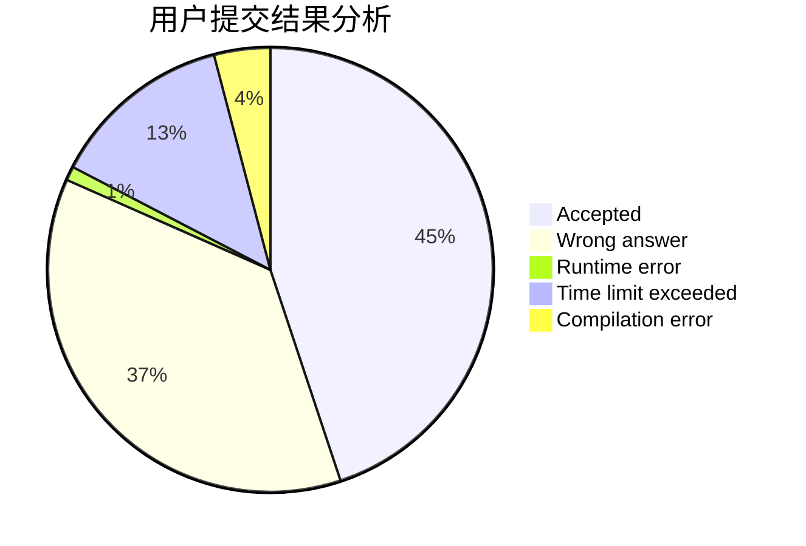
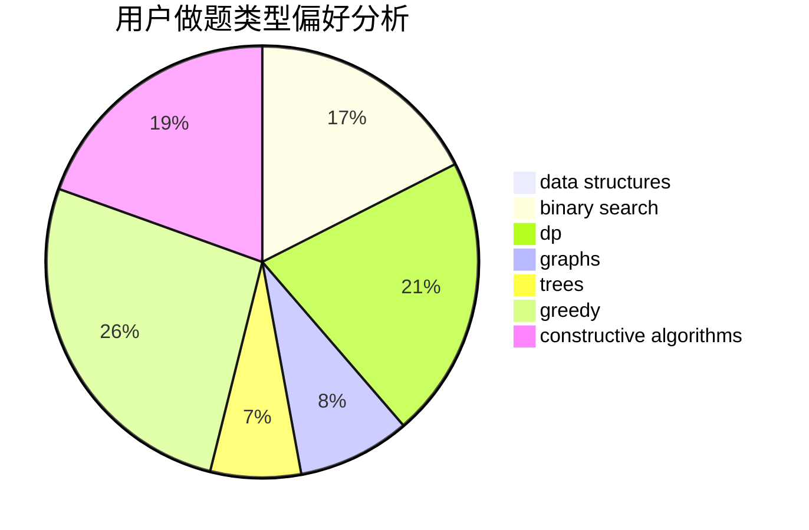
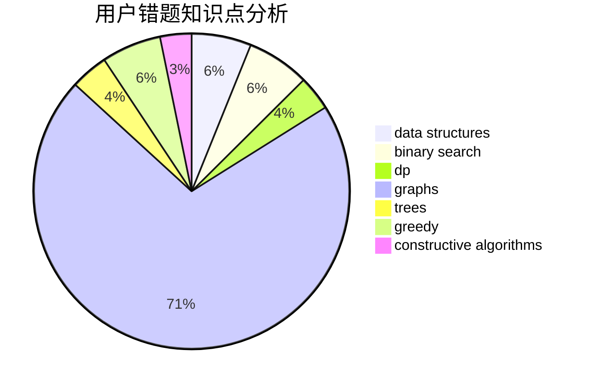

# DoveChild
<!-- tabs:start -->
#### **用户提交结果分析**

#### **用户做题类型偏好分析**

#### **用户错题知识点分析**

<!-- tabs:end -->
# 推荐题目
[Kefa and Dishes](http://codeforces.com/problemset/problem/580/D)		bitmasks,
                        dp		  
[Anton and Letters](http://codeforces.com/problemset/problem/443/A)		constructive algorithms,
                        implementation		  
[Beard Graph](http://codeforces.com/problemset/problem/165/D)		data structures,
                        dsu,
                        trees		  
[Masha and geometric depression](http://codeforces.com/problemset/problem/789/B)		brute force,
                        implementation,
                        math		  
[Vladik and chat](http://codeforces.com/problemset/problem/754/C)		brute force,
                        constructive algorithms,
                        dp,
                        implementation,
                        strings		  
[Rook, Bishop and King](http://codeforces.com/problemset/problem/370/A)		graphs,
                        math,
                        shortest paths		  
[Au Pont Rouge](https://codeforces.com/contest/1314/problem/C)		binary search,
                        dp,
                        strings		  
[Sum in the tree](https://codeforces.com/contest/1099/problem/D)		constructive algorithms,
                        dfs and similar,
                        greedy,
                        trees		  
[DZY Loves Physics](https://codeforces.com/contest/445/problem/C)		greedy,
                        math		  
[Sasha and Interesting Fact from Graph Theory](https://codeforces.com/contest/1113/problem/F)		brute force,
                        combinatorics,
                        dp,
                        math,
                        trees		  
<!-- tabs:start -->
#### **data structures**
[Beard Graph](http://codeforces.com/problemset/problem/165/D)		data structures,
                        dsu,
                        trees		  
[Zip-line](http://codeforces.com/problemset/problem/650/D)		binary search,
                        data structures,
                        dp,
                        hashing		  
[Split](http://codeforces.com/problemset/problem/1416/E)		binary search,
                        data structures,
                        dp,
                        greedy		  
[The Winds of Winter](http://codeforces.com/problemset/problem/768/G)		binary search,
                        data structures		  
[Clique Problem](http://codeforces.com/problemset/problem/527/D)		data structures,
                        dp,
                        greedy,
                        implementation,
                        sortings		  
[New task](http://codeforces.com/problemset/problem/788/E)		data structures		  
[Maximum width](http://codeforces.com/problemset/problem/1492/C)		binary search,
                        data structures,
                        dp,
                        greedy,
                        two pointers		  
[Old Floppy Drive](http://codeforces.com/problemset/problem/1490/G)		binary search,
                        data structures,
                        math		  
[Odd Mineral Resource](http://codeforces.com/problemset/problem/1479/D)		binary search,
                        bitmasks,
                        brute force,
                        data structures,
                        probabilities,
                        trees		  
[Meximization](http://codeforces.com/problemset/problem/1497/A)		brute force,
                        data structures,
                        greedy,
                        sortings		  
#### **binary search**
[Au Pont Rouge](https://codeforces.com/contest/1314/problem/C)		binary search,
                        dp,
                        strings		  
[Zip-line](http://codeforces.com/problemset/problem/650/D)		binary search,
                        data structures,
                        dp,
                        hashing		  
[Game with modulo](https://codeforces.com/contest/1104/problem/D)		binary search,
                        constructive algorithms,
                        interactive		  
[Split](http://codeforces.com/problemset/problem/1416/E)		binary search,
                        data structures,
                        dp,
                        greedy		  
[The Winds of Winter](http://codeforces.com/problemset/problem/768/G)		binary search,
                        data structures		  
[Maximum width](http://codeforces.com/problemset/problem/1492/C)		binary search,
                        data structures,
                        dp,
                        greedy,
                        two pointers		  
[Pairs](http://codeforces.com/problemset/problem/1463/D)		binary search,
                        constructive algorithms,
                        greedy,
                        two pointers		  
[Old Floppy Drive](http://codeforces.com/problemset/problem/1490/G)		binary search,
                        data structures,
                        math		  
[Odd Mineral Resource](http://codeforces.com/problemset/problem/1479/D)		binary search,
                        bitmasks,
                        brute force,
                        data structures,
                        probabilities,
                        trees		  
[Complicated Computations](http://codeforces.com/problemset/problem/1436/E)		binary search,
                        data structures,
                        two pointers		  
#### **dp**
[Kefa and Dishes](http://codeforces.com/problemset/problem/580/D)		bitmasks,
                        dp		  
[Vladik and chat](http://codeforces.com/problemset/problem/754/C)		brute force,
                        constructive algorithms,
                        dp,
                        implementation,
                        strings		  
[Au Pont Rouge](https://codeforces.com/contest/1314/problem/C)		binary search,
                        dp,
                        strings		  
[Sasha and Interesting Fact from Graph Theory](https://codeforces.com/contest/1113/problem/F)		brute force,
                        combinatorics,
                        dp,
                        math,
                        trees		  
[Zip-line](http://codeforces.com/problemset/problem/650/D)		binary search,
                        data structures,
                        dp,
                        hashing		  
[Playlist for Polycarp (hard version)](http://codeforces.com/problemset/problem/1185/G2)		combinatorics,
                        dp		  
[Lucky Number Representation](http://codeforces.com/problemset/problem/354/E)		constructive algorithms,
                        dfs and similar,
                        dp		  
[Split](http://codeforces.com/problemset/problem/1416/E)		binary search,
                        data structures,
                        dp,
                        greedy		  
[Dreamoon and Strings](http://codeforces.com/problemset/problem/476/E)		dp,
                        strings		  
[Clique Problem](http://codeforces.com/problemset/problem/527/D)		data structures,
                        dp,
                        greedy,
                        implementation,
                        sortings		  
#### **graph**
[Rook, Bishop and King](http://codeforces.com/problemset/problem/370/A)		graphs,
                        math,
                        shortest paths		  
[The Child and Toy](https://codeforces.com/contest/438/problem/A)		graphs,
                        greedy,
                        sortings		  
[Valera and Swaps](http://codeforces.com/problemset/problem/441/D)		constructive algorithms,
                        dsu,
                        graphs,
                        implementation,
                        math,
                        string suffix structures		  
[Colorful Graph](http://codeforces.com/problemset/problem/246/D)		brute force,
                        dfs and similar,
                        graphs		  
[Perishable Roads](http://codeforces.com/problemset/problem/773/D)		dp,
                        graphs,
                        shortest paths		  
[Minimum Ties](http://codeforces.com/problemset/problem/1487/C)		brute force,
                        constructive algorithms,
                        dfs and similar,
                        graphs,
                        greedy,
                        implementation,
                        math		  
[Chef Monocarp](http://codeforces.com/problemset/problem/1437/C)		dp,
                        flows,
                        graph matchings,
                        greedy,
                        math,
                        sortings		  
[Strange Housing](http://codeforces.com/problemset/problem/1470/D)		constructive algorithms,
                        dfs and similar,
                        graph matchings,
                        graphs,
                        greedy		  
[Longest Simple Cycle](http://codeforces.com/problemset/problem/1476/C)		dp,
                        graphs,
                        greedy		  
[Shortest and Longest LIS](http://codeforces.com/problemset/problem/1304/D)		constructive algorithms,
                        graphs,
                        greedy,
                        two pointers		  
#### **trees**
[Beard Graph](http://codeforces.com/problemset/problem/165/D)		data structures,
                        dsu,
                        trees		  
[Sum in the tree](https://codeforces.com/contest/1099/problem/D)		constructive algorithms,
                        dfs and similar,
                        greedy,
                        trees		  
[Sasha and Interesting Fact from Graph Theory](https://codeforces.com/contest/1113/problem/F)		brute force,
                        combinatorics,
                        dp,
                        math,
                        trees		  
[4-point polyline](http://codeforces.com/problemset/problem/452/B)		brute force,
                        constructive algorithms,
                        geometry,
                        trees		  
[Minimum Diameter Tree](http://codeforces.com/problemset/problem/1085/D)		constructive algorithms,
                        implementation,
                        trees		  
[Odd Mineral Resource](http://codeforces.com/problemset/problem/1479/D)		binary search,
                        bitmasks,
                        brute force,
                        data structures,
                        probabilities,
                        trees		  
[Yet Another Card Deck](http://codeforces.com/problemset/problem/1511/C)		brute force,
                        data structures,
                        implementation,
                        trees		  
[Diameter Cuts](http://codeforces.com/problemset/problem/1499/F)		combinatorics,
                        dfs and similar,
                        dp,
                        trees		  
[Fib-tree](http://codeforces.com/problemset/problem/1491/E)		brute force,
                        dfs and similar,
                        divide and conquer,
                        number theory,
                        trees		  
[13th Labour of Heracles](http://codeforces.com/problemset/problem/1466/D)		data structures,
                        greedy,
                        sortings,
                        trees		  
#### **divide and conquer**
[Finding lines](http://codeforces.com/problemset/problem/788/D)		constructive algorithms,
                        divide and conquer,
                        interactive		  
[Divide and Summarize](http://codeforces.com/problemset/problem/1461/D)		binary search,
                        brute force,
                        data structures,
                        divide and conquer,
                        implementation,
                        sortings		  
[Song of the Sirens](http://codeforces.com/problemset/problem/1466/G)		combinatorics,
                        divide and conquer,
                        hashing,
                        math,
                        string suffix structures,
                        strings		  
[Permutation Transformation](http://codeforces.com/problemset/problem/1490/D)		dfs and similar,
                        divide and conquer,
                        implementation		  
[Skyline Photo](https://codeforces.com/contest/1483/problem/C)		data structures,
                        divide and conquer,
                        dp		  
[Fib-tree](http://codeforces.com/problemset/problem/1491/E)		brute force,
                        dfs and similar,
                        divide and conquer,
                        number theory,
                        trees		  
[Sum of Prefix Sums](http://codeforces.com/problemset/problem/1303/G)		data structures,
                        divide and conquer,
                        geometry,
                        trees		  
[Dogeforces](http://codeforces.com/problemset/problem/1494/D)		constructive algorithms,
                        data structures,
                        dfs and similar,
                        divide and conquer,
                        dsu,
                        greedy,
                        sortings,
                        trees		  
[Logistical Questions](http://codeforces.com/problemset/problem/566/C)		dfs and similar,
                        divide and conquer,
                        trees		  
[Fruit Sequences](http://codeforces.com/problemset/problem/1428/F)		binary search,
                        data structures,
                        divide and conquer,
                        dp,
                        two pointers		  
#### **greedy**
[Sum in the tree](https://codeforces.com/contest/1099/problem/D)		constructive algorithms,
                        dfs and similar,
                        greedy,
                        trees		  
[DZY Loves Physics](https://codeforces.com/contest/445/problem/C)		greedy,
                        math		  
[The Child and Toy](https://codeforces.com/contest/438/problem/A)		graphs,
                        greedy,
                        sortings		  
[Andrey and Problem](https://codeforces.com/contest/443/problem/D)		greedy,
                        math,
                        probabilities		  
[Split](http://codeforces.com/problemset/problem/1416/E)		binary search,
                        data structures,
                        dp,
                        greedy		  
[Clique Problem](http://codeforces.com/problemset/problem/527/D)		data structures,
                        dp,
                        greedy,
                        implementation,
                        sortings		  
[Omkar and Circle](http://codeforces.com/problemset/problem/1372/D)		brute force,
                        dp,
                        games,
                        greedy		  
[Neighbor Grid](http://codeforces.com/problemset/problem/1375/B)		constructive algorithms,
                        greedy		  
[Maximum width](http://codeforces.com/problemset/problem/1492/C)		binary search,
                        data structures,
                        dp,
                        greedy,
                        two pointers		  
[Diamond Miner](https://codeforces.com/contest/1496/problem/C)		geometry,
                        greedy,
                        math,
                        sortings		  
#### **constructive algorithms**
[Anton and Letters](http://codeforces.com/problemset/problem/443/A)		constructive algorithms,
                        implementation		  
[Vladik and chat](http://codeforces.com/problemset/problem/754/C)		brute force,
                        constructive algorithms,
                        dp,
                        implementation,
                        strings		  
[Sum in the tree](https://codeforces.com/contest/1099/problem/D)		constructive algorithms,
                        dfs and similar,
                        greedy,
                        trees		  
[Lucky Number Representation](http://codeforces.com/problemset/problem/354/E)		constructive algorithms,
                        dfs and similar,
                        dp		  
[Prefix Product Sequence](http://codeforces.com/problemset/problem/487/C)		constructive algorithms,
                        math,
                        number theory		  
[Game with modulo](https://codeforces.com/contest/1104/problem/D)		binary search,
                        constructive algorithms,
                        interactive		  
[4-point polyline](http://codeforces.com/problemset/problem/452/B)		brute force,
                        constructive algorithms,
                        geometry,
                        trees		  
[Valera and Swaps](http://codeforces.com/problemset/problem/441/D)		constructive algorithms,
                        dsu,
                        graphs,
                        implementation,
                        math,
                        string suffix structures		  
[Lucky Permutation](https://codeforces.com/contest/287/problem/C)		constructive algorithms,
                        math		  
[Neighbor Grid](http://codeforces.com/problemset/problem/1375/B)		constructive algorithms,
                        greedy		  
#### **sortings**
[The Child and Toy](https://codeforces.com/contest/438/problem/A)		graphs,
                        greedy,
                        sortings		  
[Clique Problem](http://codeforces.com/problemset/problem/527/D)		data structures,
                        dp,
                        greedy,
                        implementation,
                        sortings		  
[Diamond Miner](https://codeforces.com/contest/1496/problem/C)		geometry,
                        greedy,
                        math,
                        sortings		  
[Meximization](http://codeforces.com/problemset/problem/1497/A)		brute force,
                        data structures,
                        greedy,
                        sortings		  
[Avoiding Zero](http://codeforces.com/problemset/problem/1427/A)		math,
                        sortings		  
[Divide and Summarize](http://codeforces.com/problemset/problem/1461/D)		binary search,
                        brute force,
                        data structures,
                        divide and conquer,
                        implementation,
                        sortings		  
[Chef Monocarp](http://codeforces.com/problemset/problem/1437/C)		dp,
                        flows,
                        graph matchings,
                        greedy,
                        math,
                        sortings		  
[Replacing Elements](http://codeforces.com/problemset/problem/1473/A)		greedy,
                        implementation,
                        math,
                        sortings		  
[Eastern Exhibition](http://codeforces.com/problemset/problem/1486/B)		binary search,
                        geometry,
                        shortest paths,
                        sortings		  
[The Great Hero](http://codeforces.com/problemset/problem/1480/B)		greedy,
                        implementation,
                        sortings		  
<!-- tabs:end -->
