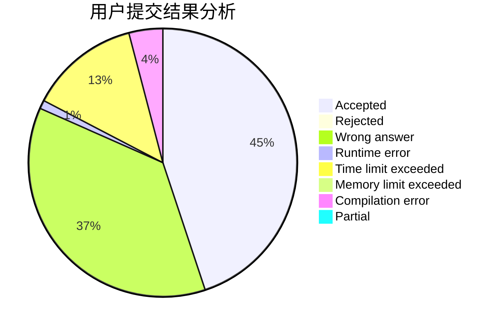
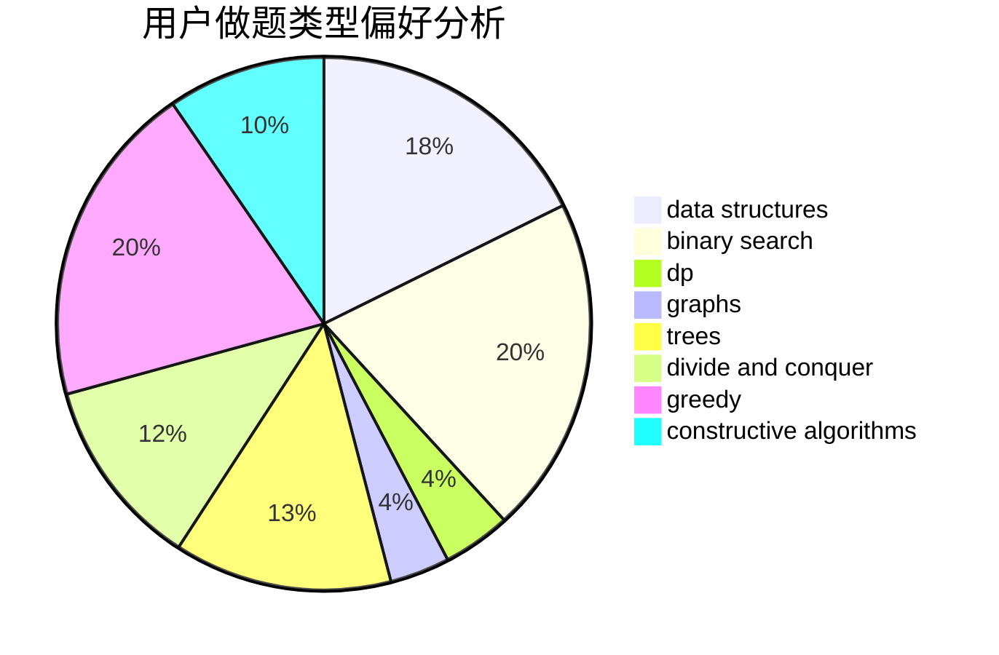
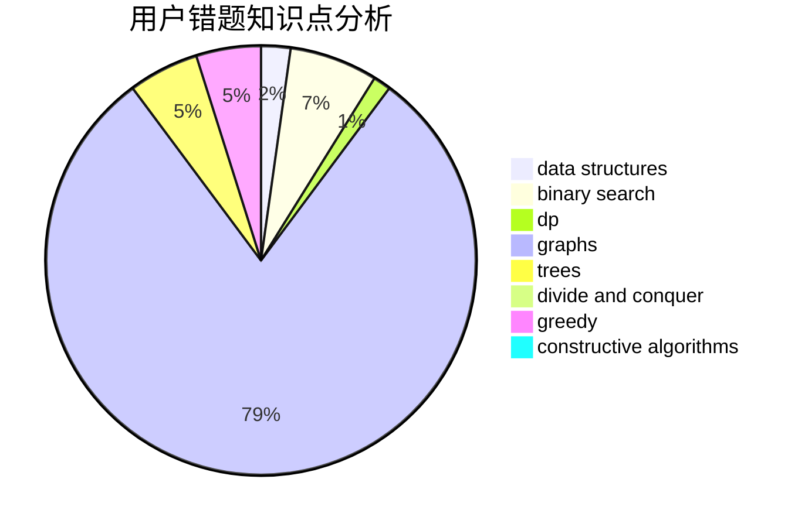

# DoveChild

<!-- tabs:start -->

#### **用户提交结果分析**

#### **用户做题类型偏好分析**

#### **用户错题知识点分析**

<!-- tabs:end -->
# 推荐题目
[804D](https://codeforces.com/contest/804/problem/D)		binary search,
                        brute force,
                        dfs and similar,
                        dp,
                        sortings,
                        trees		  
[1324B](https://codeforces.com/contest/1324/problem/B)		brute force,
                        strings		  
[267A](https://codeforces.com/contest/267/problem/A)		math,
                        number theory		  
[208C](https://codeforces.com/contest/208/problem/C)		dp,
                        graphs,
                        shortest paths		  
[109A](https://codeforces.com/contest/109/problem/A)		brute force,
                        implementation		  
[463D](https://codeforces.com/contest/463/problem/D)		dfs and similar,
                        dp,
                        graphs,
                        implementation		  
[474B](https://codeforces.com/contest/474/problem/B)		binary search,
                        implementation		  
[301B](https://codeforces.com/contest/301/problem/B)		binary search,
                        graphs,
                        shortest paths		  
[462B](https://codeforces.com/contest/462/problem/B)		greedy		  
[1114C](https://codeforces.com/contest/1114/problem/C)		brute force,
                        implementation,
                        math,
                        number theory		  
