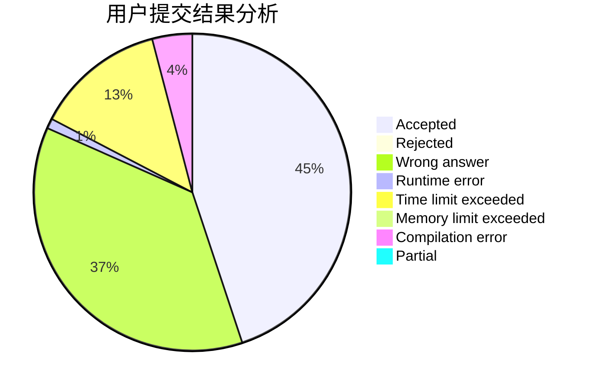
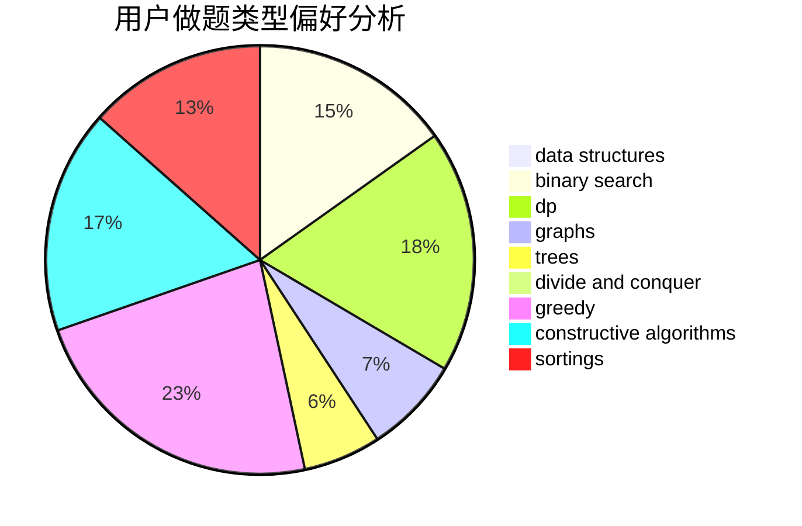
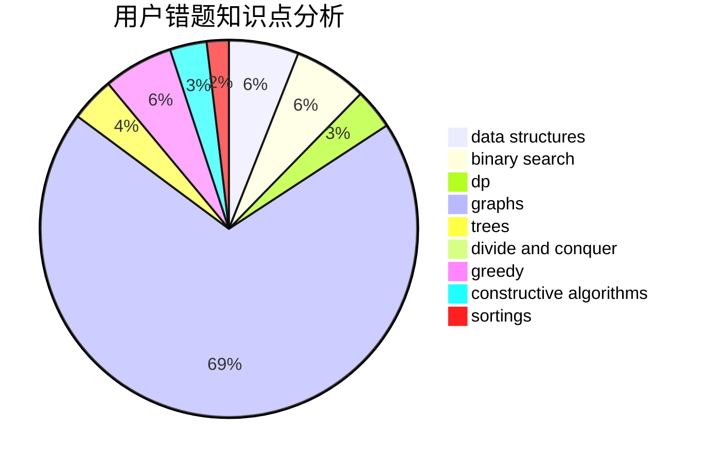

# DoveChild
<!-- tabs:start -->
#### **用户提交结果分析**

#### **用户做题类型偏好分析**

#### **用户错题知识点分析**

<!-- tabs:end -->
# 推荐题目
[580D](http://codeforces.com/problemset/problem/580/D)		bitmasks,
                        dp		  
[443A](http://codeforces.com/problemset/problem/443/A)		constructive algorithms,
                        implementation		  
[165D](http://codeforces.com/problemset/problem/165/D)		data structures,
                        dsu,
                        trees		  
[789B](http://codeforces.com/problemset/problem/789/B)		brute force,
                        implementation,
                        math		  
[754C](http://codeforces.com/problemset/problem/754/C)		brute force,
                        constructive algorithms,
                        dp,
                        implementation,
                        strings		  
[370A](http://codeforces.com/problemset/problem/370/A)		graphs,
                        math,
                        shortest paths		  
[1314C](https://codeforces.com/contest/1314/problem/C)		binary search,
                        dp,
                        strings		  
[1099D](https://codeforces.com/contest/1099/problem/D)		constructive algorithms,
                        dfs and similar,
                        greedy,
                        trees		  
[445C](https://codeforces.com/contest/445/problem/C)		greedy,
                        math		  
[1113F](https://codeforces.com/contest/1113/problem/F)		brute force,
                        combinatorics,
                        dp,
                        math,
                        trees		  
<!-- tabs:start -->
#### **data structures**
[165D](http://codeforces.com/problemset/problem/165/D)		data structures,
                        dsu,
                        trees		  
[650D](http://codeforces.com/problemset/problem/650/D)		binary search,
                        data structures,
                        dp,
                        hashing		  
[1416E](http://codeforces.com/problemset/problem/1416/E)		binary search,
                        data structures,
                        dp,
                        greedy		  
[768G](http://codeforces.com/problemset/problem/768/G)		binary search,
                        data structures		  
[527D](http://codeforces.com/problemset/problem/527/D)		data structures,
                        dp,
                        greedy,
                        implementation,
                        sortings		  
[788E](http://codeforces.com/problemset/problem/788/E)		data structures		  
[1492C](http://codeforces.com/problemset/problem/1492/C)		binary search,
                        data structures,
                        dp,
                        greedy,
                        two pointers		  
[1490G](http://codeforces.com/problemset/problem/1490/G)		binary search,
                        data structures,
                        math		  
[1479D](http://codeforces.com/problemset/problem/1479/D)		binary search,
                        bitmasks,
                        brute force,
                        data structures,
                        probabilities,
                        trees		  
[1497A](http://codeforces.com/problemset/problem/1497/A)		brute force,
                        data structures,
                        greedy,
                        sortings		  
#### **binary search**
[1314C](https://codeforces.com/contest/1314/problem/C)		binary search,
                        dp,
                        strings		  
[650D](http://codeforces.com/problemset/problem/650/D)		binary search,
                        data structures,
                        dp,
                        hashing		  
[1104D](https://codeforces.com/contest/1104/problem/D)		binary search,
                        constructive algorithms,
                        interactive		  
[1416E](http://codeforces.com/problemset/problem/1416/E)		binary search,
                        data structures,
                        dp,
                        greedy		  
[768G](http://codeforces.com/problemset/problem/768/G)		binary search,
                        data structures		  
[1492C](http://codeforces.com/problemset/problem/1492/C)		binary search,
                        data structures,
                        dp,
                        greedy,
                        two pointers		  
[1463D](http://codeforces.com/problemset/problem/1463/D)		binary search,
                        constructive algorithms,
                        greedy,
                        two pointers		  
[1490G](http://codeforces.com/problemset/problem/1490/G)		binary search,
                        data structures,
                        math		  
[1479D](http://codeforces.com/problemset/problem/1479/D)		binary search,
                        bitmasks,
                        brute force,
                        data structures,
                        probabilities,
                        trees		  
[1436E](http://codeforces.com/problemset/problem/1436/E)		binary search,
                        data structures,
                        two pointers		  
#### **dp**
[580D](http://codeforces.com/problemset/problem/580/D)		bitmasks,
                        dp		  
[754C](http://codeforces.com/problemset/problem/754/C)		brute force,
                        constructive algorithms,
                        dp,
                        implementation,
                        strings		  
[1314C](https://codeforces.com/contest/1314/problem/C)		binary search,
                        dp,
                        strings		  
[1113F](https://codeforces.com/contest/1113/problem/F)		brute force,
                        combinatorics,
                        dp,
                        math,
                        trees		  
[650D](http://codeforces.com/problemset/problem/650/D)		binary search,
                        data structures,
                        dp,
                        hashing		  
[1185G2](http://codeforces.com/problemset/problem/1185/G2)		combinatorics,
                        dp		  
[354E](http://codeforces.com/problemset/problem/354/E)		constructive algorithms,
                        dfs and similar,
                        dp		  
[1416E](http://codeforces.com/problemset/problem/1416/E)		binary search,
                        data structures,
                        dp,
                        greedy		  
[476E](http://codeforces.com/problemset/problem/476/E)		dp,
                        strings		  
[527D](http://codeforces.com/problemset/problem/527/D)		data structures,
                        dp,
                        greedy,
                        implementation,
                        sortings		  
#### **graph**
[370A](http://codeforces.com/problemset/problem/370/A)		graphs,
                        math,
                        shortest paths		  
[438A](https://codeforces.com/contest/438/problem/A)		graphs,
                        greedy,
                        sortings		  
[441D](http://codeforces.com/problemset/problem/441/D)		constructive algorithms,
                        dsu,
                        graphs,
                        implementation,
                        math,
                        string suffix structures		  
[246D](http://codeforces.com/problemset/problem/246/D)		brute force,
                        dfs and similar,
                        graphs		  
[773D](http://codeforces.com/problemset/problem/773/D)		dp,
                        graphs,
                        shortest paths		  
[1487C](http://codeforces.com/problemset/problem/1487/C)		brute force,
                        constructive algorithms,
                        dfs and similar,
                        graphs,
                        greedy,
                        implementation,
                        math		  
[1437C](http://codeforces.com/problemset/problem/1437/C)		dp,
                        flows,
                        graph matchings,
                        greedy,
                        math,
                        sortings		  
[1470D](http://codeforces.com/problemset/problem/1470/D)		constructive algorithms,
                        dfs and similar,
                        graph matchings,
                        graphs,
                        greedy		  
[1476C](http://codeforces.com/problemset/problem/1476/C)		dp,
                        graphs,
                        greedy		  
[1304D](http://codeforces.com/problemset/problem/1304/D)		constructive algorithms,
                        graphs,
                        greedy,
                        two pointers		  
#### **trees**
[165D](http://codeforces.com/problemset/problem/165/D)		data structures,
                        dsu,
                        trees		  
[1099D](https://codeforces.com/contest/1099/problem/D)		constructive algorithms,
                        dfs and similar,
                        greedy,
                        trees		  
[1113F](https://codeforces.com/contest/1113/problem/F)		brute force,
                        combinatorics,
                        dp,
                        math,
                        trees		  
[452B](http://codeforces.com/problemset/problem/452/B)		brute force,
                        constructive algorithms,
                        geometry,
                        trees		  
[1085D](http://codeforces.com/problemset/problem/1085/D)		constructive algorithms,
                        implementation,
                        trees		  
[1479D](http://codeforces.com/problemset/problem/1479/D)		binary search,
                        bitmasks,
                        brute force,
                        data structures,
                        probabilities,
                        trees		  
[1511C](http://codeforces.com/problemset/problem/1511/C)		brute force,
                        data structures,
                        implementation,
                        trees		  
[1499F](http://codeforces.com/problemset/problem/1499/F)		combinatorics,
                        dfs and similar,
                        dp,
                        trees		  
[1491E](http://codeforces.com/problemset/problem/1491/E)		brute force,
                        dfs and similar,
                        divide and conquer,
                        number theory,
                        trees		  
[1466D](http://codeforces.com/problemset/problem/1466/D)		data structures,
                        greedy,
                        sortings,
                        trees		  
#### **divide and conquer**
[788D](http://codeforces.com/problemset/problem/788/D)		constructive algorithms,
                        divide and conquer,
                        interactive		  
[1461D](http://codeforces.com/problemset/problem/1461/D)		binary search,
                        brute force,
                        data structures,
                        divide and conquer,
                        implementation,
                        sortings		  
[1466G](http://codeforces.com/problemset/problem/1466/G)		combinatorics,
                        divide and conquer,
                        hashing,
                        math,
                        string suffix structures,
                        strings		  
[1490D](http://codeforces.com/problemset/problem/1490/D)		dfs and similar,
                        divide and conquer,
                        implementation		  
[1483C](https://codeforces.com/contest/1483/problem/C)		data structures,
                        divide and conquer,
                        dp		  
[1491E](http://codeforces.com/problemset/problem/1491/E)		brute force,
                        dfs and similar,
                        divide and conquer,
                        number theory,
                        trees		  
[1303G](http://codeforces.com/problemset/problem/1303/G)		data structures,
                        divide and conquer,
                        geometry,
                        trees		  
[1494D](http://codeforces.com/problemset/problem/1494/D)		constructive algorithms,
                        data structures,
                        dfs and similar,
                        divide and conquer,
                        dsu,
                        greedy,
                        sortings,
                        trees		  
[1482E](http://codeforces.com/problemset/problem/1482/E)		data structures,
                        divide and conquer,
                        dp		  
[566C](http://codeforces.com/problemset/problem/566/C)		dfs and similar,
                        divide and conquer,
                        trees		  
#### **greedy**
[1099D](https://codeforces.com/contest/1099/problem/D)		constructive algorithms,
                        dfs and similar,
                        greedy,
                        trees		  
[445C](https://codeforces.com/contest/445/problem/C)		greedy,
                        math		  
[438A](https://codeforces.com/contest/438/problem/A)		graphs,
                        greedy,
                        sortings		  
[443D](https://codeforces.com/contest/443/problem/D)		greedy,
                        math,
                        probabilities		  
[1416E](http://codeforces.com/problemset/problem/1416/E)		binary search,
                        data structures,
                        dp,
                        greedy		  
[527D](http://codeforces.com/problemset/problem/527/D)		data structures,
                        dp,
                        greedy,
                        implementation,
                        sortings		  
[1372D](http://codeforces.com/problemset/problem/1372/D)		brute force,
                        dp,
                        games,
                        greedy		  
[1375B](http://codeforces.com/problemset/problem/1375/B)		constructive algorithms,
                        greedy		  
[1492C](http://codeforces.com/problemset/problem/1492/C)		binary search,
                        data structures,
                        dp,
                        greedy,
                        two pointers		  
[1496C](https://codeforces.com/contest/1496/problem/C)		geometry,
                        greedy,
                        math,
                        sortings		  
#### **constructive algorithms**
[443A](http://codeforces.com/problemset/problem/443/A)		constructive algorithms,
                        implementation		  
[754C](http://codeforces.com/problemset/problem/754/C)		brute force,
                        constructive algorithms,
                        dp,
                        implementation,
                        strings		  
[1099D](https://codeforces.com/contest/1099/problem/D)		constructive algorithms,
                        dfs and similar,
                        greedy,
                        trees		  
[354E](http://codeforces.com/problemset/problem/354/E)		constructive algorithms,
                        dfs and similar,
                        dp		  
[487C](http://codeforces.com/problemset/problem/487/C)		constructive algorithms,
                        math,
                        number theory		  
[1104D](https://codeforces.com/contest/1104/problem/D)		binary search,
                        constructive algorithms,
                        interactive		  
[452B](http://codeforces.com/problemset/problem/452/B)		brute force,
                        constructive algorithms,
                        geometry,
                        trees		  
[441D](http://codeforces.com/problemset/problem/441/D)		constructive algorithms,
                        dsu,
                        graphs,
                        implementation,
                        math,
                        string suffix structures		  
[287C](https://codeforces.com/contest/287/problem/C)		constructive algorithms,
                        math		  
[1375B](http://codeforces.com/problemset/problem/1375/B)		constructive algorithms,
                        greedy		  
#### **sortings**
[438A](https://codeforces.com/contest/438/problem/A)		graphs,
                        greedy,
                        sortings		  
[527D](http://codeforces.com/problemset/problem/527/D)		data structures,
                        dp,
                        greedy,
                        implementation,
                        sortings		  
[1496C](https://codeforces.com/contest/1496/problem/C)		geometry,
                        greedy,
                        math,
                        sortings		  
[1495A](http://codeforces.com/problemset/problem/1495/A)		geometry,
                        greedy,
                        math,
                        sortings		  
[1497A](http://codeforces.com/problemset/problem/1497/A)		brute force,
                        data structures,
                        greedy,
                        sortings		  
[1427A](http://codeforces.com/problemset/problem/1427/A)		math,
                        sortings		  
[1461D](http://codeforces.com/problemset/problem/1461/D)		binary search,
                        brute force,
                        data structures,
                        divide and conquer,
                        implementation,
                        sortings		  
[1437C](http://codeforces.com/problemset/problem/1437/C)		dp,
                        flows,
                        graph matchings,
                        greedy,
                        math,
                        sortings		  
[1473A](http://codeforces.com/problemset/problem/1473/A)		greedy,
                        implementation,
                        math,
                        sortings		  
[1486B](http://codeforces.com/problemset/problem/1486/B)		binary search,
                        geometry,
                        shortest paths,
                        sortings		  
<!-- tabs:end -->
