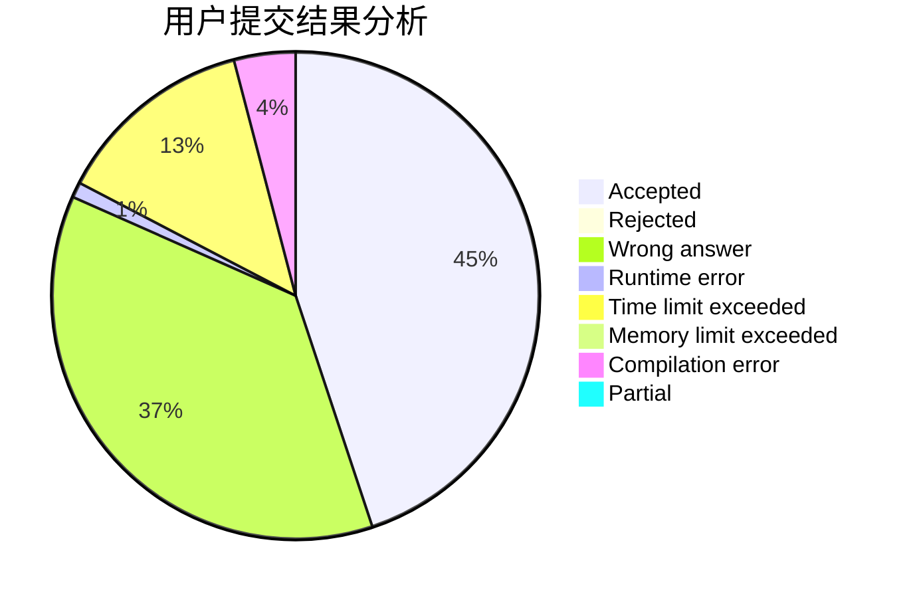
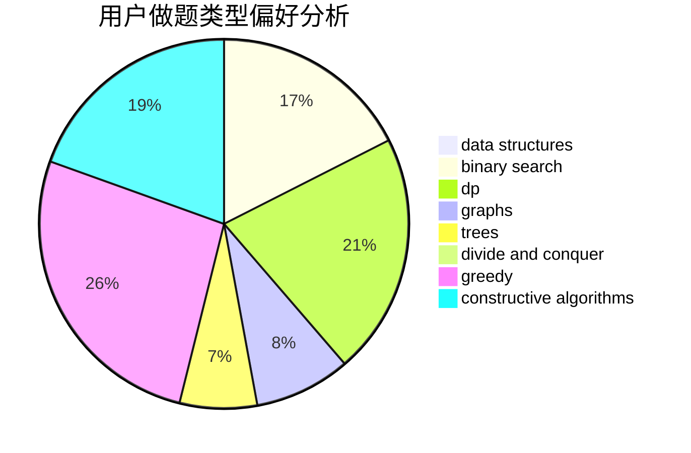
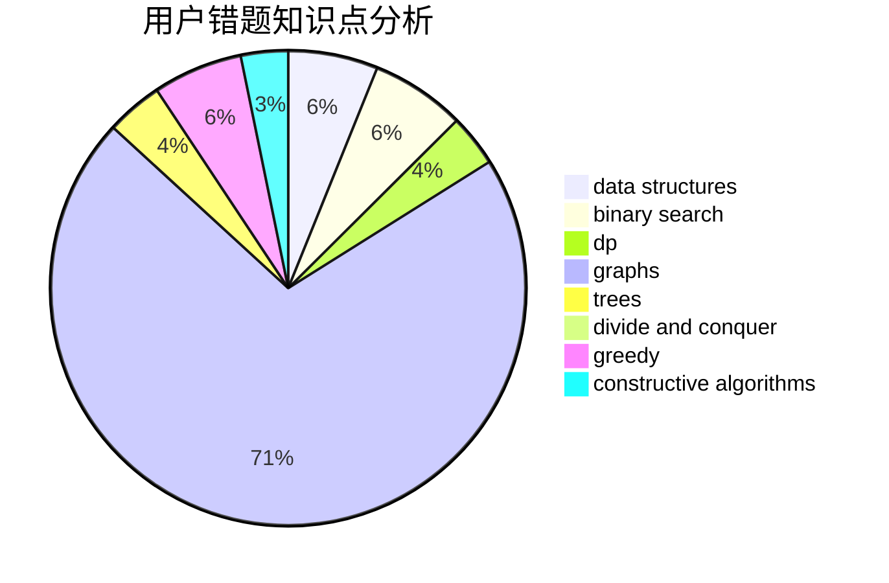

# DoveChild

<!-- tabs:start -->

#### **用户提交结果分析**

#### **用户做题类型偏好分析**

#### **用户错题知识点分析**

<!-- tabs:end -->
# 推荐题目
[789B](https://codeforces.com/contest/789/problem/B)		brute force,
                        implementation,
                        math		  
[1314C](https://codeforces.com/contest/1314/problem/C)		dsu,graphs,sortings,trees		  
[246D](https://codeforces.com/contest/246/problem/D)		brute force,
                        dfs and similar,
                        graphs		  
[181A](https://codeforces.com/contest/181/problem/A)		brute force,
                        geometry,
                        implementation		  
[1099D](https://codeforces.com/contest/1099/problem/D)		dsu,graphs,sortings,trees		  
[443A](https://codeforces.com/contest/443/problem/A)		constructive algorithms,
                        implementation		  
[452B](https://codeforces.com/contest/452/problem/B)		brute force,
                        constructive algorithms,
                        geometry,
                        trees		  
[287C](https://codeforces.com/contest/287/problem/C)		dsu,graphs,sortings,trees		  
[441D](https://codeforces.com/contest/441/problem/D)		constructive algorithms,
                        dsu,
                        graphs,
                        implementation,
                        math,
                        string suffix structures		  
[1113F](https://codeforces.com/contest/1113/problem/F)		dsu,graphs,sortings,trees		  
