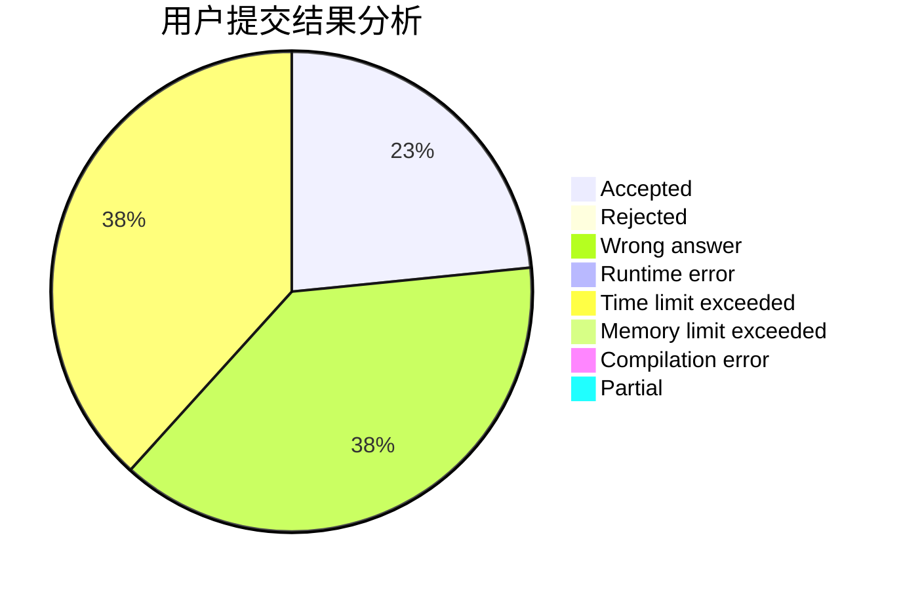
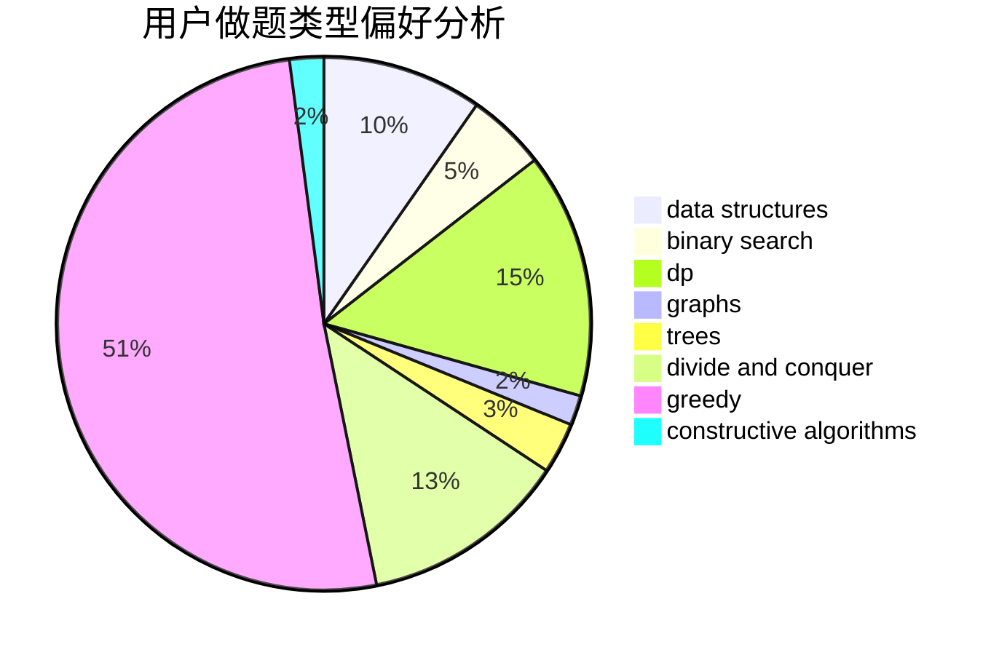
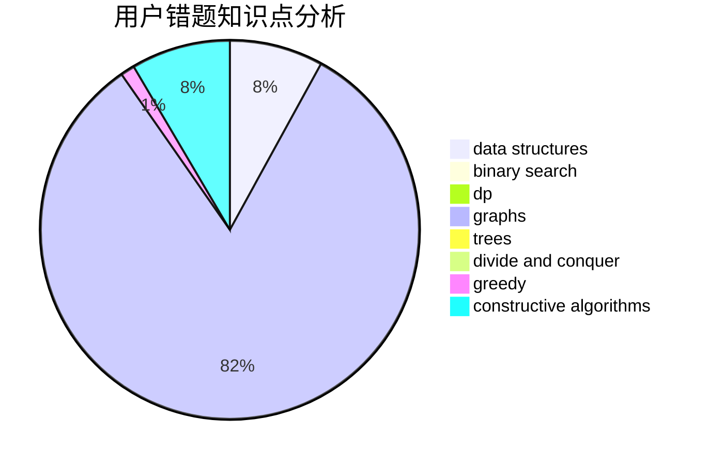

# DrCold

<!-- tabs:start -->

#### **用户提交结果分析**

#### **用户做题类型偏好分析**

#### **用户错题知识点分析**

<!-- tabs:end -->
# 推荐题目
[1384B1](https://codeforces.com/contest/1384B/problem/1)		brute force,
                        dp,
                        greedy		  
[789D](https://codeforces.com/contest/789/problem/D)		dsu,graphs,sortings,trees		  
[645E](https://codeforces.com/contest/645/problem/E)		dp,
                        greedy,
                        strings		  
[670D1](https://codeforces.com/contest/670D/problem/1)		binary search,
                        brute force,
                        implementation		  
[1064E](https://codeforces.com/contest/1064/problem/E)		dsu,graphs,sortings,trees		  
[645G](https://codeforces.com/contest/645/problem/G)		binary search,
                        geometry		  
[449B](https://codeforces.com/contest/449/problem/B)		graphs,
                        greedy,
                        shortest paths		  
[1394E](https://codeforces.com/contest/1394/problem/E)		strings		  
[591C](https://codeforces.com/contest/591/problem/C)		dsu,graphs,sortings,trees		  
[791C](https://codeforces.com/contest/791/problem/C)		dsu,graphs,sortings,trees		  
