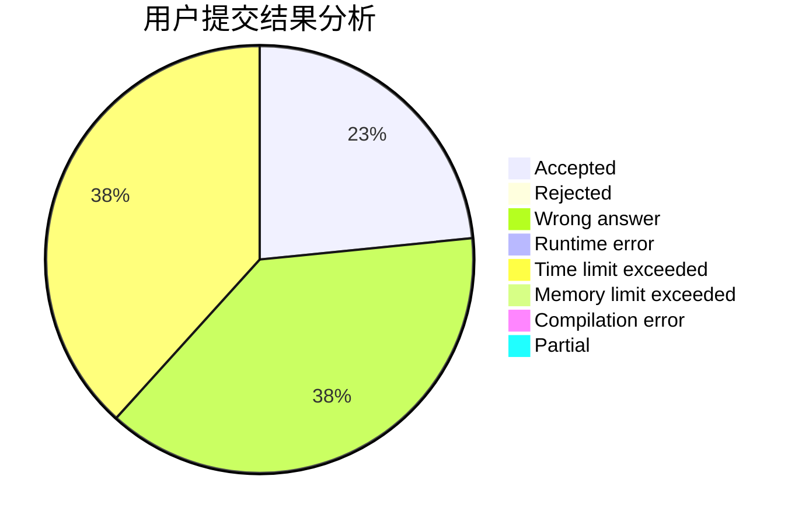
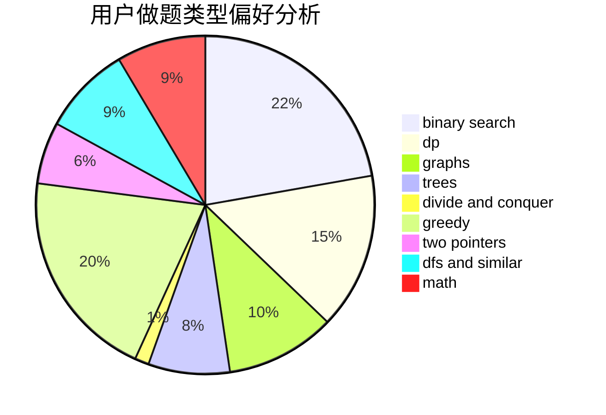

# DrCold

<!-- tabs:start -->

#### **用户提交结果分析**

#### **用户做题类型偏好分析**

<!-- tabs:end -->
# 推荐题目
[1394A](https://codeforces.com/contest/1394/problem/A)
[804F](https://codeforces.com/contest/804/problem/F)
[672A](https://codeforces.com/contest/672/problem/A)
[696B](https://codeforces.com/contest/696/problem/B)
[1065B](https://codeforces.com/contest/1065/problem/B)
[672C](https://codeforces.com/contest/672/problem/C)
[468E](https://codeforces.com/contest/468/problem/E)
[1403A](https://codeforces.com/contest/1403/problem/A)
[611A](https://codeforces.com/contest/611/problem/A)
[807A](https://codeforces.com/contest/807/problem/A)
