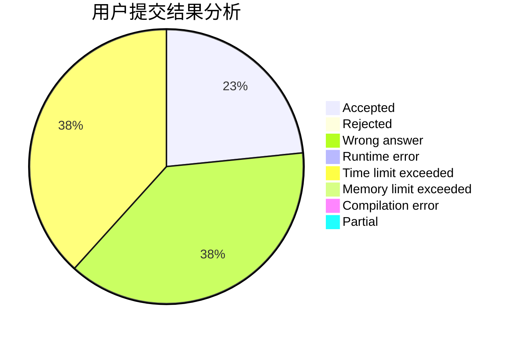
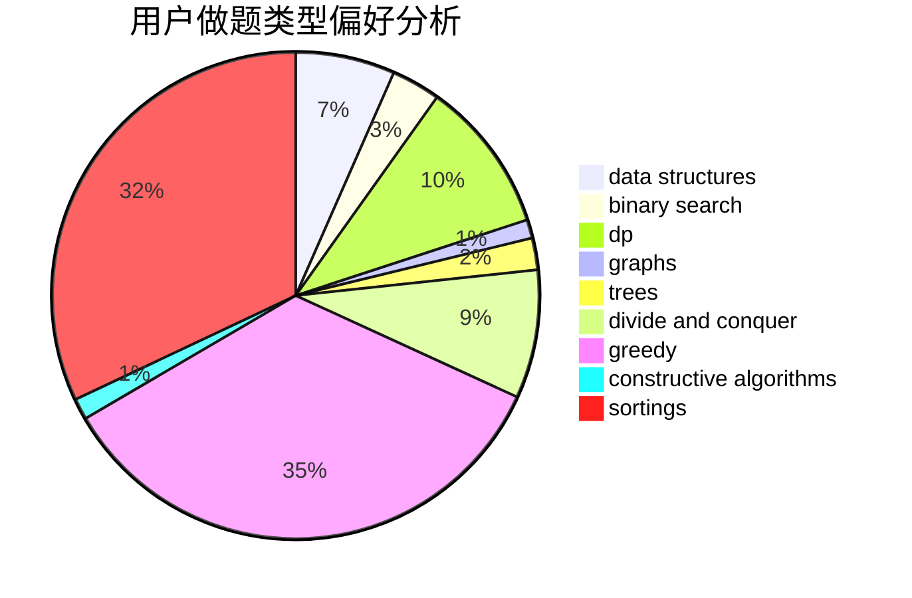
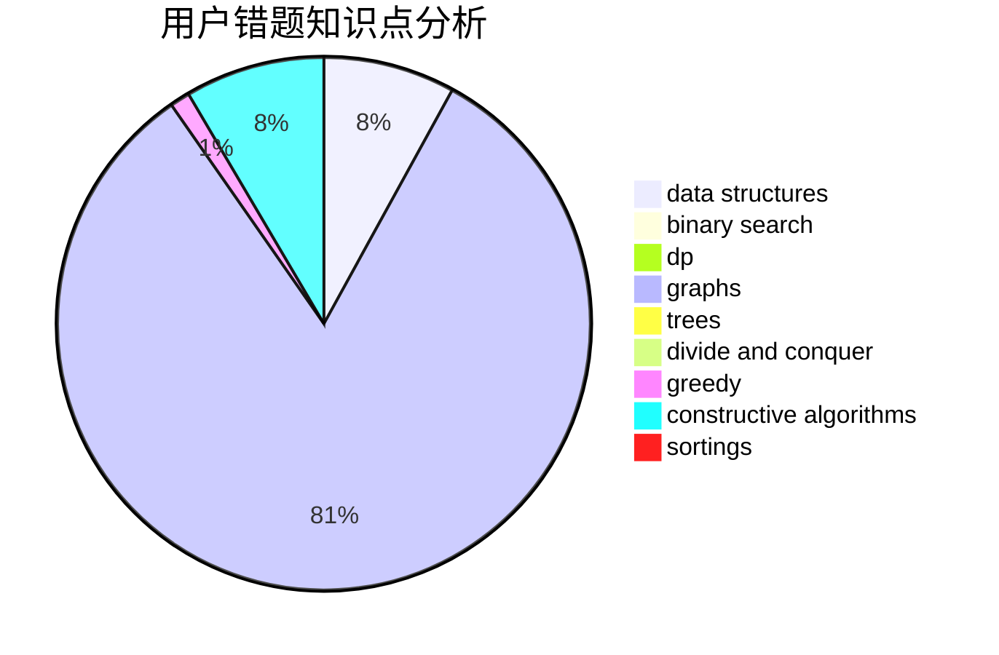

# DrCold
<!-- tabs:start -->
#### **用户提交结果分析**

#### **用户做题类型偏好分析**

#### **用户错题知识点分析**

<!-- tabs:end -->
# 推荐题目
[789D](https://codeforces.com/contest/789/problem/D)		combinatorics,
                        constructive algorithms,
                        dfs and similar,
                        dsu,
                        graphs		  
[1384B1](http://codeforces.com/problemset/problem/1384/B1)		brute force,
                        dp,
                        greedy		  
[1064E](https://codeforces.com/contest/1064/problem/E)		binary search,
                        constructive algorithms,
                        geometry,
                        interactive		  
[645E](http://codeforces.com/problemset/problem/645/E)		dp,
                        greedy,
                        strings		  
[670D1](http://codeforces.com/problemset/problem/670/D1)		binary search,
                        brute force,
                        implementation		  
[591C](https://codeforces.com/contest/591/problem/C)		implementation		  
[1394E](http://codeforces.com/problemset/problem/1394/E)		strings		  
[36D](http://codeforces.com/problemset/problem/36/D)		games		  
[789C](https://codeforces.com/contest/789/problem/C)		dp,
                        two pointers		  
[1219C](http://codeforces.com/problemset/problem/1219/C)		implementation,
                        strings		  
<!-- tabs:start -->
#### **data structures**
[150E](http://codeforces.com/problemset/problem/150/E)		binary search,
                        data structures,
                        divide and conquer,
                        trees		  
[452E](http://codeforces.com/problemset/problem/452/E)		data structures,
                        dsu,
                        string suffix structures,
                        strings		  
[1492C](http://codeforces.com/problemset/problem/1492/C)		binary search,
                        data structures,
                        dp,
                        greedy,
                        two pointers		  
[1490G](http://codeforces.com/problemset/problem/1490/G)		binary search,
                        data structures,
                        math		  
[1479D](http://codeforces.com/problemset/problem/1479/D)		binary search,
                        bitmasks,
                        brute force,
                        data structures,
                        probabilities,
                        trees		  
[1497A](http://codeforces.com/problemset/problem/1497/A)		brute force,
                        data structures,
                        greedy,
                        sortings		  
[1491C](http://codeforces.com/problemset/problem/1491/C)		brute force,
                        data structures,
                        dp,
                        greedy,
                        implementation		  
[1492B](http://codeforces.com/problemset/problem/1492/B)		data structures,
                        greedy,
                        math		  
[1436E](http://codeforces.com/problemset/problem/1436/E)		binary search,
                        data structures,
                        two pointers		  
[1461D](http://codeforces.com/problemset/problem/1461/D)		binary search,
                        brute force,
                        data structures,
                        divide and conquer,
                        implementation,
                        sortings		  
#### **binary search**
[1064E](https://codeforces.com/contest/1064/problem/E)		binary search,
                        constructive algorithms,
                        geometry,
                        interactive		  
[670D1](http://codeforces.com/problemset/problem/670/D1)		binary search,
                        brute force,
                        implementation		  
[645G](http://codeforces.com/problemset/problem/645/G)		binary search,
                        geometry		  
[1103B](http://codeforces.com/problemset/problem/1103/B)		binary search,
                        constructive algorithms,
                        interactive		  
[1493C](http://codeforces.com/problemset/problem/1493/C)		binary search,
                        brute force,
                        constructive algorithms,
                        greedy,
                        strings		  
[150E](http://codeforces.com/problemset/problem/150/E)		binary search,
                        data structures,
                        divide and conquer,
                        trees		  
[1492C](http://codeforces.com/problemset/problem/1492/C)		binary search,
                        data structures,
                        dp,
                        greedy,
                        two pointers		  
[1463D](http://codeforces.com/problemset/problem/1463/D)		binary search,
                        constructive algorithms,
                        greedy,
                        two pointers		  
[1490G](http://codeforces.com/problemset/problem/1490/G)		binary search,
                        data structures,
                        math		  
[1479D](http://codeforces.com/problemset/problem/1479/D)		binary search,
                        bitmasks,
                        brute force,
                        data structures,
                        probabilities,
                        trees		  
#### **dp**
[1384B1](http://codeforces.com/problemset/problem/1384/B1)		brute force,
                        dp,
                        greedy		  
[645E](http://codeforces.com/problemset/problem/645/E)		dp,
                        greedy,
                        strings		  
[789C](https://codeforces.com/contest/789/problem/C)		dp,
                        two pointers		  
[128C](http://codeforces.com/problemset/problem/128/C)		combinatorics,
                        dp		  
[78C](http://codeforces.com/problemset/problem/78/C)		dp,
                        games,
                        number theory		  
[1240C](https://codeforces.com/contest/1240/problem/C)		brute force,
                        constructive algorithms,
                        dp,
                        graphs,
                        implementation,
                        trees		  
[1342F](http://codeforces.com/problemset/problem/1342/F)		bitmasks,
                        brute force,
                        dp		  
[1340C](http://codeforces.com/problemset/problem/1340/C)		dfs and similar,
                        dp,
                        graphs,
                        shortest paths		  
[364B](http://codeforces.com/problemset/problem/364/B)		dp,
                        greedy		  
[455C](http://codeforces.com/problemset/problem/455/C)		dfs and similar,
                        dp,
                        dsu,
                        ternary search,
                        trees		  
#### **graph**
[789D](https://codeforces.com/contest/789/problem/D)		combinatorics,
                        constructive algorithms,
                        dfs and similar,
                        dsu,
                        graphs		  
[791B](https://codeforces.com/contest/791/problem/B)		dfs and similar,
                        dsu,
                        graphs		  
[449B](http://codeforces.com/problemset/problem/449/B)		graphs,
                        greedy,
                        shortest paths		  
[1240C](https://codeforces.com/contest/1240/problem/C)		brute force,
                        constructive algorithms,
                        dp,
                        graphs,
                        implementation,
                        trees		  
[1340C](http://codeforces.com/problemset/problem/1340/C)		dfs and similar,
                        dp,
                        graphs,
                        shortest paths		  
[1487C](http://codeforces.com/problemset/problem/1487/C)		brute force,
                        constructive algorithms,
                        dfs and similar,
                        graphs,
                        greedy,
                        implementation,
                        math		  
[1437C](http://codeforces.com/problemset/problem/1437/C)		dp,
                        flows,
                        graph matchings,
                        greedy,
                        math,
                        sortings		  
[1470D](http://codeforces.com/problemset/problem/1470/D)		constructive algorithms,
                        dfs and similar,
                        graph matchings,
                        graphs,
                        greedy		  
[1476C](http://codeforces.com/problemset/problem/1476/C)		dp,
                        graphs,
                        greedy		  
[1304D](http://codeforces.com/problemset/problem/1304/D)		constructive algorithms,
                        graphs,
                        greedy,
                        two pointers		  
#### **trees**
[1240C](https://codeforces.com/contest/1240/problem/C)		brute force,
                        constructive algorithms,
                        dp,
                        graphs,
                        implementation,
                        trees		  
[455C](http://codeforces.com/problemset/problem/455/C)		dfs and similar,
                        dp,
                        dsu,
                        ternary search,
                        trees		  
[150E](http://codeforces.com/problemset/problem/150/E)		binary search,
                        data structures,
                        divide and conquer,
                        trees		  
[1479D](http://codeforces.com/problemset/problem/1479/D)		binary search,
                        bitmasks,
                        brute force,
                        data structures,
                        probabilities,
                        trees		  
[1511C](http://codeforces.com/problemset/problem/1511/C)		brute force,
                        data structures,
                        implementation,
                        trees		  
[1499F](http://codeforces.com/problemset/problem/1499/F)		combinatorics,
                        dfs and similar,
                        dp,
                        trees		  
[1491E](http://codeforces.com/problemset/problem/1491/E)		brute force,
                        dfs and similar,
                        divide and conquer,
                        number theory,
                        trees		  
[1466D](http://codeforces.com/problemset/problem/1466/D)		data structures,
                        greedy,
                        sortings,
                        trees		  
[1495D](http://codeforces.com/problemset/problem/1495/D)		combinatorics,
                        dfs and similar,
                        graphs,
                        math,
                        shortest paths,
                        trees		  
[1303G](http://codeforces.com/problemset/problem/1303/G)		data structures,
                        divide and conquer,
                        geometry,
                        trees		  
#### **divide and conquer**
[150E](http://codeforces.com/problemset/problem/150/E)		binary search,
                        data structures,
                        divide and conquer,
                        trees		  
[1461D](http://codeforces.com/problemset/problem/1461/D)		binary search,
                        brute force,
                        data structures,
                        divide and conquer,
                        implementation,
                        sortings		  
[1466G](http://codeforces.com/problemset/problem/1466/G)		combinatorics,
                        divide and conquer,
                        hashing,
                        math,
                        string suffix structures,
                        strings		  
[1490D](http://codeforces.com/problemset/problem/1490/D)		dfs and similar,
                        divide and conquer,
                        implementation		  
[1483C](https://codeforces.com/contest/1483/problem/C)		data structures,
                        divide and conquer,
                        dp		  
[1491E](http://codeforces.com/problemset/problem/1491/E)		brute force,
                        dfs and similar,
                        divide and conquer,
                        number theory,
                        trees		  
[1303G](http://codeforces.com/problemset/problem/1303/G)		data structures,
                        divide and conquer,
                        geometry,
                        trees		  
[1494D](http://codeforces.com/problemset/problem/1494/D)		constructive algorithms,
                        data structures,
                        dfs and similar,
                        divide and conquer,
                        dsu,
                        greedy,
                        sortings,
                        trees		  
[1482E](http://codeforces.com/problemset/problem/1482/E)		data structures,
                        divide and conquer,
                        dp		  
[566C](http://codeforces.com/problemset/problem/566/C)		dfs and similar,
                        divide and conquer,
                        trees		  
#### **greedy**
[1384B1](http://codeforces.com/problemset/problem/1384/B1)		brute force,
                        dp,
                        greedy		  
[645E](http://codeforces.com/problemset/problem/645/E)		dp,
                        greedy,
                        strings		  
[449B](http://codeforces.com/problemset/problem/449/B)		graphs,
                        greedy,
                        shortest paths		  
[651B](http://codeforces.com/problemset/problem/651/B)		greedy,
                        sortings		  
[246A](http://codeforces.com/problemset/problem/246/A)		constructive algorithms,
                        greedy,
                        sortings		  
[791C](https://codeforces.com/contest/791/problem/C)		constructive algorithms,
                        greedy		  
[734B](http://codeforces.com/problemset/problem/734/B)		brute force,
                        greedy,
                        implementation,
                        math		  
[790A](https://codeforces.com/contest/790/problem/A)		constructive algorithms,
                        greedy		  
[364B](http://codeforces.com/problemset/problem/364/B)		dp,
                        greedy		  
[1493C](http://codeforces.com/problemset/problem/1493/C)		binary search,
                        brute force,
                        constructive algorithms,
                        greedy,
                        strings		  
#### **constructive algorithms**
[789D](https://codeforces.com/contest/789/problem/D)		combinatorics,
                        constructive algorithms,
                        dfs and similar,
                        dsu,
                        graphs		  
[1064E](https://codeforces.com/contest/1064/problem/E)		binary search,
                        constructive algorithms,
                        geometry,
                        interactive		  
[246A](http://codeforces.com/problemset/problem/246/A)		constructive algorithms,
                        greedy,
                        sortings		  
[1240C](https://codeforces.com/contest/1240/problem/C)		brute force,
                        constructive algorithms,
                        dp,
                        graphs,
                        implementation,
                        trees		  
[791C](https://codeforces.com/contest/791/problem/C)		constructive algorithms,
                        greedy		  
[1336D](http://codeforces.com/problemset/problem/1336/D)		constructive algorithms,
                        interactive		  
[790A](https://codeforces.com/contest/790/problem/A)		constructive algorithms,
                        greedy		  
[449C](http://codeforces.com/problemset/problem/449/C)		constructive algorithms,
                        number theory		  
[1103B](http://codeforces.com/problemset/problem/1103/B)		binary search,
                        constructive algorithms,
                        interactive		  
[1493C](http://codeforces.com/problemset/problem/1493/C)		binary search,
                        brute force,
                        constructive algorithms,
                        greedy,
                        strings		  
#### **sortings**
[651B](http://codeforces.com/problemset/problem/651/B)		greedy,
                        sortings		  
[246A](http://codeforces.com/problemset/problem/246/A)		constructive algorithms,
                        greedy,
                        sortings		  
[1106C](http://codeforces.com/problemset/problem/1106/C)		greedy,
                        implementation,
                        math,
                        sortings		  
[1375D](http://codeforces.com/problemset/problem/1375/D)		brute force,
                        constructive algorithms,
                        sortings		  
[1496C](https://codeforces.com/contest/1496/problem/C)		geometry,
                        greedy,
                        math,
                        sortings		  
[1495A](http://codeforces.com/problemset/problem/1495/A)		geometry,
                        greedy,
                        math,
                        sortings		  
[1497A](http://codeforces.com/problemset/problem/1497/A)		brute force,
                        data structures,
                        greedy,
                        sortings		  
[1427A](http://codeforces.com/problemset/problem/1427/A)		math,
                        sortings		  
[1461D](http://codeforces.com/problemset/problem/1461/D)		binary search,
                        brute force,
                        data structures,
                        divide and conquer,
                        implementation,
                        sortings		  
[1437C](http://codeforces.com/problemset/problem/1437/C)		dp,
                        flows,
                        graph matchings,
                        greedy,
                        math,
                        sortings		  
<!-- tabs:end -->
