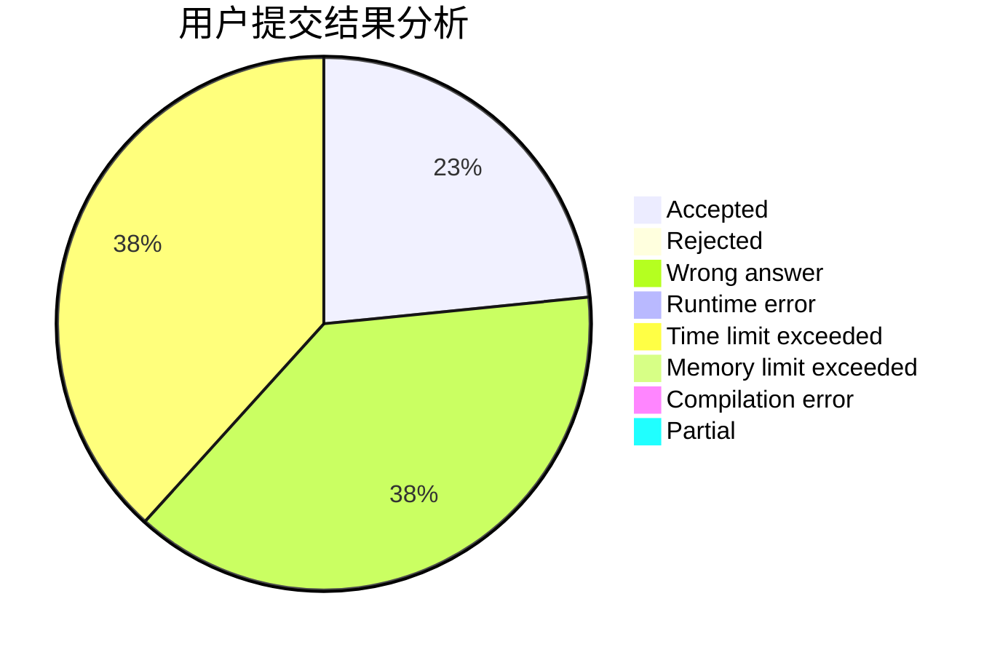
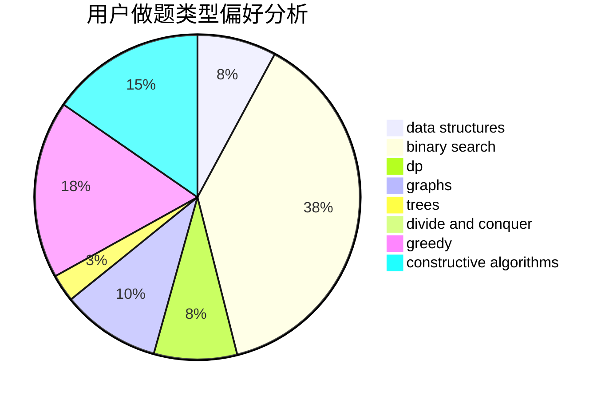

# DrCold

<!-- tabs:start -->

#### **用户提交结果分析**

#### **用户做题类型偏好分析**

#### **用户错题知识点分析**

<!-- tabs:end -->
# 推荐题目
[1394A](https://codeforces.com/contest/1394/problem/A)		dp,
                        greedy,
                        sortings,
                        two pointers		  
[804F](https://codeforces.com/contest/804/problem/F)		combinatorics,
                        dfs and similar,
                        dp,
                        graphs,
                        number theory		  
[672A](https://codeforces.com/contest/672/problem/A)		implementation		  
[696B](https://codeforces.com/contest/696/problem/B)		dfs and similar,
                        math,
                        probabilities,
                        trees		  
[1065B](https://codeforces.com/contest/1065/problem/B)		constructive algorithms,
                        graphs		  
[672C](https://codeforces.com/contest/672/problem/C)		dsu,graphs,sortings,trees		  
[468E](https://codeforces.com/contest/468/problem/E)		dp,
                        graph matchings,
                        math,
                        meet-in-the-middle		  
[1403A](https://codeforces.com/contest/1403/problem/A)		*special problem,
                        2-sat,
                        binary search,
                        data structures,
                        graphs,
                        interactive,
                        sortings,
                        two pointers		  
[611A](https://codeforces.com/contest/611/problem/A)		implementation		  
[807A](https://codeforces.com/contest/807/problem/A)		implementation,
                        sortings		  
