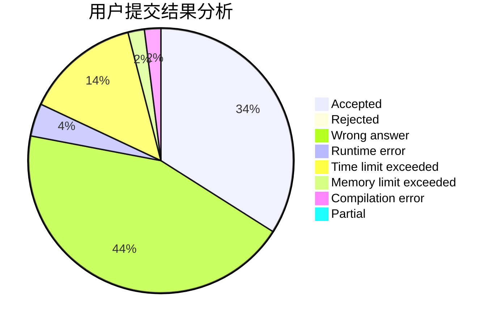
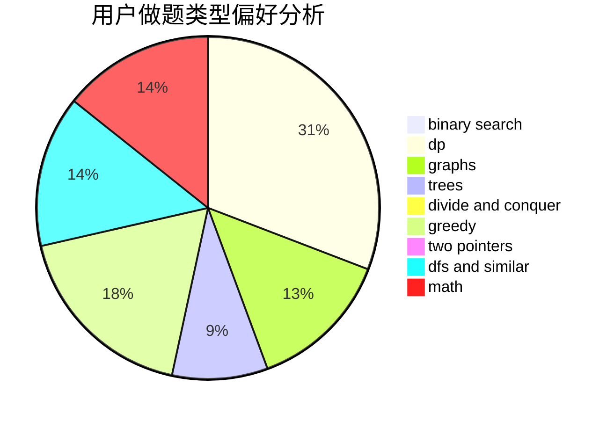

# DrIsaac

<!-- tabs:start -->

#### **用户提交结果分析**

#### **用户做题类型偏好分析**

<!-- tabs:end -->
# 推荐题目
[585B](https://codeforces.com/contest/585/problem/B)
[494E](https://codeforces.com/contest/494/problem/E)
[807C](https://codeforces.com/contest/807/problem/C)
[574A](https://codeforces.com/contest/574/problem/A)
[807B](https://codeforces.com/contest/807/problem/B)
[1136D](https://codeforces.com/contest/1136/problem/D)
[446B](https://codeforces.com/contest/446/problem/B)
[1415F](https://codeforces.com/contest/1415/problem/F)
[1011C](https://codeforces.com/contest/1011/problem/C)
[768D](https://codeforces.com/contest/768/problem/D)
