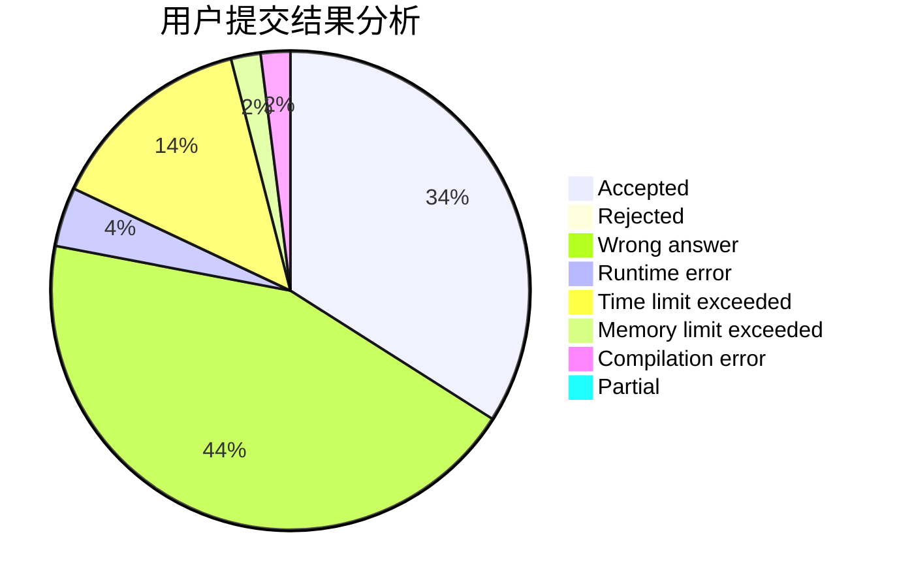
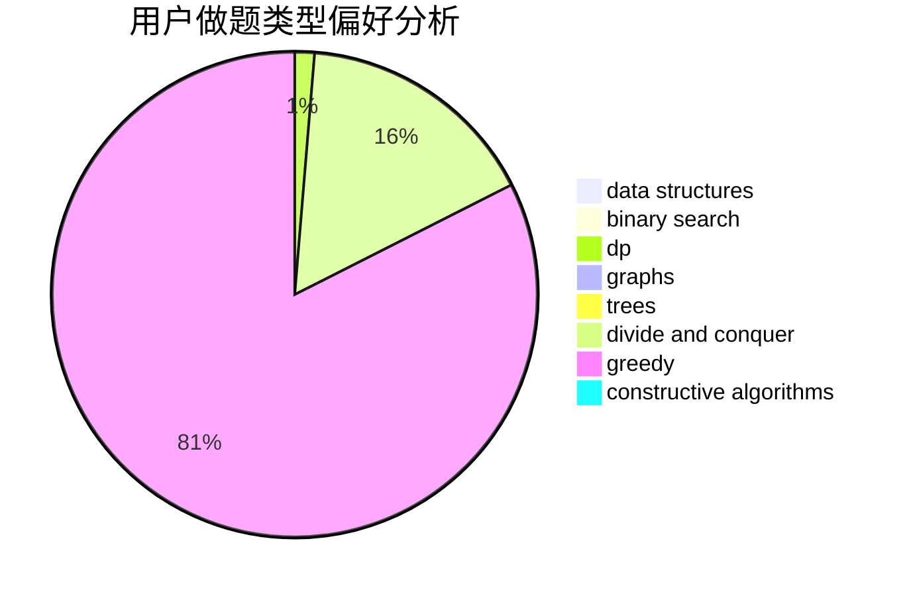
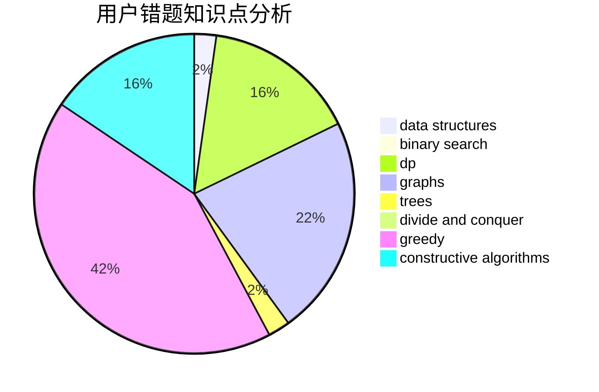

# DrIsaac

<!-- tabs:start -->

#### **用户提交结果分析**

#### **用户做题类型偏好分析**

#### **用户错题知识点分析**

<!-- tabs:end -->
# 推荐题目
[566C](https://codeforces.com/contest/566/problem/C)		dfs and similar,
                        divide and conquer,
                        trees		  
[476A](https://codeforces.com/contest/476/problem/A)		implementation,
                        math		  
[791E](https://codeforces.com/contest/791/problem/E)		dsu,graphs,sortings,trees		  
[549B](https://codeforces.com/contest/549/problem/B)		constructive algorithms,
                        dfs and similar,
                        graphs,
                        greedy		  
[791D](https://codeforces.com/contest/791/problem/D)		dsu,graphs,sortings,trees		  
[1132E](https://codeforces.com/contest/1132/problem/E)		dfs and similar,
                        dp,
                        greedy		  
[420D](https://codeforces.com/contest/420/problem/D)		data structures		  
[1404D](https://codeforces.com/contest/1404/problem/D)		constructive algorithms,
                        dfs and similar,
                        interactive,
                        math,
                        number theory		  
[1010F](https://codeforces.com/contest/1010/problem/F)		fft,
                        graphs,
                        trees		  
[749D](https://codeforces.com/contest/749/problem/D)		binary search,
                        data structures		  
