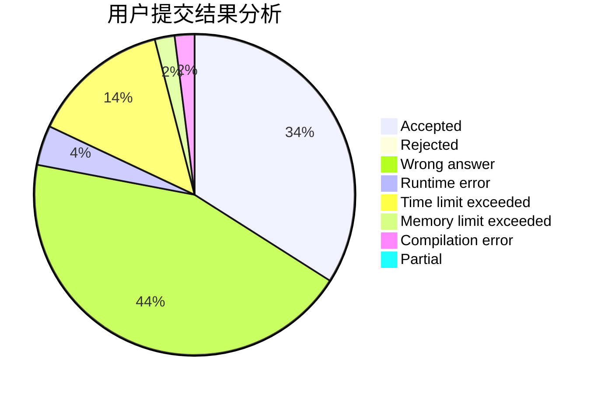
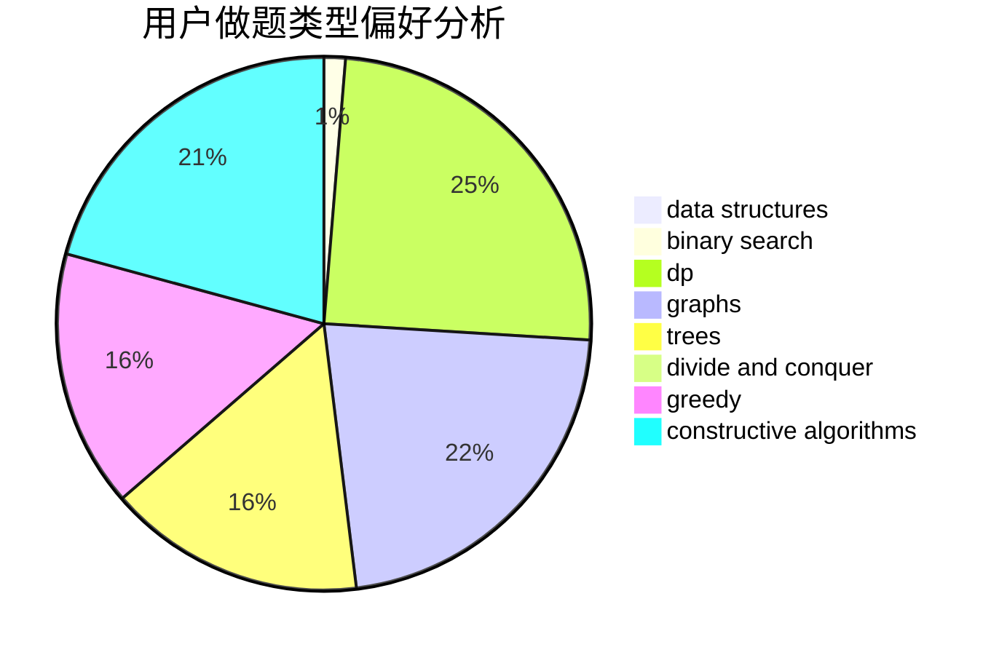
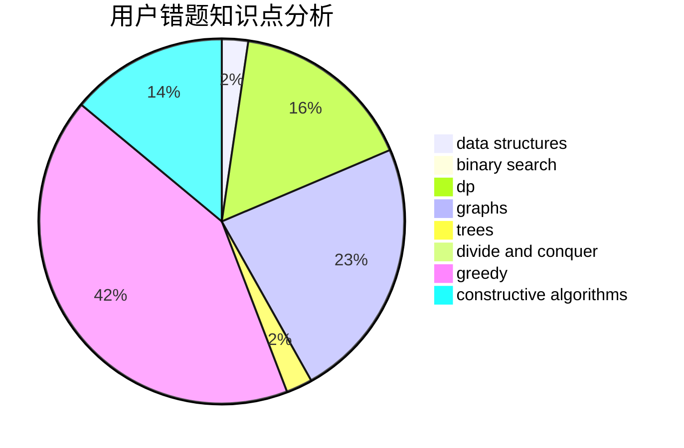

# DrIsaac

<!-- tabs:start -->

#### **用户提交结果分析**

#### **用户做题类型偏好分析**

#### **用户错题知识点分析**

<!-- tabs:end -->
# 推荐题目
[585B](https://codeforces.com/contest/585/problem/B)		dfs and similar,
                        graphs,
                        shortest paths		  
[494E](https://codeforces.com/contest/494/problem/E)		data structures,
                        games		  
[807C](https://codeforces.com/contest/807/problem/C)		dsu,graphs,sortings,trees		  
[574A](https://codeforces.com/contest/574/problem/A)		greedy,
                        implementation		  
[807B](https://codeforces.com/contest/807/problem/B)		brute force,
                        implementation		  
[1136D](https://codeforces.com/contest/1136/problem/D)		greedy		  
[446B](https://codeforces.com/contest/446/problem/B)		brute force,
                        data structures,
                        greedy		  
[1415F](https://codeforces.com/contest/1415/problem/F)		dp		  
[1011C](https://codeforces.com/contest/1011/problem/C)		dsu,graphs,sortings,trees		  
[768D](https://codeforces.com/contest/768/problem/D)		dp,
                        math,
                        probabilities		  
