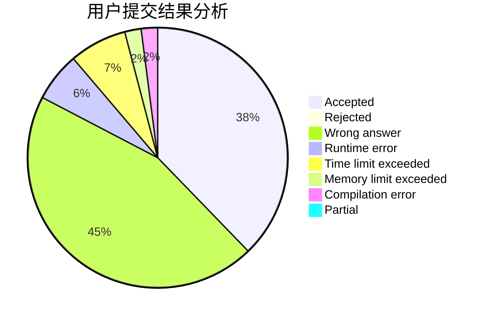
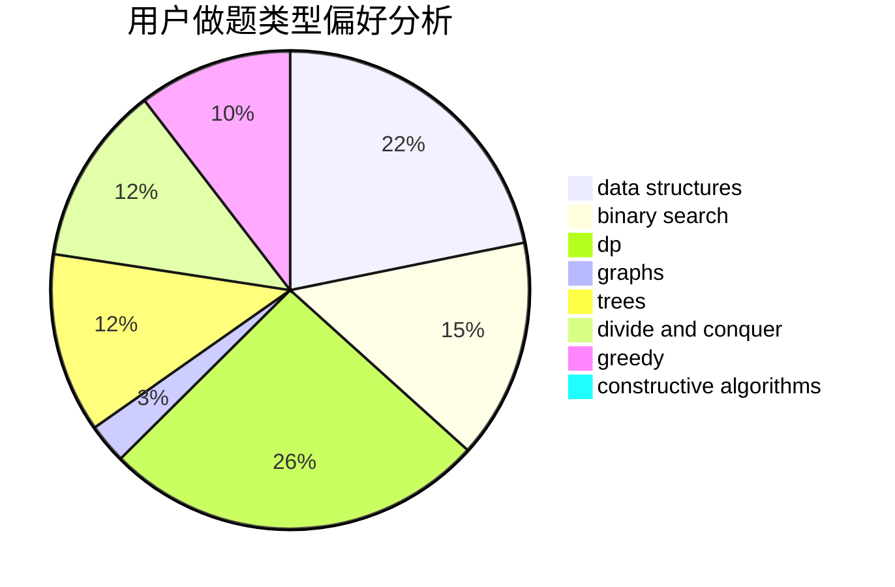
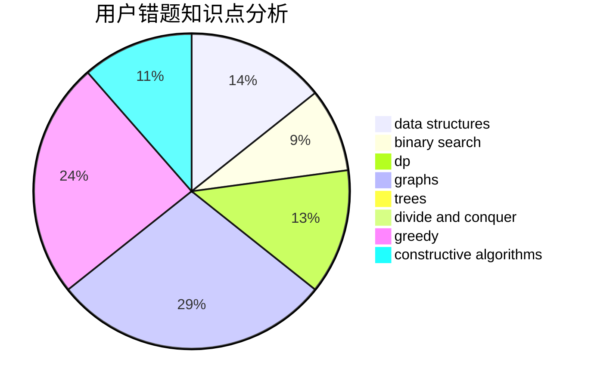

# Dragon_hao

<!-- tabs:start -->

#### **用户提交结果分析**

#### **用户做题类型偏好分析**

#### **用户错题知识点分析**

<!-- tabs:end -->
# 推荐题目
[705C](https://codeforces.com/contest/705/problem/C)		dsu,graphs,sortings,trees		  
[808A](https://codeforces.com/contest/808/problem/A)		implementation		  
[343A](https://codeforces.com/contest/343/problem/A)		math,
                        number theory		  
[807E](https://codeforces.com/contest/807/problem/E)		dsu,graphs,sortings,trees		  
[1280A](https://codeforces.com/contest/1280/problem/A)		implementation,
                        math		  
[49A](https://codeforces.com/contest/49/problem/A)		implementation		  
[150E](https://codeforces.com/contest/150/problem/E)		binary search,
                        data structures,
                        divide and conquer,
                        trees		  
[243D](https://codeforces.com/contest/243/problem/D)		data structures,
                        dp,
                        geometry,
                        two pointers		  
[688A](https://codeforces.com/contest/688/problem/A)		implementation		  
[574A](https://codeforces.com/contest/574/problem/A)		greedy,
                        implementation		  
