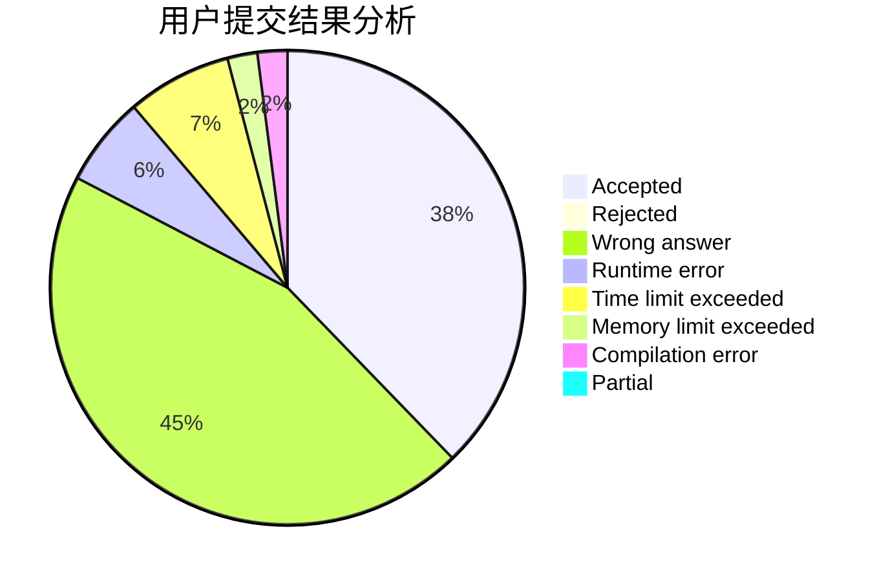
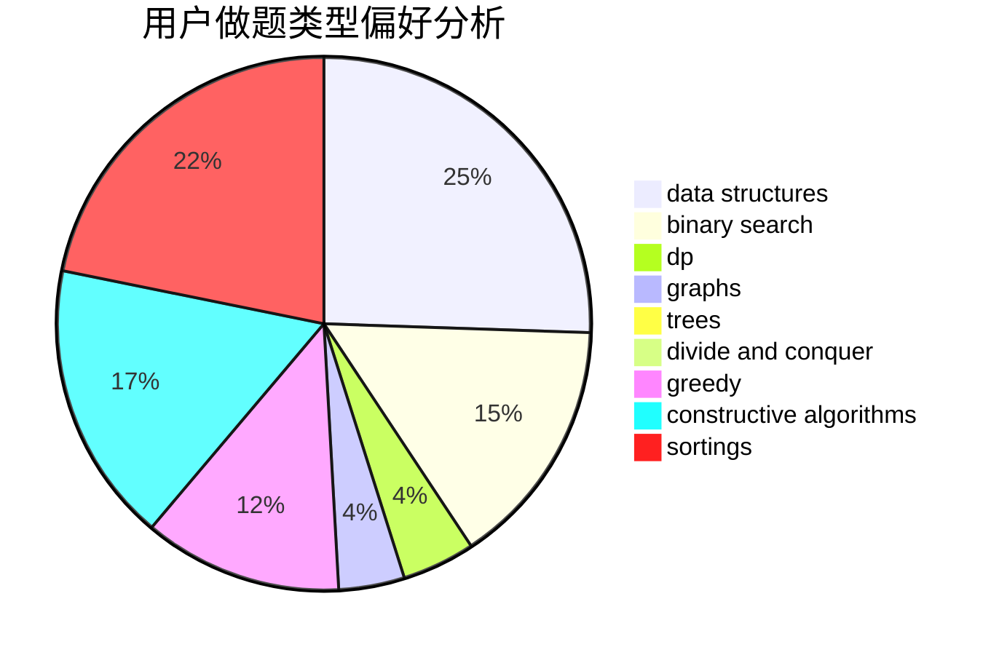
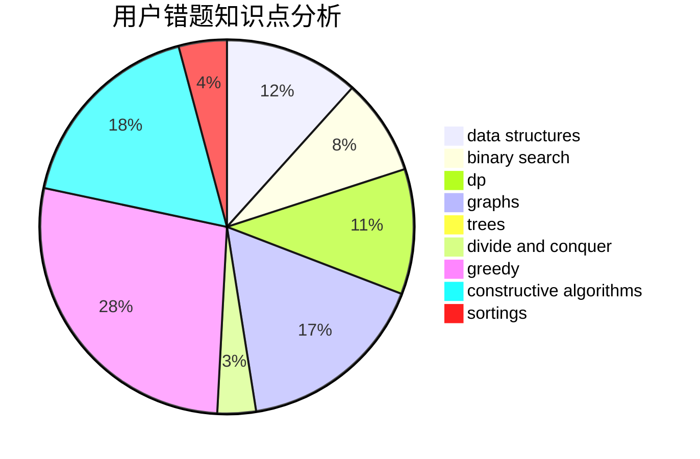

# Dragon_hao
<!-- tabs:start -->
#### **用户提交结果分析**

#### **用户做题类型偏好分析**

#### **用户错题知识点分析**

<!-- tabs:end -->
# 推荐题目
[792C](http://codeforces.com/problemset/problem/792/C)		dp,
                        greedy,
                        math,
                        number theory		  
[316E2](http://codeforces.com/problemset/problem/316/E2)		data structures,
                        math		  
[792B](http://codeforces.com/problemset/problem/792/B)		implementation		  
[1270H](http://codeforces.com/problemset/problem/1270/H)		data structures		  
[1457B](https://codeforces.com/contest/1457/problem/B)		brute force,
                        brute force,
                        greedy		  
[362C](http://codeforces.com/problemset/problem/362/C)		data structures,
                        dp,
                        implementation,
                        math		  
[479B](http://codeforces.com/problemset/problem/479/B)		brute force,
                        constructive algorithms,
                        greedy,
                        implementation,
                        sortings		  
[681E](http://codeforces.com/problemset/problem/681/E)		geometry,
                        sortings		  
[1385G](http://codeforces.com/problemset/problem/1385/G)		2-sat,
                        dfs and similar,
                        dsu,
                        graphs,
                        implementation		  
[1379B](http://codeforces.com/problemset/problem/1379/B)		binary search,
                        brute force,
                        math,
                        number theory		  
<!-- tabs:start -->
#### **data structures**
[316E2](http://codeforces.com/problemset/problem/316/E2)		data structures,
                        math		  
[1270H](http://codeforces.com/problemset/problem/1270/H)		data structures		  
[362C](http://codeforces.com/problemset/problem/362/C)		data structures,
                        dp,
                        implementation,
                        math		  
[1073D](http://codeforces.com/problemset/problem/1073/D)		binary search,
                        brute force,
                        data structures,
                        greedy		  
[549F](http://codeforces.com/problemset/problem/549/F)		data structures,
                        divide and conquer		  
[1117G](http://codeforces.com/problemset/problem/1117/G)		data structures		  
[1492C](http://codeforces.com/problemset/problem/1492/C)		binary search,
                        data structures,
                        dp,
                        greedy,
                        two pointers		  
[1490G](http://codeforces.com/problemset/problem/1490/G)		binary search,
                        data structures,
                        math		  
[1479D](http://codeforces.com/problemset/problem/1479/D)		binary search,
                        bitmasks,
                        brute force,
                        data structures,
                        probabilities,
                        trees		  
[1497A](http://codeforces.com/problemset/problem/1497/A)		brute force,
                        data structures,
                        greedy,
                        sortings		  
#### **binary search**
[1379B](http://codeforces.com/problemset/problem/1379/B)		binary search,
                        brute force,
                        math,
                        number theory		  
[1073D](http://codeforces.com/problemset/problem/1073/D)		binary search,
                        brute force,
                        data structures,
                        greedy		  
[1271E](http://codeforces.com/problemset/problem/1271/E)		binary search,
                        combinatorics,
                        dp,
                        math		  
[1492C](http://codeforces.com/problemset/problem/1492/C)		binary search,
                        data structures,
                        dp,
                        greedy,
                        two pointers		  
[1463D](http://codeforces.com/problemset/problem/1463/D)		binary search,
                        constructive algorithms,
                        greedy,
                        two pointers		  
[1490G](http://codeforces.com/problemset/problem/1490/G)		binary search,
                        data structures,
                        math		  
[1479D](http://codeforces.com/problemset/problem/1479/D)		binary search,
                        bitmasks,
                        brute force,
                        data structures,
                        probabilities,
                        trees		  
[1436E](http://codeforces.com/problemset/problem/1436/E)		binary search,
                        data structures,
                        two pointers		  
[1461D](http://codeforces.com/problemset/problem/1461/D)		binary search,
                        brute force,
                        data structures,
                        divide and conquer,
                        implementation,
                        sortings		  
[1493C](http://codeforces.com/problemset/problem/1493/C)		binary search,
                        brute force,
                        constructive algorithms,
                        greedy,
                        strings		  
#### **dp**
[792C](http://codeforces.com/problemset/problem/792/C)		dp,
                        greedy,
                        math,
                        number theory		  
[362C](http://codeforces.com/problemset/problem/362/C)		data structures,
                        dp,
                        implementation,
                        math		  
[1271E](http://codeforces.com/problemset/problem/1271/E)		binary search,
                        combinatorics,
                        dp,
                        math		  
[1091D](http://codeforces.com/problemset/problem/1091/D)		combinatorics,
                        dp,
                        math		  
[149D](http://codeforces.com/problemset/problem/149/D)		dp		  
[1492C](http://codeforces.com/problemset/problem/1492/C)		binary search,
                        data structures,
                        dp,
                        greedy,
                        two pointers		  
[1457C](https://codeforces.com/contest/1457/problem/C)		brute force,
                        dp,
                        implementation		  
[1491C](http://codeforces.com/problemset/problem/1491/C)		brute force,
                        data structures,
                        dp,
                        greedy,
                        implementation		  
[1437C](http://codeforces.com/problemset/problem/1437/C)		dp,
                        flows,
                        graph matchings,
                        greedy,
                        math,
                        sortings		  
[1499B](http://codeforces.com/problemset/problem/1499/B)		brute force,
                        dp,
                        greedy,
                        implementation		  
#### **graph**
[1385G](http://codeforces.com/problemset/problem/1385/G)		2-sat,
                        dfs and similar,
                        dsu,
                        graphs,
                        implementation		  
[225D](http://codeforces.com/problemset/problem/225/D)		bitmasks,
                        dfs and similar,
                        graphs,
                        implementation		  
[549B](http://codeforces.com/problemset/problem/549/B)		constructive algorithms,
                        dfs and similar,
                        graphs,
                        greedy		  
[1487C](http://codeforces.com/problemset/problem/1487/C)		brute force,
                        constructive algorithms,
                        dfs and similar,
                        graphs,
                        greedy,
                        implementation,
                        math		  
[1437C](http://codeforces.com/problemset/problem/1437/C)		dp,
                        flows,
                        graph matchings,
                        greedy,
                        math,
                        sortings		  
[1470D](http://codeforces.com/problemset/problem/1470/D)		constructive algorithms,
                        dfs and similar,
                        graph matchings,
                        graphs,
                        greedy		  
[1476C](http://codeforces.com/problemset/problem/1476/C)		dp,
                        graphs,
                        greedy		  
[1304D](http://codeforces.com/problemset/problem/1304/D)		constructive algorithms,
                        graphs,
                        greedy,
                        two pointers		  
[1475C](http://codeforces.com/problemset/problem/1475/C)		combinatorics,
                        graphs,
                        math		  
[553E](http://codeforces.com/problemset/problem/553/E)		dp,
                        fft,
                        graphs,
                        math,
                        probabilities		  
#### **trees**
[792D](http://codeforces.com/problemset/problem/792/D)		bitmasks,
                        trees		  
[715C](http://codeforces.com/problemset/problem/715/C)		dfs and similar,
                        divide and conquer,
                        dsu,
                        trees		  
[1479D](http://codeforces.com/problemset/problem/1479/D)		binary search,
                        bitmasks,
                        brute force,
                        data structures,
                        probabilities,
                        trees		  
[1511C](http://codeforces.com/problemset/problem/1511/C)		brute force,
                        data structures,
                        implementation,
                        trees		  
[1499F](http://codeforces.com/problemset/problem/1499/F)		combinatorics,
                        dfs and similar,
                        dp,
                        trees		  
[1491E](http://codeforces.com/problemset/problem/1491/E)		brute force,
                        dfs and similar,
                        divide and conquer,
                        number theory,
                        trees		  
[1466D](http://codeforces.com/problemset/problem/1466/D)		data structures,
                        greedy,
                        sortings,
                        trees		  
[1495D](http://codeforces.com/problemset/problem/1495/D)		combinatorics,
                        dfs and similar,
                        graphs,
                        math,
                        shortest paths,
                        trees		  
[1303G](http://codeforces.com/problemset/problem/1303/G)		data structures,
                        divide and conquer,
                        geometry,
                        trees		  
[1454E](http://codeforces.com/problemset/problem/1454/E)		combinatorics,
                        dfs and similar,
                        graphs,
                        trees		  
#### **divide and conquer**
[549F](http://codeforces.com/problemset/problem/549/F)		data structures,
                        divide and conquer		  
[715C](http://codeforces.com/problemset/problem/715/C)		dfs and similar,
                        divide and conquer,
                        dsu,
                        trees		  
[1461D](http://codeforces.com/problemset/problem/1461/D)		binary search,
                        brute force,
                        data structures,
                        divide and conquer,
                        implementation,
                        sortings		  
[1466G](http://codeforces.com/problemset/problem/1466/G)		combinatorics,
                        divide and conquer,
                        hashing,
                        math,
                        string suffix structures,
                        strings		  
[1490D](http://codeforces.com/problemset/problem/1490/D)		dfs and similar,
                        divide and conquer,
                        implementation		  
[1483C](https://codeforces.com/contest/1483/problem/C)		data structures,
                        divide and conquer,
                        dp		  
[1491E](http://codeforces.com/problemset/problem/1491/E)		brute force,
                        dfs and similar,
                        divide and conquer,
                        number theory,
                        trees		  
[1303G](http://codeforces.com/problemset/problem/1303/G)		data structures,
                        divide and conquer,
                        geometry,
                        trees		  
[1494D](http://codeforces.com/problemset/problem/1494/D)		constructive algorithms,
                        data structures,
                        dfs and similar,
                        divide and conquer,
                        dsu,
                        greedy,
                        sortings,
                        trees		  
[1482E](http://codeforces.com/problemset/problem/1482/E)		data structures,
                        divide and conquer,
                        dp		  
#### **greedy**
[792C](http://codeforces.com/problemset/problem/792/C)		dp,
                        greedy,
                        math,
                        number theory		  
[1457B](https://codeforces.com/contest/1457/problem/B)		brute force,
                        brute force,
                        greedy		  
[479B](http://codeforces.com/problemset/problem/479/B)		brute force,
                        constructive algorithms,
                        greedy,
                        implementation,
                        sortings		  
[549B](http://codeforces.com/problemset/problem/549/B)		constructive algorithms,
                        dfs and similar,
                        graphs,
                        greedy		  
[1073D](http://codeforces.com/problemset/problem/1073/D)		binary search,
                        brute force,
                        data structures,
                        greedy		  
[1173B](http://codeforces.com/problemset/problem/1173/B)		constructive algorithms,
                        greedy		  
[1492C](http://codeforces.com/problemset/problem/1492/C)		binary search,
                        data structures,
                        dp,
                        greedy,
                        two pointers		  
[1496C](https://codeforces.com/contest/1496/problem/C)		geometry,
                        greedy,
                        math,
                        sortings		  
[1493A](http://codeforces.com/problemset/problem/1493/A)		constructive algorithms,
                        greedy		  
[1463D](http://codeforces.com/problemset/problem/1463/D)		binary search,
                        constructive algorithms,
                        greedy,
                        two pointers		  
#### **constructive algorithms**
[479B](http://codeforces.com/problemset/problem/479/B)		brute force,
                        constructive algorithms,
                        greedy,
                        implementation,
                        sortings		  
[734F](http://codeforces.com/problemset/problem/734/F)		bitmasks,
                        constructive algorithms,
                        implementation,
                        math		  
[549B](http://codeforces.com/problemset/problem/549/B)		constructive algorithms,
                        dfs and similar,
                        graphs,
                        greedy		  
[632B](http://codeforces.com/problemset/problem/632/B)		brute force,
                        constructive algorithms		  
[1173B](http://codeforces.com/problemset/problem/1173/B)		constructive algorithms,
                        greedy		  
[1493A](http://codeforces.com/problemset/problem/1493/A)		constructive algorithms,
                        greedy		  
[1463D](http://codeforces.com/problemset/problem/1463/D)		binary search,
                        constructive algorithms,
                        greedy,
                        two pointers		  
[1456B](https://codeforces.com/contest/1456/problem/B)		bitmasks,
                        brute force,
                        constructive algorithms		  
[1492D](http://codeforces.com/problemset/problem/1492/D)		bitmasks,
                        constructive algorithms,
                        greedy,
                        math		  
[1504D](https://codeforces.com/contest/1504/problem/D)		constructive algorithms,
                        games,
                        interactive		  
#### **sortings**
[479B](http://codeforces.com/problemset/problem/479/B)		brute force,
                        constructive algorithms,
                        greedy,
                        implementation,
                        sortings		  
[681E](http://codeforces.com/problemset/problem/681/E)		geometry,
                        sortings		  
[34C](http://codeforces.com/problemset/problem/34/C)		expression parsing,
                        implementation,
                        sortings,
                        strings		  
[792A](http://codeforces.com/problemset/problem/792/A)		implementation,
                        sortings		  
[1496C](https://codeforces.com/contest/1496/problem/C)		geometry,
                        greedy,
                        math,
                        sortings		  
[1495A](http://codeforces.com/problemset/problem/1495/A)		geometry,
                        greedy,
                        math,
                        sortings		  
[1497A](http://codeforces.com/problemset/problem/1497/A)		brute force,
                        data structures,
                        greedy,
                        sortings		  
[1427A](http://codeforces.com/problemset/problem/1427/A)		math,
                        sortings		  
[1461D](http://codeforces.com/problemset/problem/1461/D)		binary search,
                        brute force,
                        data structures,
                        divide and conquer,
                        implementation,
                        sortings		  
[1437C](http://codeforces.com/problemset/problem/1437/C)		dp,
                        flows,
                        graph matchings,
                        greedy,
                        math,
                        sortings		  
<!-- tabs:end -->
