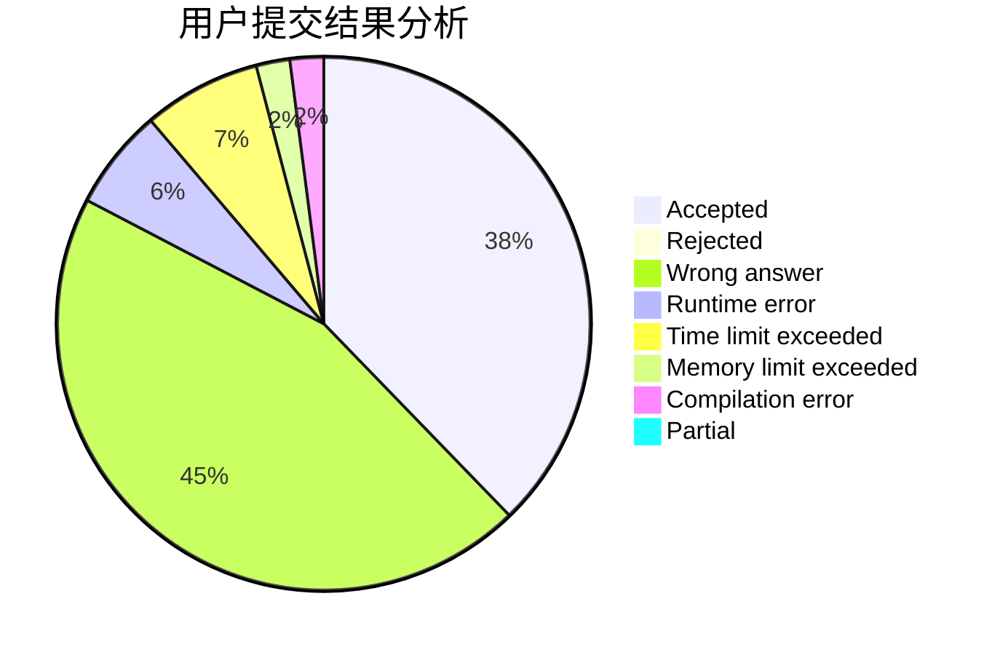
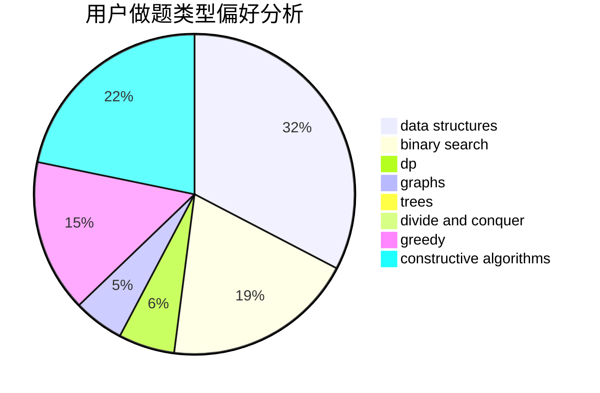
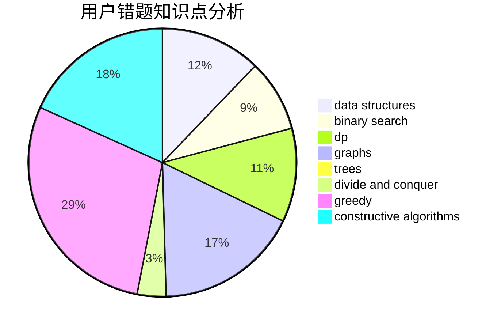

# Dragon_hao

<!-- tabs:start -->

#### **用户提交结果分析**

#### **用户做题类型偏好分析**

#### **用户错题知识点分析**

<!-- tabs:end -->
# 推荐题目
[681E](https://codeforces.com/contest/681/problem/E)		geometry,
                        sortings		  
[792B](https://codeforces.com/contest/792/problem/B)		implementation		  
[316E2](https://codeforces.com/contest/316E/problem/2)		data structures,
                        math		  
[792A](https://codeforces.com/contest/792/problem/A)		implementation,
                        sortings		  
[1270H](https://codeforces.com/contest/1270/problem/H)		data structures		  
[479B](https://codeforces.com/contest/479/problem/B)		brute force,
                        constructive algorithms,
                        greedy,
                        implementation,
                        sortings		  
[149D](https://codeforces.com/contest/149/problem/D)		dp		  
[225D](https://codeforces.com/contest/225/problem/D)		bitmasks,
                        dfs and similar,
                        graphs,
                        implementation		  
[666D](https://codeforces.com/contest/666/problem/D)		brute force,
                        geometry		  
[549B](https://codeforces.com/contest/549/problem/B)		constructive algorithms,
                        dfs and similar,
                        graphs,
                        greedy		  
