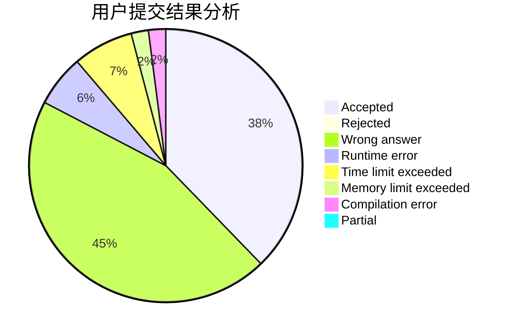
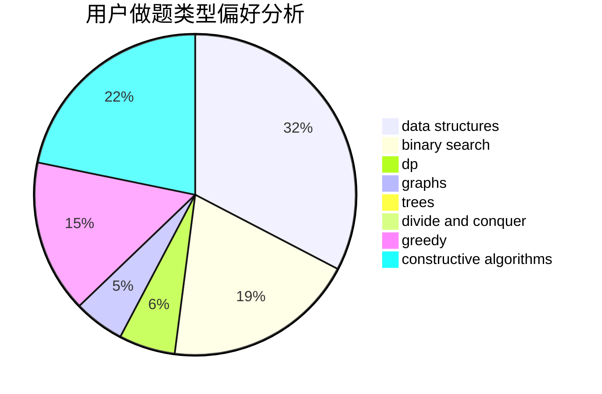
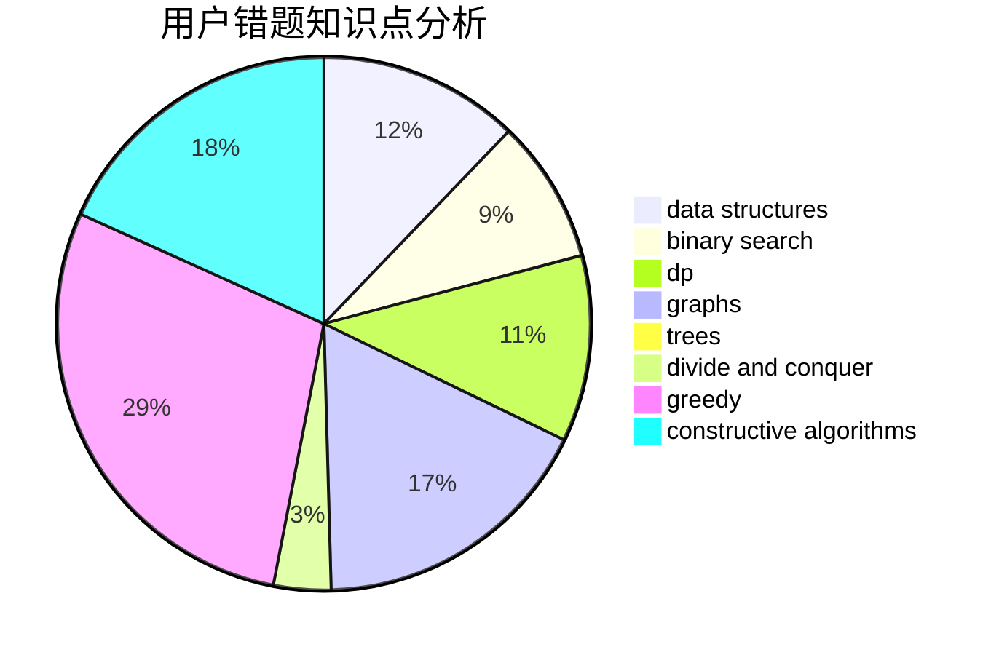

# Dragon_hao
<!-- tabs:start -->
#### **用户提交结果分析**

#### **用户做题类型偏好分析**

#### **用户错题知识点分析**

<!-- tabs:end -->
# 推荐题目
[Divide by Three](http://codeforces.com/problemset/problem/792/C)		dp,
                        greedy,
                        math,
                        number theory		  
[Summer Homework](http://codeforces.com/problemset/problem/316/E2)		data structures,
                        math		  
[Counting-out Rhyme](http://codeforces.com/problemset/problem/792/B)		implementation		  
[Number of Components](http://codeforces.com/problemset/problem/1270/H)		data structures		  
[Repainting Street](https://codeforces.com/contest/1457/problem/B)		brute force,
                        brute force,
                        greedy		  
[Insertion Sort](http://codeforces.com/problemset/problem/362/C)		data structures,
                        dp,
                        implementation,
                        math		  
[Towers](http://codeforces.com/problemset/problem/479/B)		brute force,
                        constructive algorithms,
                        greedy,
                        implementation,
                        sortings		  
[Runaway to a Shadow](http://codeforces.com/problemset/problem/681/E)		geometry,
                        sortings		  
[Columns Swaps](http://codeforces.com/problemset/problem/1385/G)		2-sat,
                        dfs and similar,
                        dsu,
                        graphs,
                        implementation		  
[Dubious Cyrpto](http://codeforces.com/problemset/problem/1379/B)		binary search,
                        brute force,
                        math,
                        number theory		  
<!-- tabs:start -->
#### **data structures**
[Summer Homework](http://codeforces.com/problemset/problem/316/E2)		data structures,
                        math		  
[Number of Components](http://codeforces.com/problemset/problem/1270/H)		data structures		  
[Insertion Sort](http://codeforces.com/problemset/problem/362/C)		data structures,
                        dp,
                        implementation,
                        math		  
[Berland Fair](http://codeforces.com/problemset/problem/1073/D)		binary search,
                        brute force,
                        data structures,
                        greedy		  
[Yura and Developers](http://codeforces.com/problemset/problem/549/F)		data structures,
                        divide and conquer		  
[Recursive Queries](http://codeforces.com/problemset/problem/1117/G)		data structures		  
[Maximum width](http://codeforces.com/problemset/problem/1492/C)		binary search,
                        data structures,
                        dp,
                        greedy,
                        two pointers		  
[Old Floppy Drive](http://codeforces.com/problemset/problem/1490/G)		binary search,
                        data structures,
                        math		  
[Odd Mineral Resource](http://codeforces.com/problemset/problem/1479/D)		binary search,
                        bitmasks,
                        brute force,
                        data structures,
                        probabilities,
                        trees		  
[Meximization](http://codeforces.com/problemset/problem/1497/A)		brute force,
                        data structures,
                        greedy,
                        sortings		  
#### **binary search**
[Dubious Cyrpto](http://codeforces.com/problemset/problem/1379/B)		binary search,
                        brute force,
                        math,
                        number theory		  
[Berland Fair](http://codeforces.com/problemset/problem/1073/D)		binary search,
                        brute force,
                        data structures,
                        greedy		  
[Common Number](http://codeforces.com/problemset/problem/1271/E)		binary search,
                        combinatorics,
                        dp,
                        math		  
[Maximum width](http://codeforces.com/problemset/problem/1492/C)		binary search,
                        data structures,
                        dp,
                        greedy,
                        two pointers		  
[Pairs](http://codeforces.com/problemset/problem/1463/D)		binary search,
                        constructive algorithms,
                        greedy,
                        two pointers		  
[Old Floppy Drive](http://codeforces.com/problemset/problem/1490/G)		binary search,
                        data structures,
                        math		  
[Odd Mineral Resource](http://codeforces.com/problemset/problem/1479/D)		binary search,
                        bitmasks,
                        brute force,
                        data structures,
                        probabilities,
                        trees		  
[Complicated Computations](http://codeforces.com/problemset/problem/1436/E)		binary search,
                        data structures,
                        two pointers		  
[Divide and Summarize](http://codeforces.com/problemset/problem/1461/D)		binary search,
                        brute force,
                        data structures,
                        divide and conquer,
                        implementation,
                        sortings		  
[K-beautiful Strings](http://codeforces.com/problemset/problem/1493/C)		binary search,
                        brute force,
                        constructive algorithms,
                        greedy,
                        strings		  
#### **dp**
[Divide by Three](http://codeforces.com/problemset/problem/792/C)		dp,
                        greedy,
                        math,
                        number theory		  
[Insertion Sort](http://codeforces.com/problemset/problem/362/C)		data structures,
                        dp,
                        implementation,
                        math		  
[Common Number](http://codeforces.com/problemset/problem/1271/E)		binary search,
                        combinatorics,
                        dp,
                        math		  
[New Year and the Permutation Concatenation](http://codeforces.com/problemset/problem/1091/D)		combinatorics,
                        dp,
                        math		  
[Coloring Brackets](http://codeforces.com/problemset/problem/149/D)		dp		  
[Maximum width](http://codeforces.com/problemset/problem/1492/C)		binary search,
                        data structures,
                        dp,
                        greedy,
                        two pointers		  
[Bouncing Ball](https://codeforces.com/contest/1457/problem/C)		brute force,
                        dp,
                        implementation		  
[Pekora and Trampoline](http://codeforces.com/problemset/problem/1491/C)		brute force,
                        data structures,
                        dp,
                        greedy,
                        implementation		  
[Chef Monocarp](http://codeforces.com/problemset/problem/1437/C)		dp,
                        flows,
                        graph matchings,
                        greedy,
                        math,
                        sortings		  
[Binary Removals](http://codeforces.com/problemset/problem/1499/B)		brute force,
                        dp,
                        greedy,
                        implementation		  
#### **graph**
[Columns Swaps](http://codeforces.com/problemset/problem/1385/G)		2-sat,
                        dfs and similar,
                        dsu,
                        graphs,
                        implementation		  
[Snake](http://codeforces.com/problemset/problem/225/D)		bitmasks,
                        dfs and similar,
                        graphs,
                        implementation		  
[Looksery Party](http://codeforces.com/problemset/problem/549/B)		constructive algorithms,
                        dfs and similar,
                        graphs,
                        greedy		  
[Minimum Ties](http://codeforces.com/problemset/problem/1487/C)		brute force,
                        constructive algorithms,
                        dfs and similar,
                        graphs,
                        greedy,
                        implementation,
                        math		  
[Chef Monocarp](http://codeforces.com/problemset/problem/1437/C)		dp,
                        flows,
                        graph matchings,
                        greedy,
                        math,
                        sortings		  
[Strange Housing](http://codeforces.com/problemset/problem/1470/D)		constructive algorithms,
                        dfs and similar,
                        graph matchings,
                        graphs,
                        greedy		  
[Longest Simple Cycle](http://codeforces.com/problemset/problem/1476/C)		dp,
                        graphs,
                        greedy		  
[Shortest and Longest LIS](http://codeforces.com/problemset/problem/1304/D)		constructive algorithms,
                        graphs,
                        greedy,
                        two pointers		  
[Ball in Berland](http://codeforces.com/problemset/problem/1475/C)		combinatorics,
                        graphs,
                        math		  
[Kyoya and Train](http://codeforces.com/problemset/problem/553/E)		dp,
                        fft,
                        graphs,
                        math,
                        probabilities		  
#### **trees**
[Paths in a Complete Binary Tree](http://codeforces.com/problemset/problem/792/D)		bitmasks,
                        trees		  
[Digit Tree](http://codeforces.com/problemset/problem/715/C)		dfs and similar,
                        divide and conquer,
                        dsu,
                        trees		  
[Odd Mineral Resource](http://codeforces.com/problemset/problem/1479/D)		binary search,
                        bitmasks,
                        brute force,
                        data structures,
                        probabilities,
                        trees		  
[Yet Another Card Deck](http://codeforces.com/problemset/problem/1511/C)		brute force,
                        data structures,
                        implementation,
                        trees		  
[Diameter Cuts](http://codeforces.com/problemset/problem/1499/F)		combinatorics,
                        dfs and similar,
                        dp,
                        trees		  
[Fib-tree](http://codeforces.com/problemset/problem/1491/E)		brute force,
                        dfs and similar,
                        divide and conquer,
                        number theory,
                        trees		  
[13th Labour of Heracles](http://codeforces.com/problemset/problem/1466/D)		data structures,
                        greedy,
                        sortings,
                        trees		  
[BFS Trees](http://codeforces.com/problemset/problem/1495/D)		combinatorics,
                        dfs and similar,
                        graphs,
                        math,
                        shortest paths,
                        trees		  
[Sum of Prefix Sums](http://codeforces.com/problemset/problem/1303/G)		data structures,
                        divide and conquer,
                        geometry,
                        trees		  
[Number of Simple Paths](http://codeforces.com/problemset/problem/1454/E)		combinatorics,
                        dfs and similar,
                        graphs,
                        trees		  
#### **divide and conquer**
[Yura and Developers](http://codeforces.com/problemset/problem/549/F)		data structures,
                        divide and conquer		  
[Digit Tree](http://codeforces.com/problemset/problem/715/C)		dfs and similar,
                        divide and conquer,
                        dsu,
                        trees		  
[Divide and Summarize](http://codeforces.com/problemset/problem/1461/D)		binary search,
                        brute force,
                        data structures,
                        divide and conquer,
                        implementation,
                        sortings		  
[Song of the Sirens](http://codeforces.com/problemset/problem/1466/G)		combinatorics,
                        divide and conquer,
                        hashing,
                        math,
                        string suffix structures,
                        strings		  
[Permutation Transformation](http://codeforces.com/problemset/problem/1490/D)		dfs and similar,
                        divide and conquer,
                        implementation		  
[Skyline Photo](https://codeforces.com/contest/1483/problem/C)		data structures,
                        divide and conquer,
                        dp		  
[Fib-tree](http://codeforces.com/problemset/problem/1491/E)		brute force,
                        dfs and similar,
                        divide and conquer,
                        number theory,
                        trees		  
[Sum of Prefix Sums](http://codeforces.com/problemset/problem/1303/G)		data structures,
                        divide and conquer,
                        geometry,
                        trees		  
[Dogeforces](http://codeforces.com/problemset/problem/1494/D)		constructive algorithms,
                        data structures,
                        dfs and similar,
                        divide and conquer,
                        dsu,
                        greedy,
                        sortings,
                        trees		  
[Logistical Questions](http://codeforces.com/problemset/problem/566/C)		dfs and similar,
                        divide and conquer,
                        trees		  
#### **greedy**
[Divide by Three](http://codeforces.com/problemset/problem/792/C)		dp,
                        greedy,
                        math,
                        number theory		  
[Repainting Street](https://codeforces.com/contest/1457/problem/B)		brute force,
                        brute force,
                        greedy		  
[Towers](http://codeforces.com/problemset/problem/479/B)		brute force,
                        constructive algorithms,
                        greedy,
                        implementation,
                        sortings		  
[Looksery Party](http://codeforces.com/problemset/problem/549/B)		constructive algorithms,
                        dfs and similar,
                        graphs,
                        greedy		  
[Berland Fair](http://codeforces.com/problemset/problem/1073/D)		binary search,
                        brute force,
                        data structures,
                        greedy		  
[Nauuo and Chess](http://codeforces.com/problemset/problem/1173/B)		constructive algorithms,
                        greedy		  
[Maximum width](http://codeforces.com/problemset/problem/1492/C)		binary search,
                        data structures,
                        dp,
                        greedy,
                        two pointers		  
[Diamond Miner](https://codeforces.com/contest/1496/problem/C)		geometry,
                        greedy,
                        math,
                        sortings		  
[Anti-knapsack](http://codeforces.com/problemset/problem/1493/A)		constructive algorithms,
                        greedy		  
[Pairs](http://codeforces.com/problemset/problem/1463/D)		binary search,
                        constructive algorithms,
                        greedy,
                        two pointers		  
#### **constructive algorithms**
[Towers](http://codeforces.com/problemset/problem/479/B)		brute force,
                        constructive algorithms,
                        greedy,
                        implementation,
                        sortings		  
[Anton and School](http://codeforces.com/problemset/problem/734/F)		bitmasks,
                        constructive algorithms,
                        implementation,
                        math		  
[Looksery Party](http://codeforces.com/problemset/problem/549/B)		constructive algorithms,
                        dfs and similar,
                        graphs,
                        greedy		  
[Alice, Bob, Two Teams](http://codeforces.com/problemset/problem/632/B)		brute force,
                        constructive algorithms		  
[Nauuo and Chess](http://codeforces.com/problemset/problem/1173/B)		constructive algorithms,
                        greedy		  
[Anti-knapsack](http://codeforces.com/problemset/problem/1493/A)		constructive algorithms,
                        greedy		  
[Pairs](http://codeforces.com/problemset/problem/1463/D)		binary search,
                        constructive algorithms,
                        greedy,
                        two pointers		  
[XOR-gun](https://codeforces.com/contest/1456/problem/B)		bitmasks,
                        brute force,
                        constructive algorithms		  
[Genius's Gambit](http://codeforces.com/problemset/problem/1492/D)		bitmasks,
                        constructive algorithms,
                        greedy,
                        math		  
[3-Coloring](https://codeforces.com/contest/1504/problem/D)		constructive algorithms,
                        games,
                        interactive		  
#### **sortings**
[Towers](http://codeforces.com/problemset/problem/479/B)		brute force,
                        constructive algorithms,
                        greedy,
                        implementation,
                        sortings		  
[Runaway to a Shadow](http://codeforces.com/problemset/problem/681/E)		geometry,
                        sortings		  
[Page Numbers](http://codeforces.com/problemset/problem/34/C)		expression parsing,
                        implementation,
                        sortings,
                        strings		  
[New Bus Route](http://codeforces.com/problemset/problem/792/A)		implementation,
                        sortings		  
[Diamond Miner](https://codeforces.com/contest/1496/problem/C)		geometry,
                        greedy,
                        math,
                        sortings		  
[Meximization](http://codeforces.com/problemset/problem/1497/A)		brute force,
                        data structures,
                        greedy,
                        sortings		  
[Avoiding Zero](http://codeforces.com/problemset/problem/1427/A)		math,
                        sortings		  
[Divide and Summarize](http://codeforces.com/problemset/problem/1461/D)		binary search,
                        brute force,
                        data structures,
                        divide and conquer,
                        implementation,
                        sortings		  
[Chef Monocarp](http://codeforces.com/problemset/problem/1437/C)		dp,
                        flows,
                        graph matchings,
                        greedy,
                        math,
                        sortings		  
[Replacing Elements](http://codeforces.com/problemset/problem/1473/A)		greedy,
                        implementation,
                        math,
                        sortings		  
<!-- tabs:end -->
