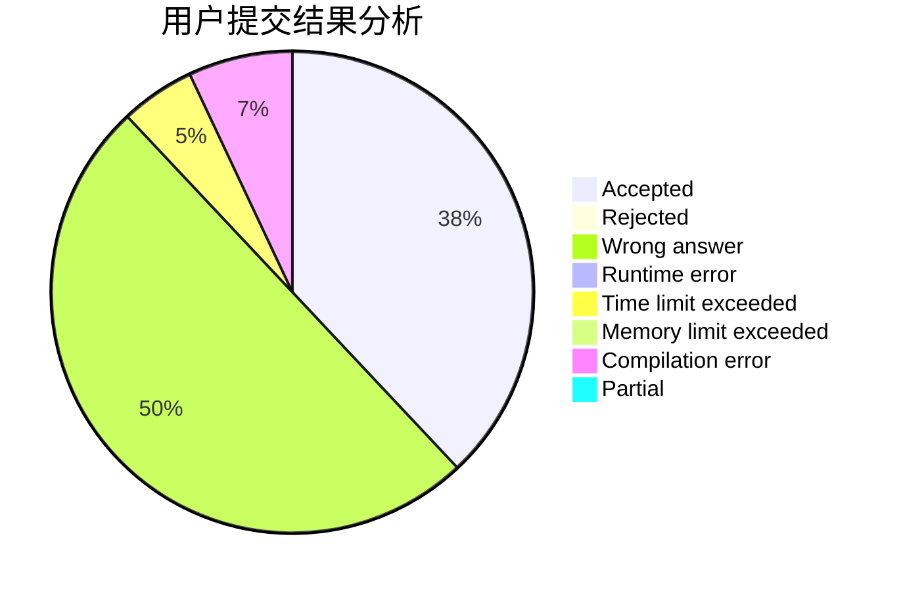
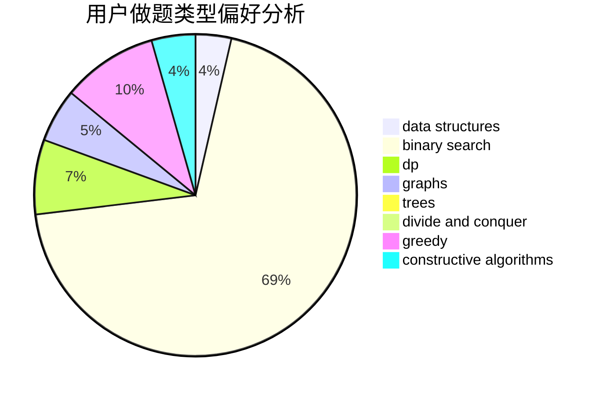
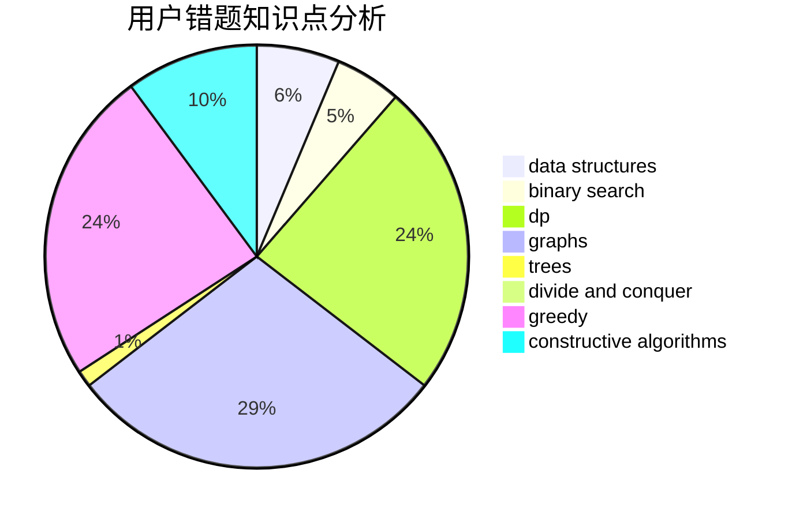

# Dragon_in_Bed

<!-- tabs:start -->

#### **用户提交结果分析**

#### **用户做题类型偏好分析**

#### **用户错题知识点分析**

<!-- tabs:end -->
# 推荐题目
[1362C](https://codeforces.com/contest/1362/problem/C)		bitmasks,
                        greedy,
                        math		  
[343A](https://codeforces.com/contest/343/problem/A)		math,
                        number theory		  
[638A](https://codeforces.com/contest/638/problem/A)		*special problem,
                        constructive algorithms,
                        math		  
[1131B](https://codeforces.com/contest/1131/problem/B)		greedy,
                        implementation		  
[261D](https://codeforces.com/contest/261/problem/D)		dp		  
[1091H](https://codeforces.com/contest/1091/problem/H)		games		  
[708A](https://codeforces.com/contest/708/problem/A)		constructive algorithms,
                        greedy,
                        implementation,
                        strings		  
[808F](https://codeforces.com/contest/808/problem/F)		binary search,
                        flows,
                        graphs		  
[398C](https://codeforces.com/contest/398/problem/C)		constructive algorithms		  
[708B](https://codeforces.com/contest/708/problem/B)		constructive algorithms,
                        greedy,
                        implementation,
                        math		  
