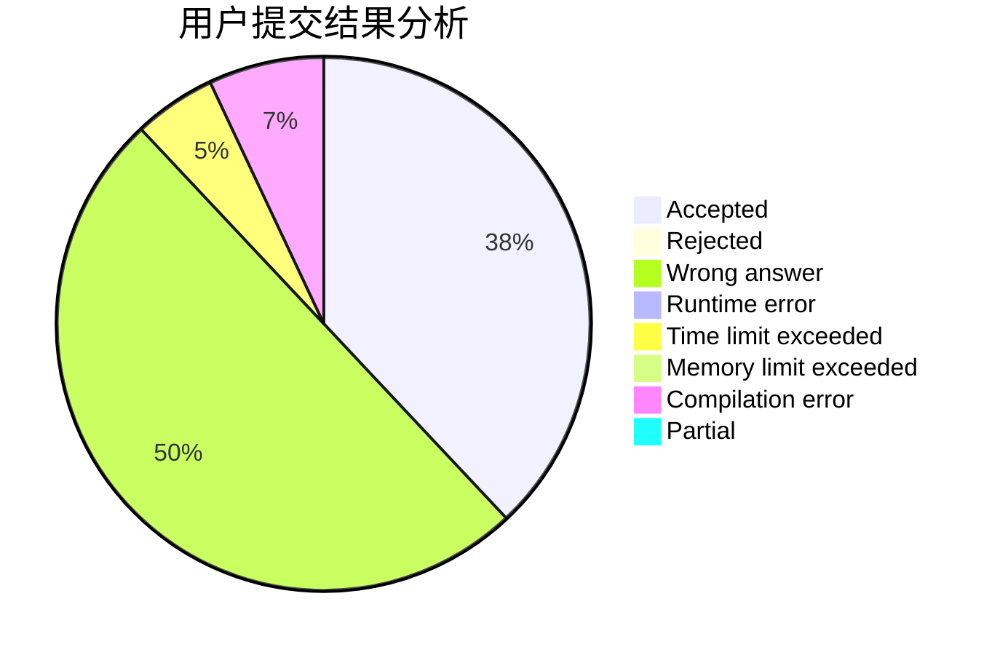
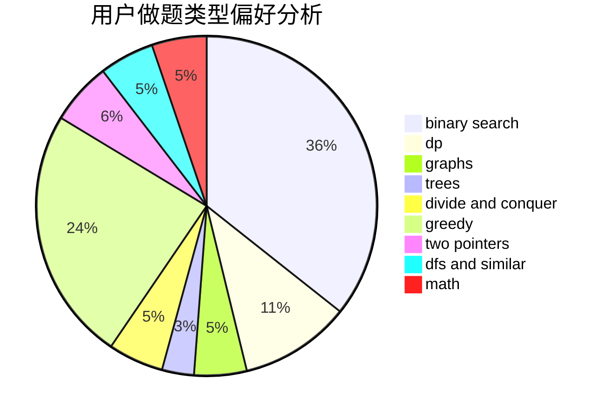

# Dragon_in_Bed

<!-- tabs:start -->

#### **用户提交结果分析**

#### **用户做题类型偏好分析**

<!-- tabs:end -->
# 推荐题目
[1362C](https://codeforces.com/contest/1362/problem/C)
[343A](https://codeforces.com/contest/343/problem/A)
[638A](https://codeforces.com/contest/638/problem/A)
[1131B](https://codeforces.com/contest/1131/problem/B)
[261D](https://codeforces.com/contest/261/problem/D)
[1091H](https://codeforces.com/contest/1091/problem/H)
[708A](https://codeforces.com/contest/708/problem/A)
[808F](https://codeforces.com/contest/808/problem/F)
[398C](https://codeforces.com/contest/398/problem/C)
[708B](https://codeforces.com/contest/708/problem/B)
