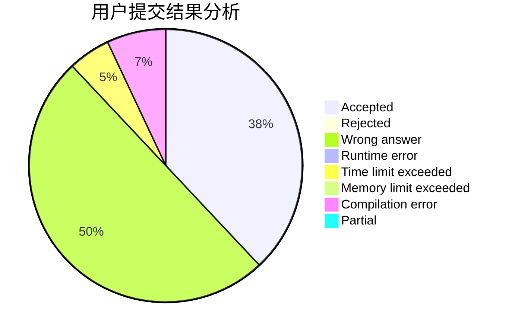
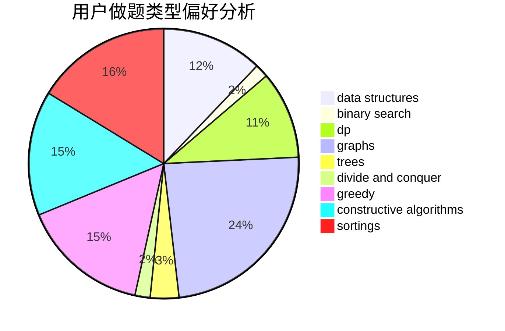
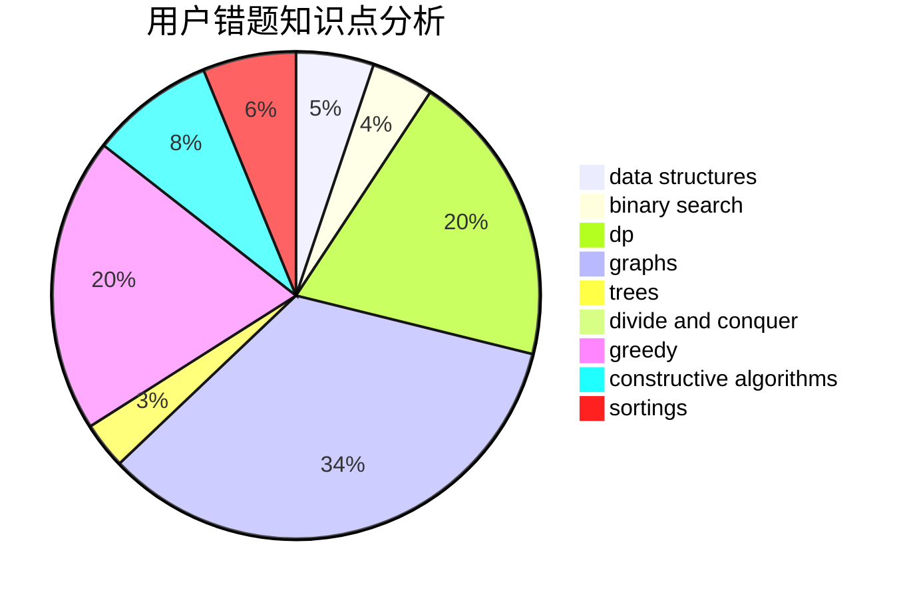

# Dragon_in_Bed
<!-- tabs:start -->
#### **用户提交结果分析**

#### **用户做题类型偏好分析**

#### **用户错题知识点分析**

<!-- tabs:end -->
# 推荐题目
[618B](http://codeforces.com/problemset/problem/618/B)		constructive algorithms		  
[316E2](http://codeforces.com/problemset/problem/316/E2)		data structures,
                        math		  
[240F](http://codeforces.com/problemset/problem/240/F)		data structures		  
[686B](http://codeforces.com/problemset/problem/686/B)		constructive algorithms,
                        implementation,
                        sortings		  
[1129B](http://codeforces.com/problemset/problem/1129/B)		constructive algorithms		  
[686A](http://codeforces.com/problemset/problem/686/A)		constructive algorithms,
                        implementation		  
[793A](http://codeforces.com/problemset/problem/793/A)		implementation,
                        math		  
[367D](http://codeforces.com/problemset/problem/367/D)		bitmasks,
                        dfs and similar		  
[1091E](http://codeforces.com/problemset/problem/1091/E)		binary search,
                        data structures,
                        graphs,
                        greedy,
                        implementation,
                        math,
                        sortings		  
[582C](http://codeforces.com/problemset/problem/582/C)		number theory		  
<!-- tabs:start -->
#### **data structures**
[316E2](http://codeforces.com/problemset/problem/316/E2)		data structures,
                        math		  
[240F](http://codeforces.com/problemset/problem/240/F)		data structures		  
[1091E](http://codeforces.com/problemset/problem/1091/E)		binary search,
                        data structures,
                        graphs,
                        greedy,
                        implementation,
                        math,
                        sortings		  
[1403B](http://codeforces.com/problemset/problem/1403/B)		*special problem,
                        data structures,
                        dfs and similar,
                        graphs,
                        trees		  
[793F](http://codeforces.com/problemset/problem/793/F)		data structures,
                        divide and conquer,
                        dp		  
[1336F](http://codeforces.com/problemset/problem/1336/F)		data structures,
                        divide and conquer,
                        graphs,
                        trees		  
[1439B](http://codeforces.com/problemset/problem/1439/B)		constructive algorithms,
                        data structures,
                        graphs		  
[685B](http://codeforces.com/problemset/problem/685/B)		data structures,
                        dfs and similar,
                        dp,
                        trees		  
[793G](http://codeforces.com/problemset/problem/793/G)		data structures,
                        divide and conquer,
                        flows,
                        graph matchings		  
[1383E](http://codeforces.com/problemset/problem/1383/E)		combinatorics,
                        data structures,
                        dp		  
#### **binary search**
[1091E](http://codeforces.com/problemset/problem/1091/E)		binary search,
                        data structures,
                        graphs,
                        greedy,
                        implementation,
                        math,
                        sortings		  
[525E](http://codeforces.com/problemset/problem/525/E)		binary search,
                        bitmasks,
                        brute force,
                        dp,
                        math,
                        meet-in-the-middle		  
[1366F](http://codeforces.com/problemset/problem/1366/F)		binary search,
                        dp,
                        geometry,
                        graphs		  
[1492C](http://codeforces.com/problemset/problem/1492/C)		binary search,
                        data structures,
                        dp,
                        greedy,
                        two pointers		  
[1463D](http://codeforces.com/problemset/problem/1463/D)		binary search,
                        constructive algorithms,
                        greedy,
                        two pointers		  
[1490G](http://codeforces.com/problemset/problem/1490/G)		binary search,
                        data structures,
                        math		  
[1479D](http://codeforces.com/problemset/problem/1479/D)		binary search,
                        bitmasks,
                        brute force,
                        data structures,
                        probabilities,
                        trees		  
[1436E](http://codeforces.com/problemset/problem/1436/E)		binary search,
                        data structures,
                        two pointers		  
[1461D](http://codeforces.com/problemset/problem/1461/D)		binary search,
                        brute force,
                        data structures,
                        divide and conquer,
                        implementation,
                        sortings		  
[1493C](http://codeforces.com/problemset/problem/1493/C)		binary search,
                        brute force,
                        constructive algorithms,
                        greedy,
                        strings		  
#### **dp**
[793D](http://codeforces.com/problemset/problem/793/D)		dp,
                        graphs,
                        shortest paths		  
[793F](http://codeforces.com/problemset/problem/793/F)		data structures,
                        divide and conquer,
                        dp		  
[525E](http://codeforces.com/problemset/problem/525/E)		binary search,
                        bitmasks,
                        brute force,
                        dp,
                        math,
                        meet-in-the-middle		  
[1366F](http://codeforces.com/problemset/problem/1366/F)		binary search,
                        dp,
                        geometry,
                        graphs		  
[685B](http://codeforces.com/problemset/problem/685/B)		data structures,
                        dfs and similar,
                        dp,
                        trees		  
[1385D](http://codeforces.com/problemset/problem/1385/D)		bitmasks,
                        brute force,
                        divide and conquer,
                        dp,
                        implementation		  
[1384D](https://codeforces.com/contest/1384/problem/D)		bitmasks,
                        constructive algorithms,
                        dp,
                        games,
                        greedy,
                        math		  
[1383E](http://codeforces.com/problemset/problem/1383/E)		combinatorics,
                        data structures,
                        dp		  
[455B](http://codeforces.com/problemset/problem/455/B)		dfs and similar,
                        dp,
                        games,
                        implementation,
                        strings,
                        trees		  
[1478B](http://codeforces.com/problemset/problem/1478/B)		brute force,
                        dp,
                        greedy,
                        math		  
#### **graph**
[1091E](http://codeforces.com/problemset/problem/1091/E)		binary search,
                        data structures,
                        graphs,
                        greedy,
                        implementation,
                        math,
                        sortings		  
[1385G](http://codeforces.com/problemset/problem/1385/G)		2-sat,
                        dfs and similar,
                        dsu,
                        graphs,
                        implementation		  
[793D](http://codeforces.com/problemset/problem/793/D)		dp,
                        graphs,
                        shortest paths		  
[1403B](http://codeforces.com/problemset/problem/1403/B)		*special problem,
                        data structures,
                        dfs and similar,
                        graphs,
                        trees		  
[1384C](https://codeforces.com/contest/1384/problem/C)		dsu,
                        graphs,
                        greedy,
                        sortings,
                        strings,
                        trees,
                        two pointers		  
[1336F](http://codeforces.com/problemset/problem/1336/F)		data structures,
                        divide and conquer,
                        graphs,
                        trees		  
[1439B](http://codeforces.com/problemset/problem/1439/B)		constructive algorithms,
                        data structures,
                        graphs		  
[1366F](http://codeforces.com/problemset/problem/1366/F)		binary search,
                        dp,
                        geometry,
                        graphs		  
[1187G](http://codeforces.com/problemset/problem/1187/G)		flows,
                        graphs		  
[793G](http://codeforces.com/problemset/problem/793/G)		data structures,
                        divide and conquer,
                        flows,
                        graph matchings		  
#### **trees**
[1403B](http://codeforces.com/problemset/problem/1403/B)		*special problem,
                        data structures,
                        dfs and similar,
                        graphs,
                        trees		  
[1384C](https://codeforces.com/contest/1384/problem/C)		dsu,
                        graphs,
                        greedy,
                        sortings,
                        strings,
                        trees,
                        two pointers		  
[1336F](http://codeforces.com/problemset/problem/1336/F)		data structures,
                        divide and conquer,
                        graphs,
                        trees		  
[685B](http://codeforces.com/problemset/problem/685/B)		data structures,
                        dfs and similar,
                        dp,
                        trees		  
[455B](http://codeforces.com/problemset/problem/455/B)		dfs and similar,
                        dp,
                        games,
                        implementation,
                        strings,
                        trees		  
[1383A](http://codeforces.com/problemset/problem/1383/A)		dsu,
                        graphs,
                        greedy,
                        sortings,
                        strings,
                        trees,
                        two pointers		  
[1479D](http://codeforces.com/problemset/problem/1479/D)		binary search,
                        bitmasks,
                        brute force,
                        data structures,
                        probabilities,
                        trees		  
[1511C](http://codeforces.com/problemset/problem/1511/C)		brute force,
                        data structures,
                        implementation,
                        trees		  
[1499F](http://codeforces.com/problemset/problem/1499/F)		combinatorics,
                        dfs and similar,
                        dp,
                        trees		  
[1491E](http://codeforces.com/problemset/problem/1491/E)		brute force,
                        dfs and similar,
                        divide and conquer,
                        number theory,
                        trees		  
#### **divide and conquer**
[793F](http://codeforces.com/problemset/problem/793/F)		data structures,
                        divide and conquer,
                        dp		  
[1336F](http://codeforces.com/problemset/problem/1336/F)		data structures,
                        divide and conquer,
                        graphs,
                        trees		  
[1385D](http://codeforces.com/problemset/problem/1385/D)		bitmasks,
                        brute force,
                        divide and conquer,
                        dp,
                        implementation		  
[793G](http://codeforces.com/problemset/problem/793/G)		data structures,
                        divide and conquer,
                        flows,
                        graph matchings		  
[1461D](http://codeforces.com/problemset/problem/1461/D)		binary search,
                        brute force,
                        data structures,
                        divide and conquer,
                        implementation,
                        sortings		  
[1466G](http://codeforces.com/problemset/problem/1466/G)		combinatorics,
                        divide and conquer,
                        hashing,
                        math,
                        string suffix structures,
                        strings		  
[1490D](http://codeforces.com/problemset/problem/1490/D)		dfs and similar,
                        divide and conquer,
                        implementation		  
[1483C](https://codeforces.com/contest/1483/problem/C)		data structures,
                        divide and conquer,
                        dp		  
[1491E](http://codeforces.com/problemset/problem/1491/E)		brute force,
                        dfs and similar,
                        divide and conquer,
                        number theory,
                        trees		  
[1303G](http://codeforces.com/problemset/problem/1303/G)		data structures,
                        divide and conquer,
                        geometry,
                        trees		  
#### **greedy**
[1091E](http://codeforces.com/problemset/problem/1091/E)		binary search,
                        data structures,
                        graphs,
                        greedy,
                        implementation,
                        math,
                        sortings		  
[1031C](http://codeforces.com/problemset/problem/1031/C)		greedy		  
[792E](http://codeforces.com/problemset/problem/792/E)		greedy,
                        math,
                        number theory		  
[1384C](https://codeforces.com/contest/1384/problem/C)		dsu,
                        graphs,
                        greedy,
                        sortings,
                        strings,
                        trees,
                        two pointers		  
[1365A](http://codeforces.com/problemset/problem/1365/A)		games,
                        greedy,
                        implementation		  
[1384D](https://codeforces.com/contest/1384/problem/D)		bitmasks,
                        constructive algorithms,
                        dp,
                        games,
                        greedy,
                        math		  
[1197A](http://codeforces.com/problemset/problem/1197/A)		greedy,
                        math,
                        sortings		  
[1385C](http://codeforces.com/problemset/problem/1385/C)		greedy		  
[700D](http://codeforces.com/problemset/problem/700/D)		data structures,
                        greedy		  
[1383A](http://codeforces.com/problemset/problem/1383/A)		dsu,
                        graphs,
                        greedy,
                        sortings,
                        strings,
                        trees,
                        two pointers		  
#### **constructive algorithms**
[618B](http://codeforces.com/problemset/problem/618/B)		constructive algorithms		  
[686B](http://codeforces.com/problemset/problem/686/B)		constructive algorithms,
                        implementation,
                        sortings		  
[1129B](http://codeforces.com/problemset/problem/1129/B)		constructive algorithms		  
[686A](http://codeforces.com/problemset/problem/686/A)		constructive algorithms,
                        implementation		  
[675B](http://codeforces.com/problemset/problem/675/B)		brute force,
                        constructive algorithms,
                        math		  
[725C](http://codeforces.com/problemset/problem/725/C)		brute force,
                        constructive algorithms,
                        implementation,
                        strings		  
[1439B](http://codeforces.com/problemset/problem/1439/B)		constructive algorithms,
                        data structures,
                        graphs		  
[1355D](http://codeforces.com/problemset/problem/1355/D)		constructive algorithms,
                        math		  
[1384D](https://codeforces.com/contest/1384/problem/D)		bitmasks,
                        constructive algorithms,
                        dp,
                        games,
                        greedy,
                        math		  
[1374F](http://codeforces.com/problemset/problem/1374/F)		brute force,
                        constructive algorithms,
                        implementation,
                        sortings		  
#### **sortings**
[686B](http://codeforces.com/problemset/problem/686/B)		constructive algorithms,
                        implementation,
                        sortings		  
[1091E](http://codeforces.com/problemset/problem/1091/E)		binary search,
                        data structures,
                        graphs,
                        greedy,
                        implementation,
                        math,
                        sortings		  
[1384C](https://codeforces.com/contest/1384/problem/C)		dsu,
                        graphs,
                        greedy,
                        sortings,
                        strings,
                        trees,
                        two pointers		  
[1374F](http://codeforces.com/problemset/problem/1374/F)		brute force,
                        constructive algorithms,
                        implementation,
                        sortings		  
[1197A](http://codeforces.com/problemset/problem/1197/A)		greedy,
                        math,
                        sortings		  
[1383A](http://codeforces.com/problemset/problem/1383/A)		dsu,
                        graphs,
                        greedy,
                        sortings,
                        strings,
                        trees,
                        two pointers		  
[1496C](https://codeforces.com/contest/1496/problem/C)		geometry,
                        greedy,
                        math,
                        sortings		  
[1495A](http://codeforces.com/problemset/problem/1495/A)		geometry,
                        greedy,
                        math,
                        sortings		  
[1497A](http://codeforces.com/problemset/problem/1497/A)		brute force,
                        data structures,
                        greedy,
                        sortings		  
[1427A](http://codeforces.com/problemset/problem/1427/A)		math,
                        sortings		  
<!-- tabs:end -->
