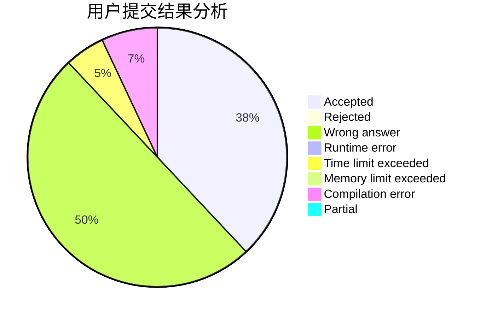
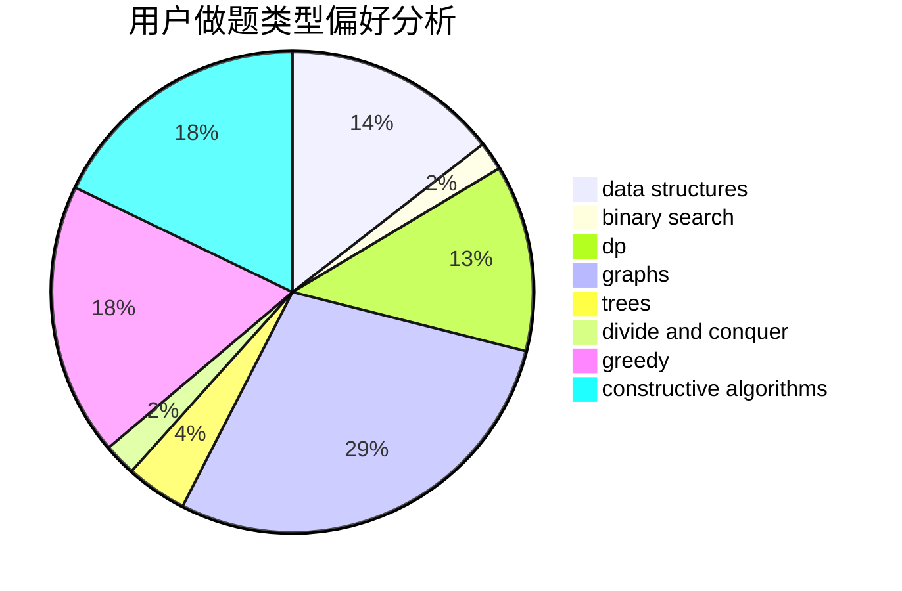
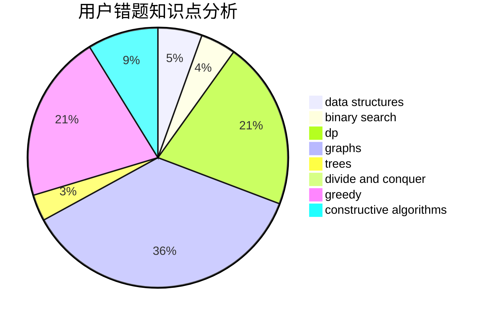

# Dragon_in_Bed

<!-- tabs:start -->

#### **用户提交结果分析**

#### **用户做题类型偏好分析**

#### **用户错题知识点分析**

<!-- tabs:end -->
# 推荐题目
[1355D](https://codeforces.com/contest/1355/problem/D)		constructive algorithms,
                        math		  
[316E2](https://codeforces.com/contest/316E/problem/2)		data structures,
                        math		  
[618B](https://codeforces.com/contest/618/problem/B)		constructive algorithms		  
[1129B](https://codeforces.com/contest/1129/problem/B)		constructive algorithms		  
[240F](https://codeforces.com/contest/240/problem/F)		data structures		  
[1091E](https://codeforces.com/contest/1091/problem/E)		binary search,
                        data structures,
                        graphs,
                        greedy,
                        implementation,
                        math,
                        sortings		  
[686A](https://codeforces.com/contest/686/problem/A)		constructive algorithms,
                        implementation		  
[793D](https://codeforces.com/contest/793/problem/D)		dp,
                        graphs,
                        shortest paths		  
[367D](https://codeforces.com/contest/367/problem/D)		bitmasks,
                        dfs and similar		  
[686B](https://codeforces.com/contest/686/problem/B)		constructive algorithms,
                        implementation,
                        sortings		  
