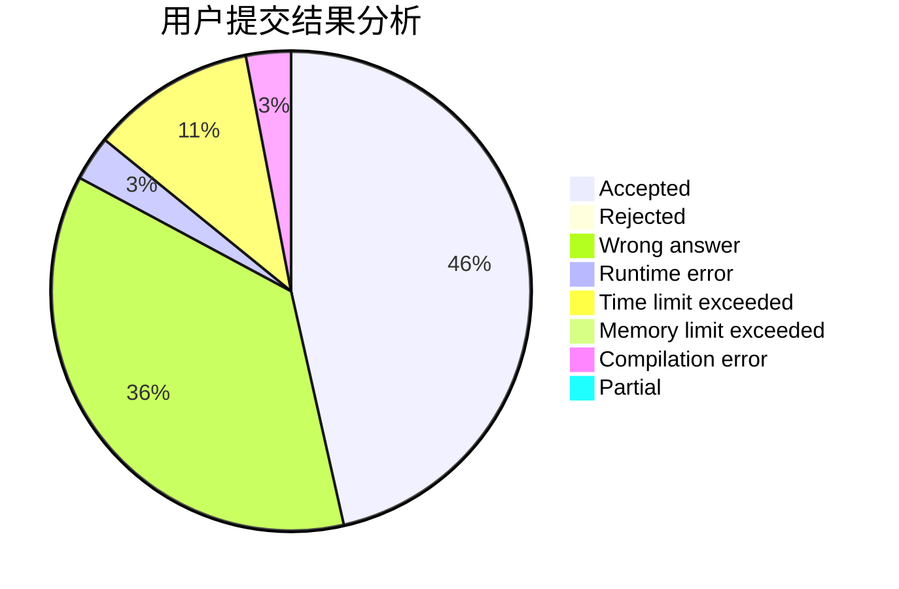
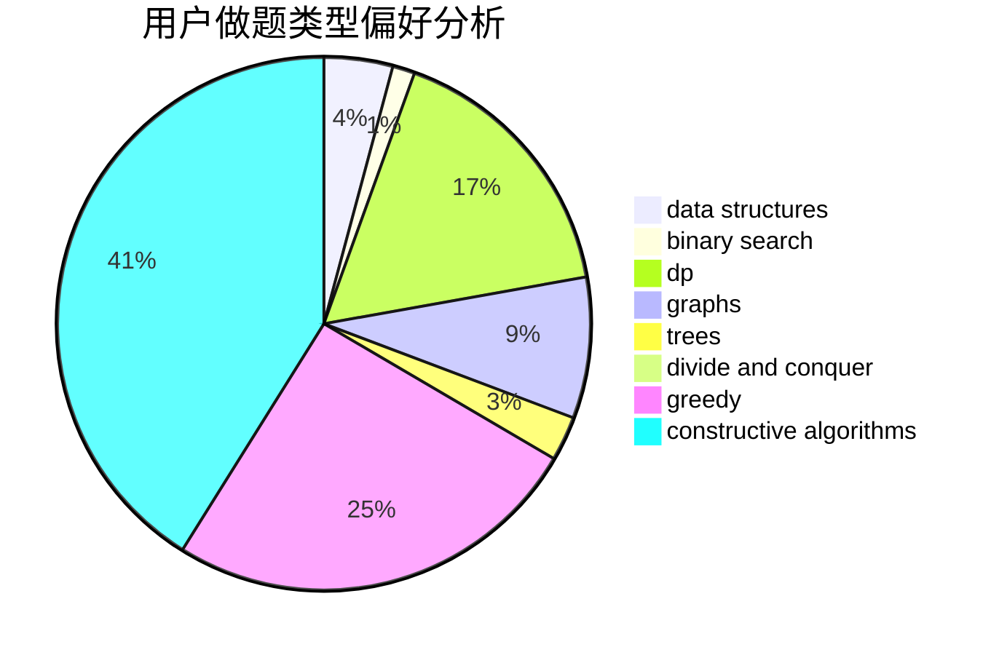
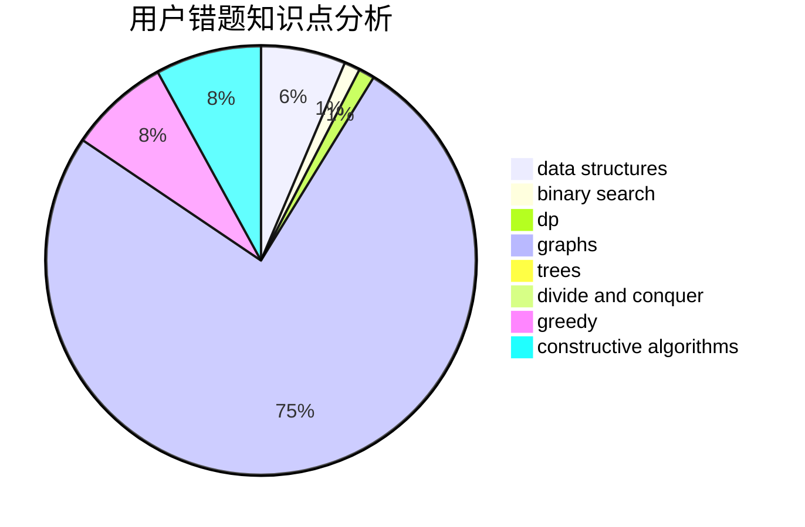

# Dream_caterpillar

<!-- tabs:start -->

#### **用户提交结果分析**

#### **用户做题类型偏好分析**

#### **用户错题知识点分析**

<!-- tabs:end -->
# 推荐题目
[1155C](https://codeforces.com/contest/1155/problem/C)		math,
                        number theory		  
[1089E](https://codeforces.com/contest/1089/problem/E)		constructive algorithms		  
[794G](https://codeforces.com/contest/794/problem/G)		combinatorics,
                        dp,
                        math		  
[795K](https://codeforces.com/contest/795/problem/K)		dsu,graphs,sortings,trees		  
[216B](https://codeforces.com/contest/216/problem/B)		dfs and similar,
                        implementation		  
[638A](https://codeforces.com/contest/638/problem/A)		*special problem,
                        constructive algorithms,
                        math		  
[463A](https://codeforces.com/contest/463/problem/A)		brute force,
                        implementation		  
[1174E](https://codeforces.com/contest/1174/problem/E)		combinatorics,
                        dp,
                        math,
                        number theory		  
[582A](https://codeforces.com/contest/582/problem/A)		constructive algorithms,
                        greedy,
                        number theory		  
[527B](https://codeforces.com/contest/527/problem/B)		greedy		  
