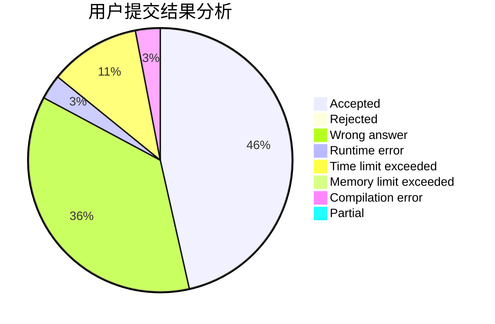
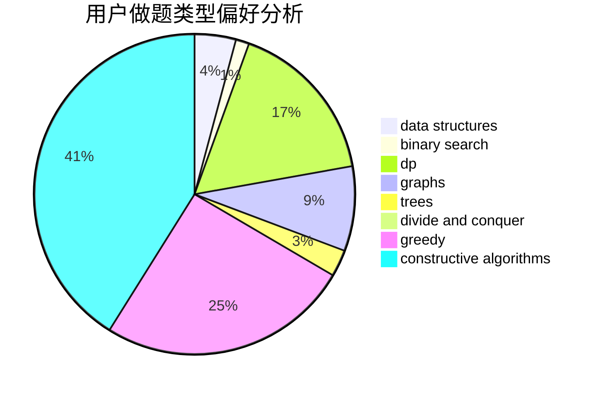
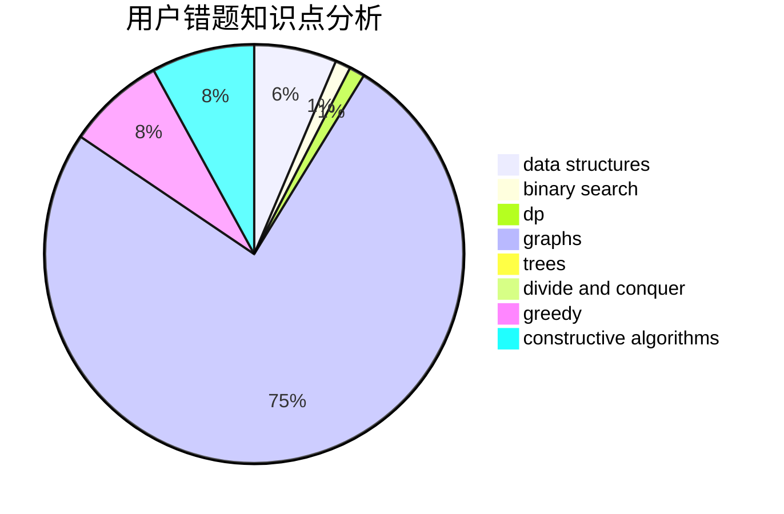

# Dream_caterpillar
<!-- tabs:start -->
#### **用户提交结果分析**

#### **用户做题类型偏好分析**

#### **用户错题知识点分析**

<!-- tabs:end -->
# 推荐题目
[Strange Definition](https://codeforces.com/contest/1471/problem/D)		bitmasks,
                        graphs,
                        hashing,
                        math,
                        number theory		  
[Magical Permutation](http://codeforces.com/problemset/problem/1163/E)		bitmasks,
                        brute force,
                        constructive algorithms,
                        data structures,
                        graphs,
                        math		  
[Two Cakes](http://codeforces.com/problemset/problem/1130/B)		greedy		  
[Jeff and Furik](http://codeforces.com/problemset/problem/351/B)		combinatorics,
                        dp,
                        probabilities		  
[Replace All](http://codeforces.com/problemset/problem/794/G)		combinatorics,
                        dp,
                        math		  
[Stepan and Vowels](https://codeforces.com/contest/795/problem/K)		*special problem,
                        implementation,
                        strings		  
[Error Correct System](http://codeforces.com/problemset/problem/527/B)		greedy		  
[Constellation](http://codeforces.com/problemset/problem/618/C)		geometry,
                        implementation		  
[Holidays](http://codeforces.com/problemset/problem/44/C)		implementation		  
[Caisa and Sugar](http://codeforces.com/problemset/problem/463/A)		brute force,
                        implementation		  
<!-- tabs:start -->
#### **data structures**
[Magical Permutation](http://codeforces.com/problemset/problem/1163/E)		bitmasks,
                        brute force,
                        constructive algorithms,
                        data structures,
                        graphs,
                        math		  
[Kay and Snowflake](https://codeforces.com/contest/686/problem/D)		data structures,
                        dfs and similar,
                        dp,
                        trees		  
[Drazil and Park](http://codeforces.com/problemset/problem/515/E)		data structures		  
[Bicolored Segments](http://codeforces.com/problemset/problem/1389/F)		data structures,
                        dp,
                        graph matchings,
                        sortings		  
[Mixture](http://codeforces.com/problemset/problem/1386/B)		*special problem,
                        data structures,
                        geometry,
                        math,
                        sortings		  
[Mike and Geometry Problem](http://codeforces.com/problemset/problem/689/E)		combinatorics,
                        data structures,
                        dp,
                        geometry,
                        implementation		  
[Christmas Game](http://codeforces.com/problemset/problem/1498/F)		bitmasks,
                        data structures,
                        dfs and similar,
                        dp,
                        games,
                        math,
                        trees		  
[Restructuring Company](http://codeforces.com/problemset/problem/566/D)		data structures,
                        dsu		  
[Appleman and a Sheet of Paper](https://codeforces.com/contest/462/problem/E)		data structures,
                        implementation		  
[Koala and Notebook](http://codeforces.com/problemset/problem/1209/F)		data structures,
                        dfs and similar,
                        graphs,
                        shortest paths,
                        strings,
                        trees		  
#### **binary search**
[Forward, march!](http://codeforces.com/problemset/problem/11/E)		binary search,
                        dp,
                        greedy		  
[K-th Not Divisible by n](http://codeforces.com/problemset/problem/1352/C)		binary search,
                        math		  
[Serval and Snake](http://codeforces.com/problemset/problem/1153/E)		binary search,
                        brute force,
                        interactive		  
[Maximum width](http://codeforces.com/problemset/problem/1492/C)		binary search,
                        data structures,
                        dp,
                        greedy,
                        two pointers		  
[Pairs](http://codeforces.com/problemset/problem/1463/D)		binary search,
                        constructive algorithms,
                        greedy,
                        two pointers		  
[Old Floppy Drive](http://codeforces.com/problemset/problem/1490/G)		binary search,
                        data structures,
                        math		  
[Odd Mineral Resource](http://codeforces.com/problemset/problem/1479/D)		binary search,
                        bitmasks,
                        brute force,
                        data structures,
                        probabilities,
                        trees		  
[Complicated Computations](http://codeforces.com/problemset/problem/1436/E)		binary search,
                        data structures,
                        two pointers		  
[Divide and Summarize](http://codeforces.com/problemset/problem/1461/D)		binary search,
                        brute force,
                        data structures,
                        divide and conquer,
                        implementation,
                        sortings		  
[K-beautiful Strings](http://codeforces.com/problemset/problem/1493/C)		binary search,
                        brute force,
                        constructive algorithms,
                        greedy,
                        strings		  
#### **dp**
[Jeff and Furik](http://codeforces.com/problemset/problem/351/B)		combinatorics,
                        dp,
                        probabilities		  
[Replace All](http://codeforces.com/problemset/problem/794/G)		combinatorics,
                        dp,
                        math		  
[Robbers' watch](https://codeforces.com/contest/686/problem/C)		brute force,
                        combinatorics,
                        dp,
                        math		  
[Xenon's Attack on the Gangs](http://codeforces.com/problemset/problem/1292/C)		combinatorics,
                        dfs and similar,
                        dp,
                        greedy,
                        trees		  
[Forward, march!](http://codeforces.com/problemset/problem/11/E)		binary search,
                        dp,
                        greedy		  
[Coloring Trees](http://codeforces.com/problemset/problem/711/C)		dp		  
[Kay and Snowflake](https://codeforces.com/contest/686/problem/D)		data structures,
                        dfs and similar,
                        dp,
                        trees		  
[Bicolored Segments](http://codeforces.com/problemset/problem/1389/F)		data structures,
                        dp,
                        graph matchings,
                        sortings		  
[Solitaire](http://codeforces.com/problemset/problem/208/B)		dfs and similar,
                        dp		  
[Mike and Geometry Problem](http://codeforces.com/problemset/problem/689/E)		combinatorics,
                        data structures,
                        dp,
                        geometry,
                        implementation		  
#### **graph**
[Strange Definition](https://codeforces.com/contest/1471/problem/D)		bitmasks,
                        graphs,
                        hashing,
                        math,
                        number theory		  
[Magical Permutation](http://codeforces.com/problemset/problem/1163/E)		bitmasks,
                        brute force,
                        constructive algorithms,
                        data structures,
                        graphs,
                        math		  
[Challenges in school №41](http://codeforces.com/problemset/problem/1333/D)		brute force,
                        constructive algorithms,
                        games,
                        graphs,
                        greedy,
                        implementation,
                        sortings		  
[Deja Vu](http://codeforces.com/problemset/problem/331/E1)		constructive algorithms,
                        graphs,
                        implementation		  
[Bicolored Segments](http://codeforces.com/problemset/problem/1389/F)		data structures,
                        dp,
                        graph matchings,
                        sortings		  
[Planar Perimeter](http://codeforces.com/problemset/problem/1242/E)		constructive algorithms,
                        graphs		  
[Power Tree](http://codeforces.com/problemset/problem/1120/D)		dfs and similar,
                        dp,
                        dsu,
                        graphs,
                        greedy,
                        trees		  
[Koala and Notebook](http://codeforces.com/problemset/problem/1209/F)		data structures,
                        dfs and similar,
                        graphs,
                        shortest paths,
                        strings,
                        trees		  
[Button Lock](http://codeforces.com/problemset/problem/1510/B)		flows,
                        graph matchings,
                        graphs		  
[Minimum Ties](http://codeforces.com/problemset/problem/1487/C)		brute force,
                        constructive algorithms,
                        dfs and similar,
                        graphs,
                        greedy,
                        implementation,
                        math		  
#### **trees**
[Xenon's Attack on the Gangs](http://codeforces.com/problemset/problem/1292/C)		combinatorics,
                        dfs and similar,
                        dp,
                        greedy,
                        trees		  
[Kay and Snowflake](https://codeforces.com/contest/686/problem/D)		data structures,
                        dfs and similar,
                        dp,
                        trees		  
[Christmas Game](http://codeforces.com/problemset/problem/1498/F)		bitmasks,
                        data structures,
                        dfs and similar,
                        dp,
                        games,
                        math,
                        trees		  
[Power Tree](http://codeforces.com/problemset/problem/1120/D)		dfs and similar,
                        dp,
                        dsu,
                        graphs,
                        greedy,
                        trees		  
[Koala and Notebook](http://codeforces.com/problemset/problem/1209/F)		data structures,
                        dfs and similar,
                        graphs,
                        shortest paths,
                        strings,
                        trees		  
[Nauuo and Circle](http://codeforces.com/problemset/problem/1172/B)		combinatorics,
                        dfs and similar,
                        dp,
                        trees		  
[Odd Mineral Resource](http://codeforces.com/problemset/problem/1479/D)		binary search,
                        bitmasks,
                        brute force,
                        data structures,
                        probabilities,
                        trees		  
[Yet Another Card Deck](http://codeforces.com/problemset/problem/1511/C)		brute force,
                        data structures,
                        implementation,
                        trees		  
[Diameter Cuts](http://codeforces.com/problemset/problem/1499/F)		combinatorics,
                        dfs and similar,
                        dp,
                        trees		  
[Fib-tree](http://codeforces.com/problemset/problem/1491/E)		brute force,
                        dfs and similar,
                        divide and conquer,
                        number theory,
                        trees		  
#### **divide and conquer**
[Skyline Photo](https://codeforces.com/contest/1484/problem/E)		data structures,
                        divide and conquer,
                        dp		  
[Divide and Summarize](http://codeforces.com/problemset/problem/1461/D)		binary search,
                        brute force,
                        data structures,
                        divide and conquer,
                        implementation,
                        sortings		  
[Song of the Sirens](http://codeforces.com/problemset/problem/1466/G)		combinatorics,
                        divide and conquer,
                        hashing,
                        math,
                        string suffix structures,
                        strings		  
[Permutation Transformation](http://codeforces.com/problemset/problem/1490/D)		dfs and similar,
                        divide and conquer,
                        implementation		  
[Fib-tree](http://codeforces.com/problemset/problem/1491/E)		brute force,
                        dfs and similar,
                        divide and conquer,
                        number theory,
                        trees		  
[Sum of Prefix Sums](http://codeforces.com/problemset/problem/1303/G)		data structures,
                        divide and conquer,
                        geometry,
                        trees		  
[Dogeforces](http://codeforces.com/problemset/problem/1494/D)		constructive algorithms,
                        data structures,
                        dfs and similar,
                        divide and conquer,
                        dsu,
                        greedy,
                        sortings,
                        trees		  
[Logistical Questions](http://codeforces.com/problemset/problem/566/C)		dfs and similar,
                        divide and conquer,
                        trees		  
[Fruit Sequences](http://codeforces.com/problemset/problem/1428/F)		binary search,
                        data structures,
                        divide and conquer,
                        dp,
                        two pointers		  
[Dr. Evil Underscores](http://codeforces.com/problemset/problem/1285/D)		bitmasks,
                        brute force,
                        dfs and similar,
                        divide and conquer,
                        dp,
                        greedy,
                        strings,
                        trees		  
#### **greedy**
[Two Cakes](http://codeforces.com/problemset/problem/1130/B)		greedy		  
[Error Correct System](http://codeforces.com/problemset/problem/527/B)		greedy		  
[Challenges in school №41](http://codeforces.com/problemset/problem/1333/D)		brute force,
                        constructive algorithms,
                        games,
                        graphs,
                        greedy,
                        implementation,
                        sortings		  
[Xenon's Attack on the Gangs](http://codeforces.com/problemset/problem/1292/C)		combinatorics,
                        dfs and similar,
                        dp,
                        greedy,
                        trees		  
[Candy Box (easy version)](http://codeforces.com/problemset/problem/1183/D)		greedy,
                        sortings		  
[Forward, march!](http://codeforces.com/problemset/problem/11/E)		binary search,
                        dp,
                        greedy		  
[Naming Company](http://codeforces.com/problemset/problem/794/C)		games,
                        greedy,
                        sortings		  
[GCD Table](http://codeforces.com/problemset/problem/582/A)		constructive algorithms,
                        greedy,
                        number theory		  
[Power Tree](http://codeforces.com/problemset/problem/1120/D)		dfs and similar,
                        dp,
                        dsu,
                        graphs,
                        greedy,
                        trees		  
[Boats Competition](http://codeforces.com/problemset/problem/1399/C)		brute force,
                        greedy,
                        two pointers		  
#### **constructive algorithms**
[Magical Permutation](http://codeforces.com/problemset/problem/1163/E)		bitmasks,
                        brute force,
                        constructive algorithms,
                        data structures,
                        graphs,
                        math		  
[Challenges in school №41](http://codeforces.com/problemset/problem/1333/D)		brute force,
                        constructive algorithms,
                        games,
                        graphs,
                        greedy,
                        implementation,
                        sortings		  
[Triple Flips](https://codeforces.com/contest/1071/problem/C)		constructive algorithms		  
[Lie or Truth](https://codeforces.com/contest/795/problem/D)		*special problem,
                        constructive algorithms,
                        sortings		  
[Home Numbers](http://codeforces.com/problemset/problem/638/A)		*special problem,
                        constructive algorithms,
                        math		  
[Deja Vu](http://codeforces.com/problemset/problem/331/E1)		constructive algorithms,
                        graphs,
                        implementation		  
[Easy Chess](http://codeforces.com/problemset/problem/1089/E)		constructive algorithms		  
[Planar Perimeter](http://codeforces.com/problemset/problem/1242/E)		constructive algorithms,
                        graphs		  
[Finding Sasuke](https://codeforces.com/contest/1435/problem/A)		constructive algorithms,
                        math		  
[GCD Table](http://codeforces.com/problemset/problem/582/A)		constructive algorithms,
                        greedy,
                        number theory		  
#### **sortings**
[Challenges in school №41](http://codeforces.com/problemset/problem/1333/D)		brute force,
                        constructive algorithms,
                        games,
                        graphs,
                        greedy,
                        implementation,
                        sortings		  
[Lie or Truth](https://codeforces.com/contest/795/problem/D)		*special problem,
                        constructive algorithms,
                        sortings		  
[Candy Box (easy version)](http://codeforces.com/problemset/problem/1183/D)		greedy,
                        sortings		  
[Pashmak and Flowers](http://codeforces.com/problemset/problem/459/B)		combinatorics,
                        implementation,
                        sortings		  
[Naming Company](http://codeforces.com/problemset/problem/794/C)		games,
                        greedy,
                        sortings		  
[Bicolored Segments](http://codeforces.com/problemset/problem/1389/F)		data structures,
                        dp,
                        graph matchings,
                        sortings		  
[Mixture](http://codeforces.com/problemset/problem/1386/B)		*special problem,
                        data structures,
                        geometry,
                        math,
                        sortings		  
[Diamond Miner](https://codeforces.com/contest/1496/problem/C)		geometry,
                        greedy,
                        math,
                        sortings		  
[Meximization](http://codeforces.com/problemset/problem/1497/A)		brute force,
                        data structures,
                        greedy,
                        sortings		  
[Avoiding Zero](http://codeforces.com/problemset/problem/1427/A)		math,
                        sortings		  
<!-- tabs:end -->
