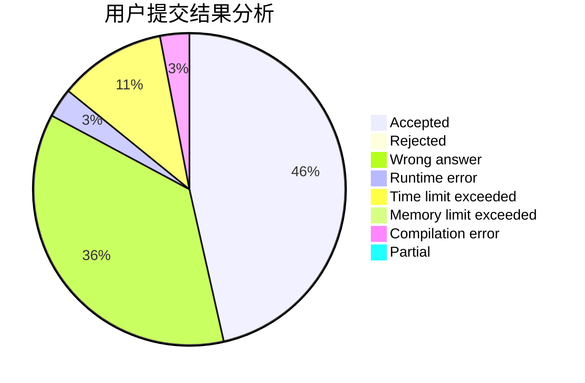
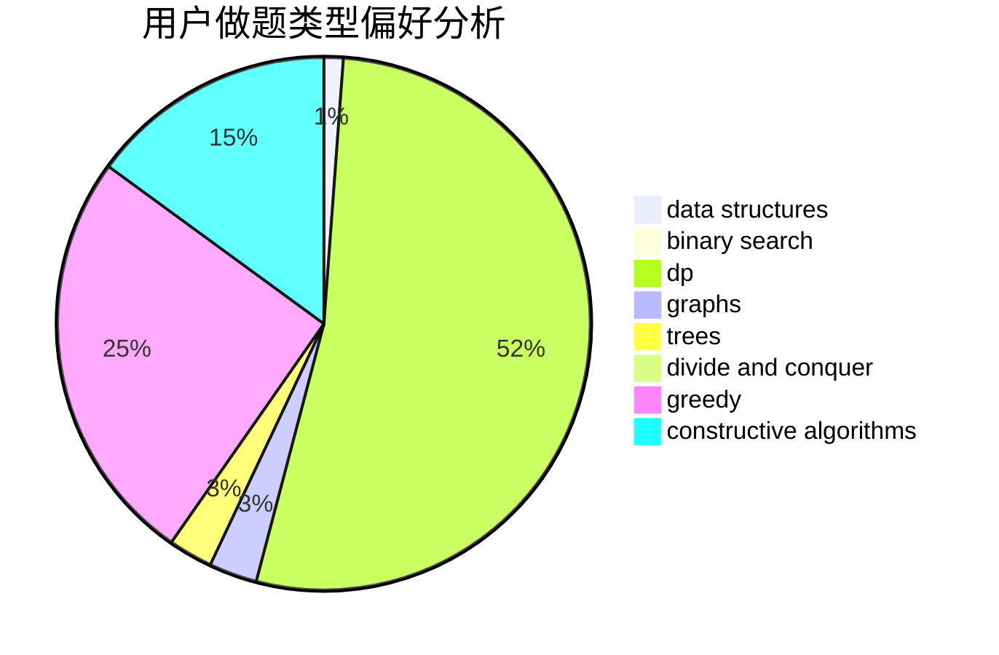
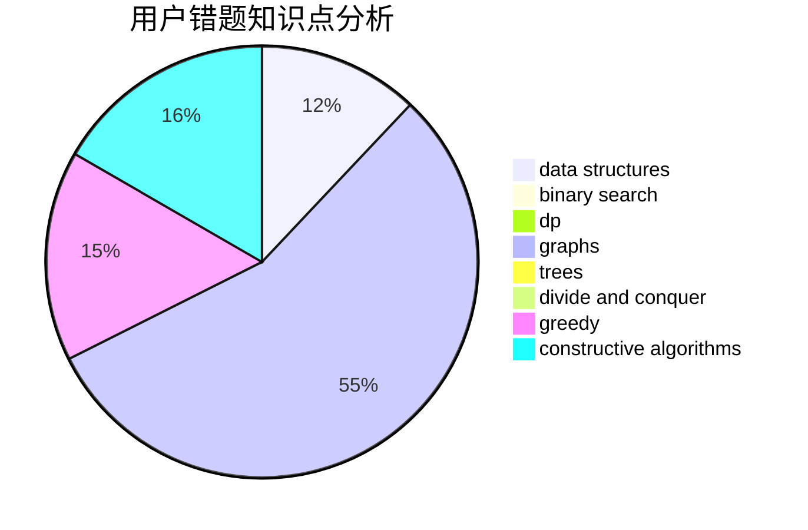

# Dream_caterpillar

<!-- tabs:start -->

#### **用户提交结果分析**

#### **用户做题类型偏好分析**

#### **用户错题知识点分析**

<!-- tabs:end -->
# 推荐题目
[1157A](https://codeforces.com/contest/1157/problem/A)		implementation		  
[1089I](https://codeforces.com/contest/1089/problem/I)		nan		  
[80A](https://codeforces.com/contest/80/problem/A)		brute force		  
[810A](https://codeforces.com/contest/810/problem/A)		implementation,
                        math		  
[235D](https://codeforces.com/contest/235/problem/D)		graphs		  
[668B](https://codeforces.com/contest/668/problem/B)		dsu,graphs,sortings,trees		  
[482E](https://codeforces.com/contest/482/problem/E)		data structures,
                        trees		  
[11781](https://codeforces.com/contest/1178/problem/1)		dsu,graphs,sortings,trees		  
[603A](https://codeforces.com/contest/603/problem/A)		dp,
                        greedy,
                        math		  
[551B](https://codeforces.com/contest/551/problem/B)		brute force,
                        constructive algorithms,
                        implementation,
                        strings		  
