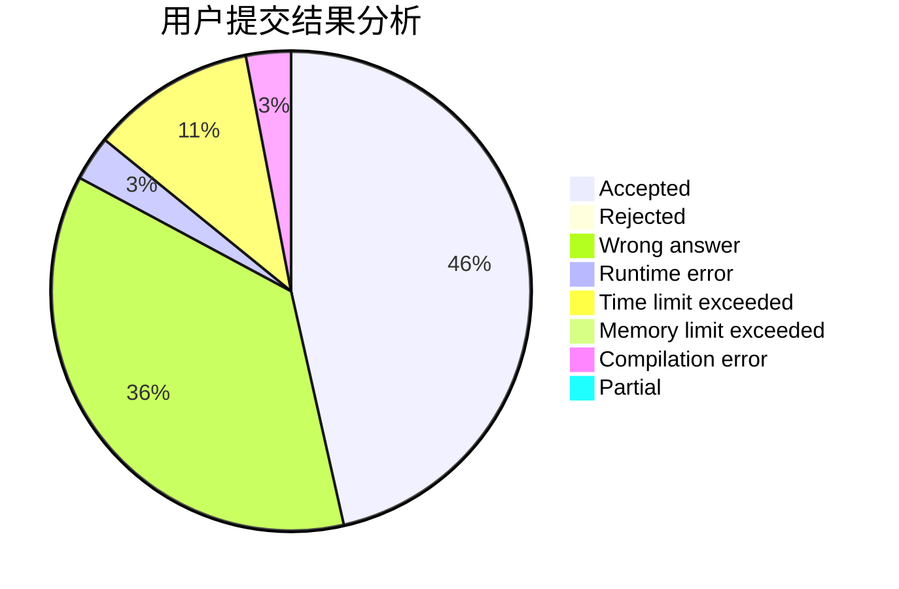
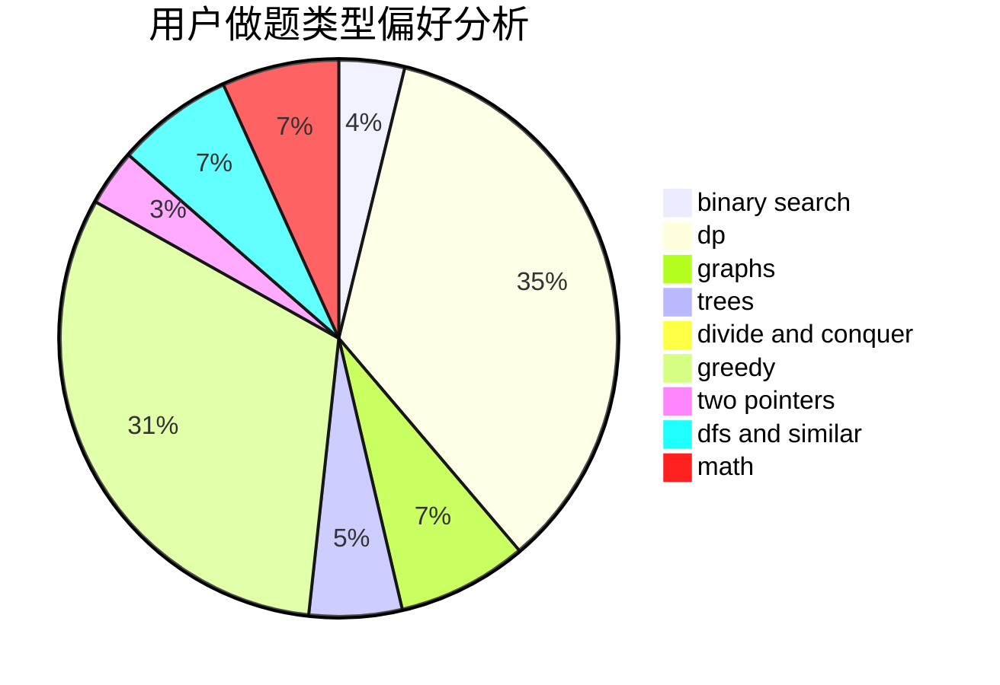

# Dream_caterpillar

<!-- tabs:start -->

#### **用户提交结果分析**

#### **用户做题类型偏好分析**

<!-- tabs:end -->
# 推荐题目
[1157A](https://codeforces.com/contest/1157/problem/A)
[1089I](https://codeforces.com/contest/1089/problem/I)
[80A](https://codeforces.com/contest/80/problem/A)
[810A](https://codeforces.com/contest/810/problem/A)
[235D](https://codeforces.com/contest/235/problem/D)
[668B](https://codeforces.com/contest/668/problem/B)
[482E](https://codeforces.com/contest/482/problem/E)
[11781](https://codeforces.com/contest/1178/problem/1)
[603A](https://codeforces.com/contest/603/problem/A)
[551B](https://codeforces.com/contest/551/problem/B)
