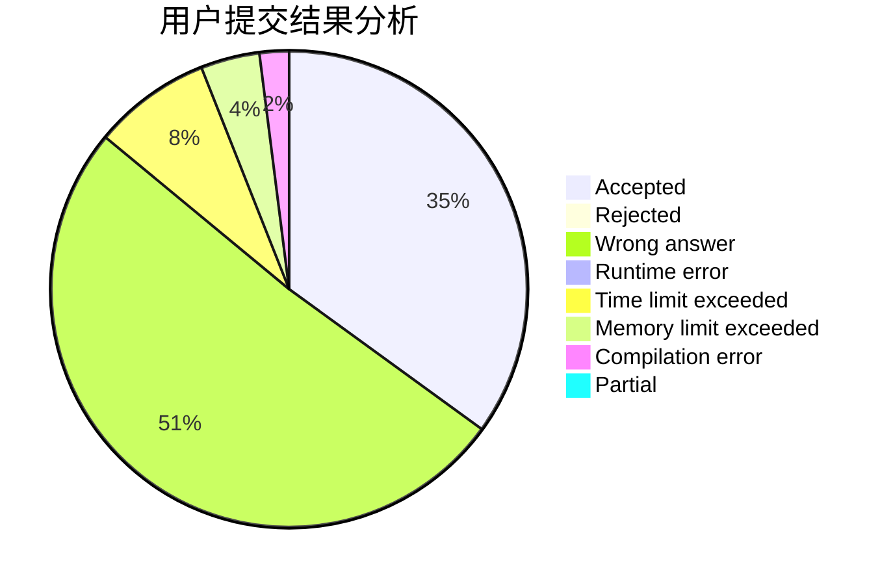
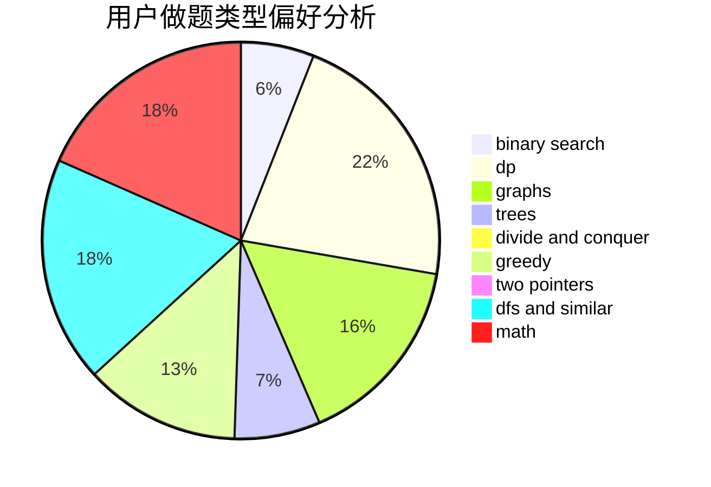

# 20175259

<!-- tabs:start -->

#### **用户提交结果分析**

#### **用户做题类型偏好分析**

<!-- tabs:end -->
# 推荐题目
[1243A](https://codeforces.com/contest/1243/problem/A)
[1065B](https://codeforces.com/contest/1065/problem/B)
[1238G](https://codeforces.com/contest/1238/problem/G)
[1159F](https://codeforces.com/contest/1159/problem/F)
[1239D](https://codeforces.com/contest/1239/problem/D)
[1241B](https://codeforces.com/contest/1241/problem/B)
[1240B](https://codeforces.com/contest/1240/problem/B)
[1168C](https://codeforces.com/contest/1168/problem/C)
[1239B](https://codeforces.com/contest/1239/problem/B)
[1240C](https://codeforces.com/contest/1240/problem/C)
