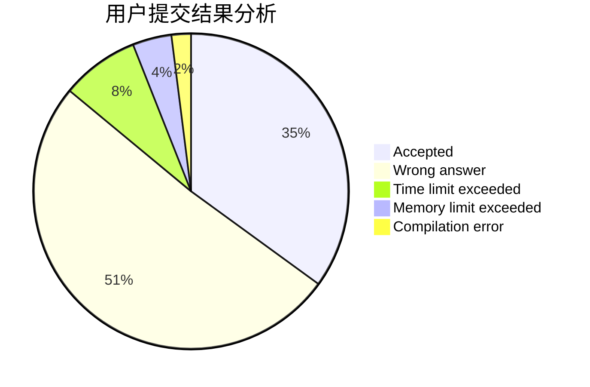
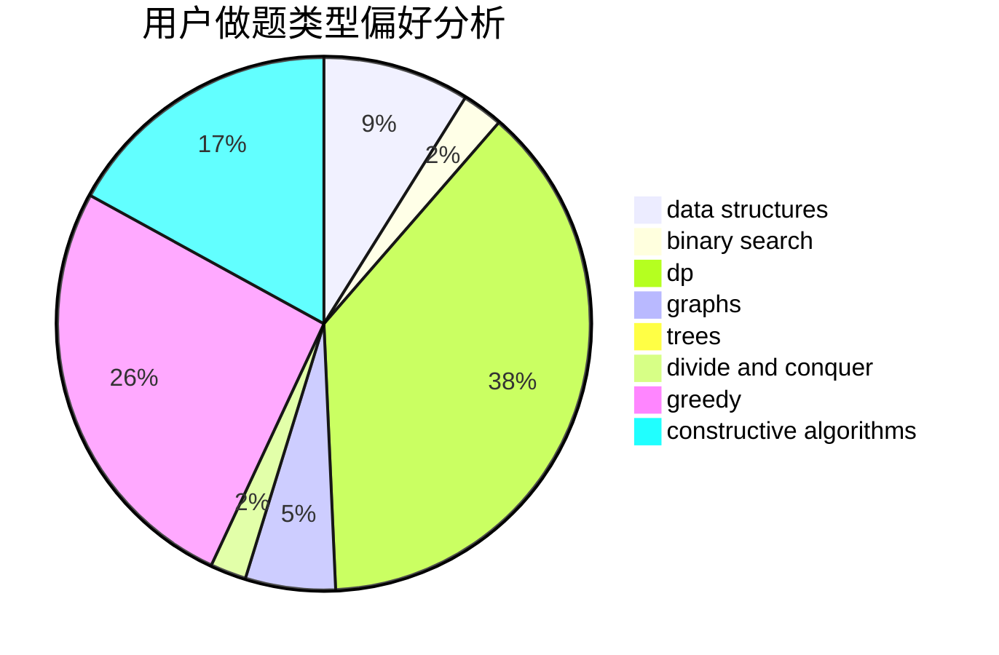
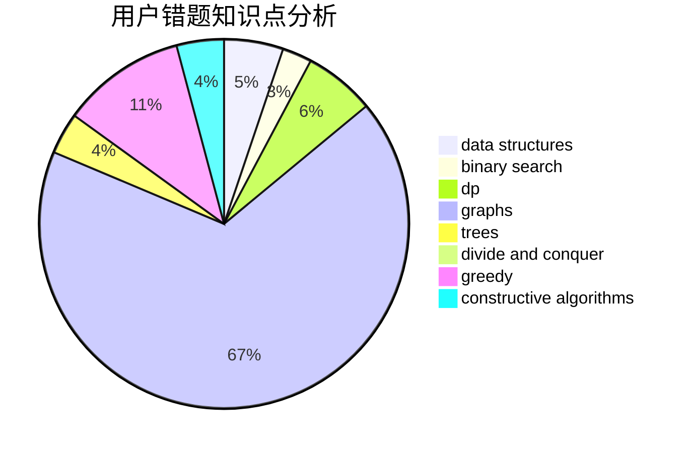

# 20175259
<!-- tabs:start -->
#### **用户提交结果分析**

#### **用户做题类型偏好分析**

#### **用户错题知识点分析**

<!-- tabs:end -->
# 推荐题目
[Increasing Matrix](http://codeforces.com/problemset/problem/1231/C)		greedy		  
[Anadi and Domino](https://codeforces.com/contest/1230/problem/C)		brute force,
                        graphs		  
[Yet Another Substring Reverse](http://codeforces.com/problemset/problem/1234/F)		bitmasks,
                        dp		  
[N Problems During K Days](http://codeforces.com/problemset/problem/1157/D)		constructive algorithms,
                        greedy,
                        math		  
[Kill `Em All](http://codeforces.com/problemset/problem/1238/B)		greedy,
                        sortings		  
[Alice and the Unfair Game](http://codeforces.com/problemset/problem/1236/E)		binary search,
                        data structures,
                        dp,
                        dsu		  
[Dwarves, Hats and Extrasensory Abilities](https://codeforces.com/contest/1064/problem/E)		binary search,
                        constructive algorithms,
                        geometry,
                        interactive		  
[Greedy Subsequences](http://codeforces.com/problemset/problem/1132/G)		data structures,
                        dp,
                        trees		  
[Balanced Distribution](http://codeforces.com/problemset/problem/1237/G)		data structures,
                        dp,
                        greedy		  
[Kamil and Making a Stream](https://codeforces.com/contest/1230/problem/E)		math,
                        number theory,
                        trees		  
<!-- tabs:start -->
#### **data structures**
[Alice and the Unfair Game](http://codeforces.com/problemset/problem/1236/E)		binary search,
                        data structures,
                        dp,
                        dsu		  
[Greedy Subsequences](http://codeforces.com/problemset/problem/1132/G)		data structures,
                        dp,
                        trees		  
[Balanced Distribution](http://codeforces.com/problemset/problem/1237/G)		data structures,
                        dp,
                        greedy		  
[Distinct Characters Queries](http://codeforces.com/problemset/problem/1234/D)		data structures		  
[Sasha and a Very Easy Test](http://codeforces.com/problemset/problem/1109/E)		data structures,
                        number theory		  
[Balanced Playlist](http://codeforces.com/problemset/problem/1237/D)		binary search,
                        data structures,
                        implementation		  
[Alice and the Doll](http://codeforces.com/problemset/problem/1236/D)		brute force,
                        data structures,
                        greedy,
                        implementation		  
[Social Network (hard version)](http://codeforces.com/problemset/problem/1234/B2)		data structures,
                        implementation		  
[Balanced Tunnel](http://codeforces.com/problemset/problem/1237/B)		data structures,
                        sortings,
                        two pointers		  
[Maximum width](http://codeforces.com/problemset/problem/1492/C)		binary search,
                        data structures,
                        dp,
                        greedy,
                        two pointers		  
#### **binary search**
[Alice and the Unfair Game](http://codeforces.com/problemset/problem/1236/E)		binary search,
                        data structures,
                        dp,
                        dsu		  
[Dwarves, Hats and Extrasensory Abilities](https://codeforces.com/contest/1064/problem/E)		binary search,
                        constructive algorithms,
                        geometry,
                        interactive		  
[Microtransactions (hard version)](http://codeforces.com/problemset/problem/1165/F2)		binary search,
                        greedy,
                        implementation		  
[Balanced Playlist](http://codeforces.com/problemset/problem/1237/D)		binary search,
                        data structures,
                        implementation		  
[Balanced Removals (Harder)](http://codeforces.com/problemset/problem/1237/C2)		binary search,
                        constructive algorithms,
                        divide and conquer,
                        greedy,
                        implementation,
                        sortings		  
[Maximum width](http://codeforces.com/problemset/problem/1492/C)		binary search,
                        data structures,
                        dp,
                        greedy,
                        two pointers		  
[Pairs](http://codeforces.com/problemset/problem/1463/D)		binary search,
                        constructive algorithms,
                        greedy,
                        two pointers		  
[Old Floppy Drive](http://codeforces.com/problemset/problem/1490/G)		binary search,
                        data structures,
                        math		  
[Odd Mineral Resource](http://codeforces.com/problemset/problem/1479/D)		binary search,
                        bitmasks,
                        brute force,
                        data structures,
                        probabilities,
                        trees		  
[Complicated Computations](http://codeforces.com/problemset/problem/1436/E)		binary search,
                        data structures,
                        two pointers		  
#### **dp**
[Yet Another Substring Reverse](http://codeforces.com/problemset/problem/1234/F)		bitmasks,
                        dp		  
[Alice and the Unfair Game](http://codeforces.com/problemset/problem/1236/E)		binary search,
                        data structures,
                        dp,
                        dsu		  
[Greedy Subsequences](http://codeforces.com/problemset/problem/1132/G)		data structures,
                        dp,
                        trees		  
[Balanced Distribution](http://codeforces.com/problemset/problem/1237/G)		data structures,
                        dp,
                        greedy		  
[Balanced Domino Placements](http://codeforces.com/problemset/problem/1237/F)		combinatorics,
                        dp		  
[Pipes](http://codeforces.com/problemset/problem/1234/C)		dp,
                        implementation		  
[Balanced Binary Search Trees](http://codeforces.com/problemset/problem/1237/E)		dp,
                        math		  
[Standard Free2play](http://codeforces.com/problemset/problem/1238/C)		dp,
                        greedy,
                        math		  
[Maximum width](http://codeforces.com/problemset/problem/1492/C)		binary search,
                        data structures,
                        dp,
                        greedy,
                        two pointers		  
[Bouncing Ball](https://codeforces.com/contest/1457/problem/C)		brute force,
                        dp,
                        implementation		  
#### **graph**
[Anadi and Domino](https://codeforces.com/contest/1230/problem/C)		brute force,
                        graphs		  
[Konrad and Company Evaluation](https://codeforces.com/contest/1230/problem/F)		graphs		  
[Fun with Integers](http://codeforces.com/problemset/problem/1062/D)		dfs and similar,
                        graphs,
                        implementation,
                        math		  
[Minimum Ties](http://codeforces.com/problemset/problem/1487/C)		brute force,
                        constructive algorithms,
                        dfs and similar,
                        graphs,
                        greedy,
                        implementation,
                        math		  
[Chef Monocarp](http://codeforces.com/problemset/problem/1437/C)		dp,
                        flows,
                        graph matchings,
                        greedy,
                        math,
                        sortings		  
[Strange Housing](http://codeforces.com/problemset/problem/1470/D)		constructive algorithms,
                        dfs and similar,
                        graph matchings,
                        graphs,
                        greedy		  
[Longest Simple Cycle](http://codeforces.com/problemset/problem/1476/C)		dp,
                        graphs,
                        greedy		  
[Shortest and Longest LIS](http://codeforces.com/problemset/problem/1304/D)		constructive algorithms,
                        graphs,
                        greedy,
                        two pointers		  
[Ball in Berland](http://codeforces.com/problemset/problem/1475/C)		combinatorics,
                        graphs,
                        math		  
[Kyoya and Train](http://codeforces.com/problemset/problem/553/E)		dp,
                        fft,
                        graphs,
                        math,
                        probabilities		  
#### **trees**
[Greedy Subsequences](http://codeforces.com/problemset/problem/1132/G)		data structures,
                        dp,
                        trees		  
[Kamil and Making a Stream](https://codeforces.com/contest/1230/problem/E)		math,
                        number theory,
                        trees		  
[Odd Mineral Resource](http://codeforces.com/problemset/problem/1479/D)		binary search,
                        bitmasks,
                        brute force,
                        data structures,
                        probabilities,
                        trees		  
[Yet Another Card Deck](http://codeforces.com/problemset/problem/1511/C)		brute force,
                        data structures,
                        implementation,
                        trees		  
[Diameter Cuts](http://codeforces.com/problemset/problem/1499/F)		combinatorics,
                        dfs and similar,
                        dp,
                        trees		  
[Fib-tree](http://codeforces.com/problemset/problem/1491/E)		brute force,
                        dfs and similar,
                        divide and conquer,
                        number theory,
                        trees		  
[13th Labour of Heracles](http://codeforces.com/problemset/problem/1466/D)		data structures,
                        greedy,
                        sortings,
                        trees		  
[BFS Trees](http://codeforces.com/problemset/problem/1495/D)		combinatorics,
                        dfs and similar,
                        graphs,
                        math,
                        shortest paths,
                        trees		  
[Sum of Prefix Sums](http://codeforces.com/problemset/problem/1303/G)		data structures,
                        divide and conquer,
                        geometry,
                        trees		  
[Number of Simple Paths](http://codeforces.com/problemset/problem/1454/E)		combinatorics,
                        dfs and similar,
                        graphs,
                        trees		  
#### **divide and conquer**
[Balanced Removals (Harder)](http://codeforces.com/problemset/problem/1237/C2)		binary search,
                        constructive algorithms,
                        divide and conquer,
                        greedy,
                        implementation,
                        sortings		  
[Divide and Summarize](http://codeforces.com/problemset/problem/1461/D)		binary search,
                        brute force,
                        data structures,
                        divide and conquer,
                        implementation,
                        sortings		  
[Song of the Sirens](http://codeforces.com/problemset/problem/1466/G)		combinatorics,
                        divide and conquer,
                        hashing,
                        math,
                        string suffix structures,
                        strings		  
[Permutation Transformation](http://codeforces.com/problemset/problem/1490/D)		dfs and similar,
                        divide and conquer,
                        implementation		  
[Skyline Photo](https://codeforces.com/contest/1483/problem/C)		data structures,
                        divide and conquer,
                        dp		  
[Fib-tree](http://codeforces.com/problemset/problem/1491/E)		brute force,
                        dfs and similar,
                        divide and conquer,
                        number theory,
                        trees		  
[Sum of Prefix Sums](http://codeforces.com/problemset/problem/1303/G)		data structures,
                        divide and conquer,
                        geometry,
                        trees		  
[Dogeforces](http://codeforces.com/problemset/problem/1494/D)		constructive algorithms,
                        data structures,
                        dfs and similar,
                        divide and conquer,
                        dsu,
                        greedy,
                        sortings,
                        trees		  
[Logistical Questions](http://codeforces.com/problemset/problem/566/C)		dfs and similar,
                        divide and conquer,
                        trees		  
[Fruit Sequences](http://codeforces.com/problemset/problem/1428/F)		binary search,
                        data structures,
                        divide and conquer,
                        dp,
                        two pointers		  
#### **greedy**
[Increasing Matrix](http://codeforces.com/problemset/problem/1231/C)		greedy		  
[N Problems During K Days](http://codeforces.com/problemset/problem/1157/D)		constructive algorithms,
                        greedy,
                        math		  
[Kill `Em All](http://codeforces.com/problemset/problem/1238/B)		greedy,
                        sortings		  
[Balanced Distribution](http://codeforces.com/problemset/problem/1237/G)		data structures,
                        dp,
                        greedy		  
[Microtransactions (hard version)](http://codeforces.com/problemset/problem/1165/F2)		binary search,
                        greedy,
                        implementation		  
[Stones](http://codeforces.com/problemset/problem/1236/A)		brute force,
                        greedy,
                        math		  
[Alice and the Doll](http://codeforces.com/problemset/problem/1236/D)		brute force,
                        data structures,
                        greedy,
                        implementation		  
[Balanced Removals (Harder)](http://codeforces.com/problemset/problem/1237/C2)		binary search,
                        constructive algorithms,
                        divide and conquer,
                        greedy,
                        implementation,
                        sortings		  
[Marcin and Training Camp](https://codeforces.com/contest/1230/problem/D)		brute force,
                        greedy		  
[Balanced Removals (Easier)](http://codeforces.com/problemset/problem/1237/C1)		constructive algorithms,
                        geometry,
                        greedy		  
#### **constructive algorithms**
[N Problems During K Days](http://codeforces.com/problemset/problem/1157/D)		constructive algorithms,
                        greedy,
                        math		  
[Dwarves, Hats and Extrasensory Abilities](https://codeforces.com/contest/1064/problem/E)		binary search,
                        constructive algorithms,
                        geometry,
                        interactive		  
[Balanced Removals (Harder)](http://codeforces.com/problemset/problem/1237/C2)		binary search,
                        constructive algorithms,
                        divide and conquer,
                        greedy,
                        implementation,
                        sortings		  
[Balanced Reversals](http://codeforces.com/problemset/problem/1237/H)		constructive algorithms		  
[Balanced Removals (Easier)](http://codeforces.com/problemset/problem/1237/C1)		constructive algorithms,
                        geometry,
                        greedy		  
[Labs](http://codeforces.com/problemset/problem/1236/C)		constructive algorithms,
                        greedy,
                        implementation		  
[Anti-knapsack](http://codeforces.com/problemset/problem/1493/A)		constructive algorithms,
                        greedy		  
[Pairs](http://codeforces.com/problemset/problem/1463/D)		binary search,
                        constructive algorithms,
                        greedy,
                        two pointers		  
[XOR-gun](https://codeforces.com/contest/1456/problem/B)		bitmasks,
                        brute force,
                        constructive algorithms		  
[Genius's Gambit](http://codeforces.com/problemset/problem/1492/D)		bitmasks,
                        constructive algorithms,
                        greedy,
                        math		  
#### **sortings**
[Kill `Em All](http://codeforces.com/problemset/problem/1238/B)		greedy,
                        sortings		  
[Balanced Removals (Harder)](http://codeforces.com/problemset/problem/1237/C2)		binary search,
                        constructive algorithms,
                        divide and conquer,
                        greedy,
                        implementation,
                        sortings		  
[Balanced Tunnel](http://codeforces.com/problemset/problem/1237/B)		data structures,
                        sortings,
                        two pointers		  
[Diamond Miner](https://codeforces.com/contest/1496/problem/C)		geometry,
                        greedy,
                        math,
                        sortings		  
[Meximization](http://codeforces.com/problemset/problem/1497/A)		brute force,
                        data structures,
                        greedy,
                        sortings		  
[Avoiding Zero](http://codeforces.com/problemset/problem/1427/A)		math,
                        sortings		  
[Divide and Summarize](http://codeforces.com/problemset/problem/1461/D)		binary search,
                        brute force,
                        data structures,
                        divide and conquer,
                        implementation,
                        sortings		  
[Chef Monocarp](http://codeforces.com/problemset/problem/1437/C)		dp,
                        flows,
                        graph matchings,
                        greedy,
                        math,
                        sortings		  
[Replacing Elements](http://codeforces.com/problemset/problem/1473/A)		greedy,
                        implementation,
                        math,
                        sortings		  
[Eastern Exhibition](http://codeforces.com/problemset/problem/1486/B)		binary search,
                        geometry,
                        shortest paths,
                        sortings		  
<!-- tabs:end -->
