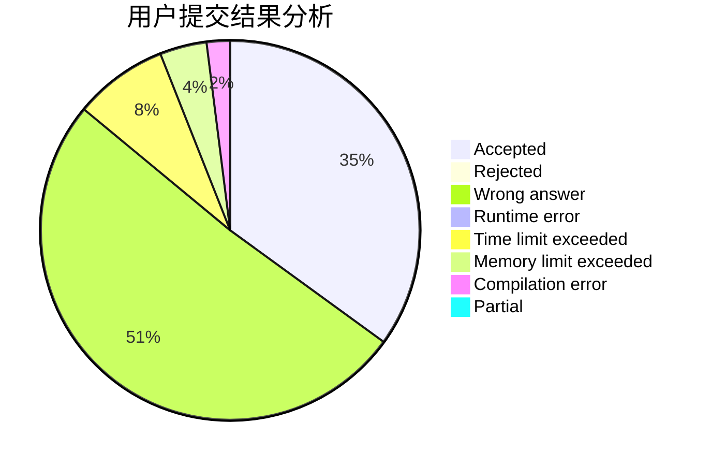
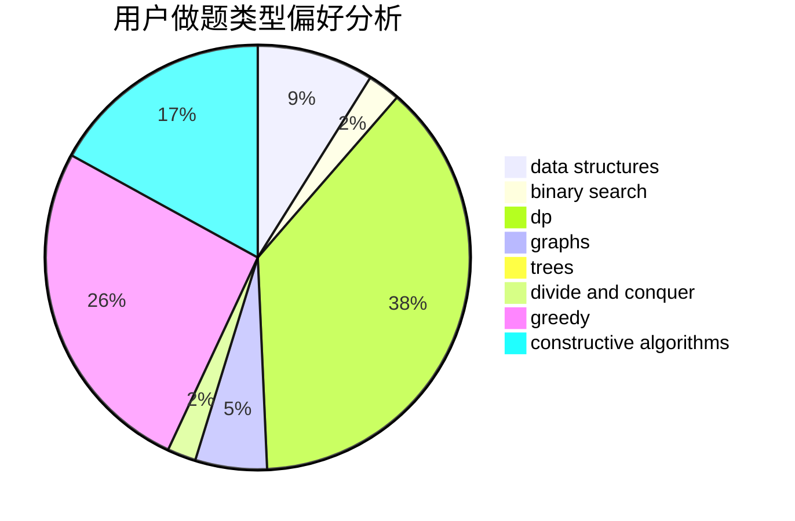
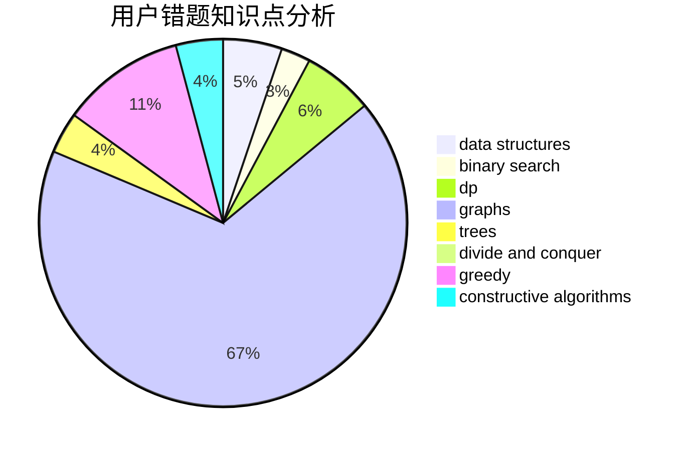

# 20175259

<!-- tabs:start -->

#### **用户提交结果分析**

#### **用户做题类型偏好分析**

#### **用户错题知识点分析**

<!-- tabs:end -->
# 推荐题目
[1238B](https://codeforces.com/contest/1238/problem/B)		greedy,
                        sortings		  
[1064E](https://codeforces.com/contest/1064/problem/E)		dsu,graphs,sortings,trees		  
[1230C](https://codeforces.com/contest/1230/problem/C)		dsu,graphs,sortings,trees		  
[1157D](https://codeforces.com/contest/1157/problem/D)		constructive algorithms,
                        greedy,
                        math		  
[1231C](https://codeforces.com/contest/1231/problem/C)		greedy		  
[1236E](https://codeforces.com/contest/1236/problem/E)		binary search,
                        data structures,
                        dp,
                        dsu		  
[1234E](https://codeforces.com/contest/1234/problem/E)		math		  
[1165F2](https://codeforces.com/contest/1165F/problem/2)		binary search,
                        greedy,
                        implementation		  
[1230E](https://codeforces.com/contest/1230/problem/E)		dsu,graphs,sortings,trees		  
[1234F](https://codeforces.com/contest/1234/problem/F)		bitmasks,
                        dp		  
