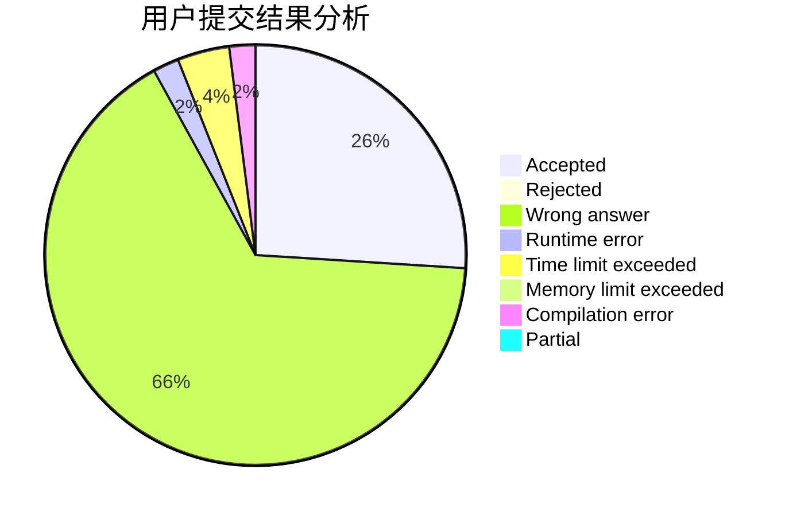
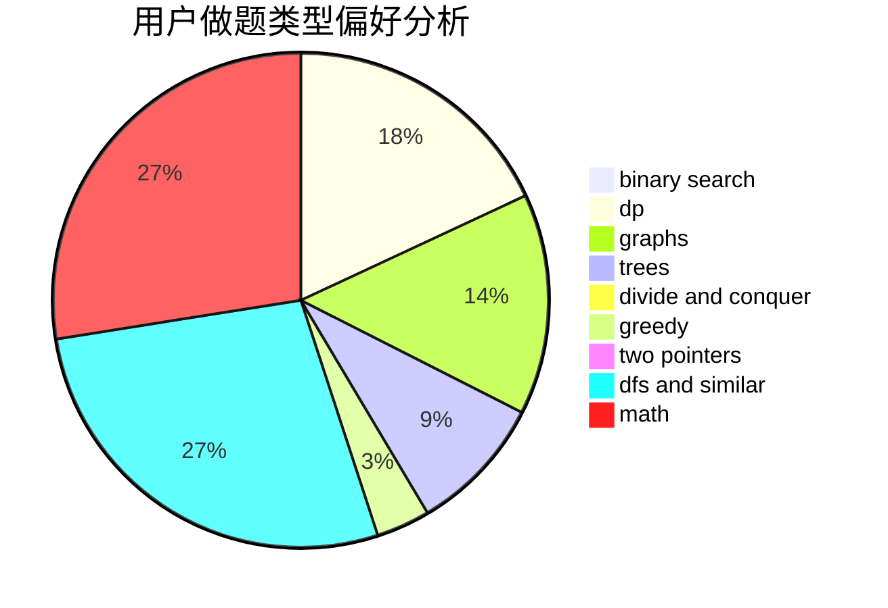

# Dreamer2020

<!-- tabs:start -->

#### **用户提交结果分析**

#### **用户做题类型偏好分析**

<!-- tabs:end -->
# 推荐题目
[810B](https://codeforces.com/contest/810/problem/B)
[1038C](https://codeforces.com/contest/1038/problem/C)
[346A](https://codeforces.com/contest/346/problem/A)
[18A](https://codeforces.com/contest/18/problem/A)
[11721](https://codeforces.com/contest/1172/problem/1)
[1405B](https://codeforces.com/contest/1405/problem/B)
[1405C](https://codeforces.com/contest/1405/problem/C)
[479A](https://codeforces.com/contest/479/problem/A)
[1195B](https://codeforces.com/contest/1195/problem/B)
[1418A](https://codeforces.com/contest/1418/problem/A)
