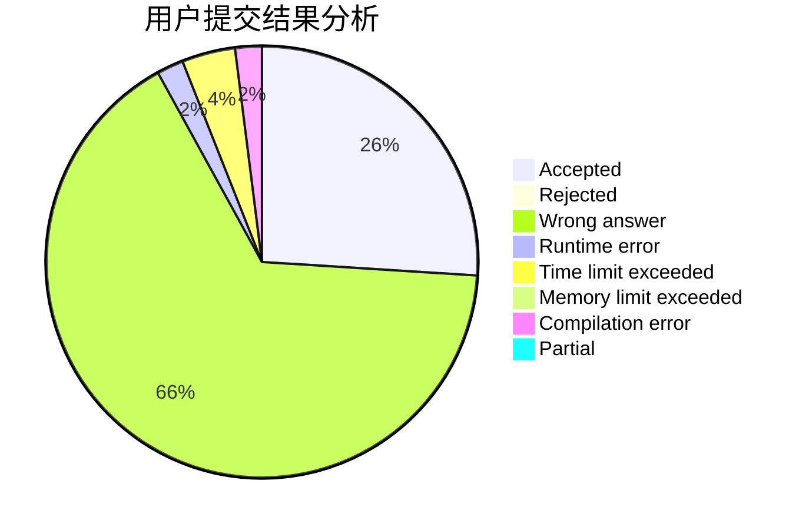
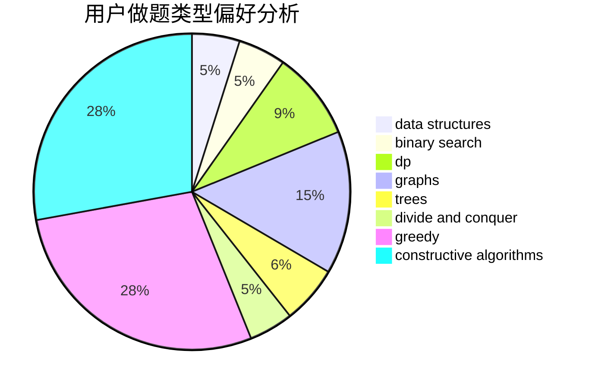

# Dreamer2020

<!-- tabs:start -->

#### **用户提交结果分析**

#### **用户做题类型偏好分析**

#### **用户错题知识点分析**

<!-- tabs:end -->
# 推荐题目
[796A](https://codeforces.com/contest/796/problem/A)		brute force,
                        implementation		  
[1037H](https://codeforces.com/contest/1037/problem/H)		data structures,
                        string suffix structures		  
[316G3](https://codeforces.com/contest/316G/problem/3)		string suffix structures		  
[164C](https://codeforces.com/contest/164/problem/C)		flows,
                        graphs		  
[1167B](https://codeforces.com/contest/1167/problem/B)		brute force,
                        divide and conquer,
                        interactive,
                        math		  
[1396C](https://codeforces.com/contest/1396/problem/C)		dp,
                        greedy,
                        implementation		  
[1396D](https://codeforces.com/contest/1396/problem/D)		data structures,
                        sortings,
                        two pointers		  
[45D](https://codeforces.com/contest/45/problem/D)		greedy,
                        meet-in-the-middle,
                        sortings		  
[118B](https://codeforces.com/contest/118/problem/B)		constructive algorithms,
                        implementation		  
[1407B](https://codeforces.com/contest/1407/problem/B)		brute force,
                        greedy,
                        math,
                        number theory		  
