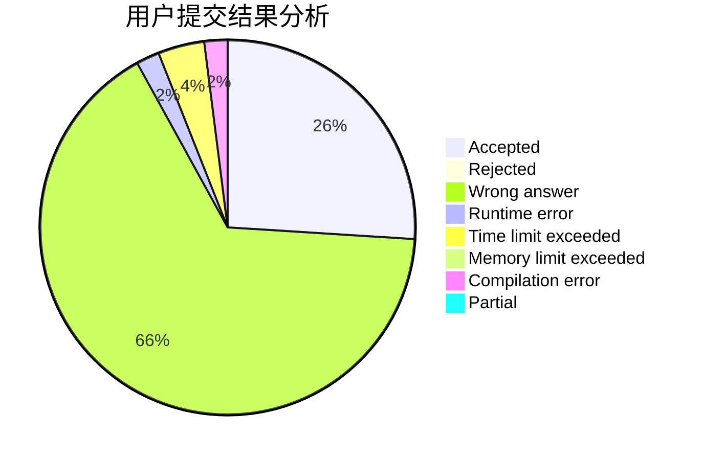
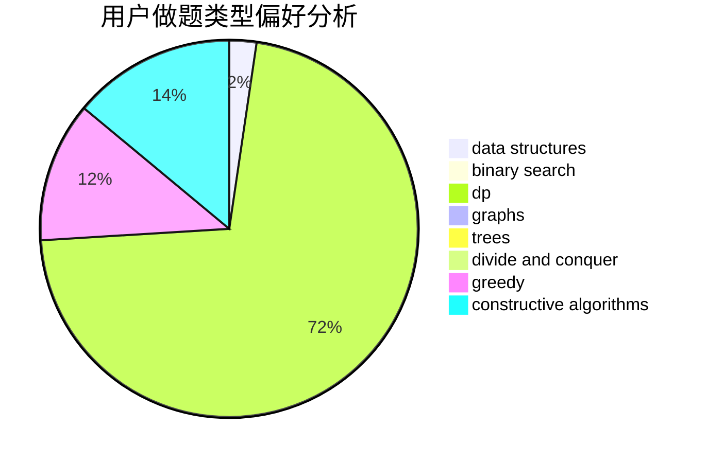

# Dreamer2020

<!-- tabs:start -->

#### **用户提交结果分析**

#### **用户做题类型偏好分析**

#### **用户错题知识点分析**

<!-- tabs:end -->
# 推荐题目
[810B](https://codeforces.com/contest/810/problem/B)		greedy,
                        sortings		  
[1038C](https://codeforces.com/contest/1038/problem/C)		greedy,
                        sortings		  
[346A](https://codeforces.com/contest/346/problem/A)		games,
                        math,
                        number theory		  
[18A](https://codeforces.com/contest/18/problem/A)		brute force,
                        geometry		  
[11721](https://codeforces.com/contest/1172/problem/1)		dsu,graphs,sortings,trees		  
[1405B](https://codeforces.com/contest/1405/problem/B)		constructive algorithms,
                        implementation		  
[1405C](https://codeforces.com/contest/1405/problem/C)		dsu,graphs,sortings,trees		  
[479A](https://codeforces.com/contest/479/problem/A)		brute force,
                        math		  
[1195B](https://codeforces.com/contest/1195/problem/B)		binary search,
                        brute force,
                        math		  
[1418A](https://codeforces.com/contest/1418/problem/A)		math		  
