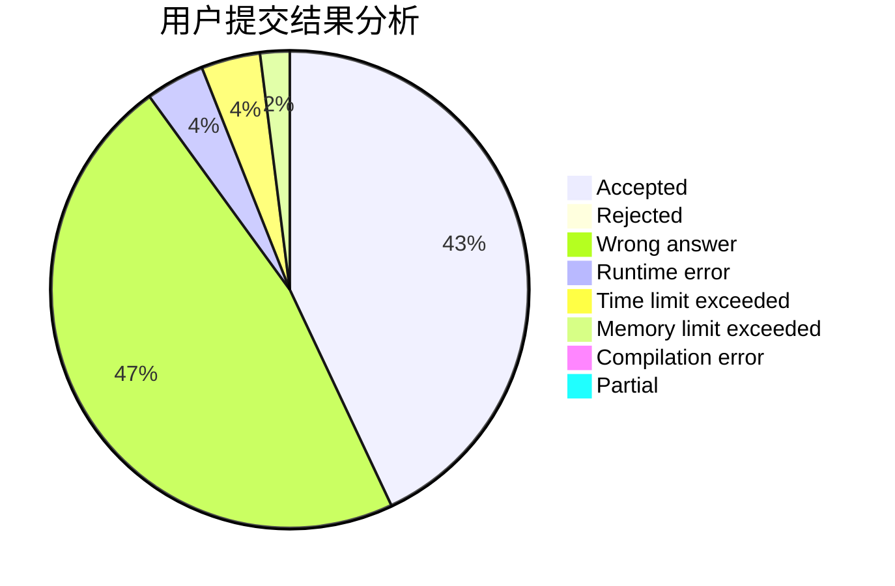
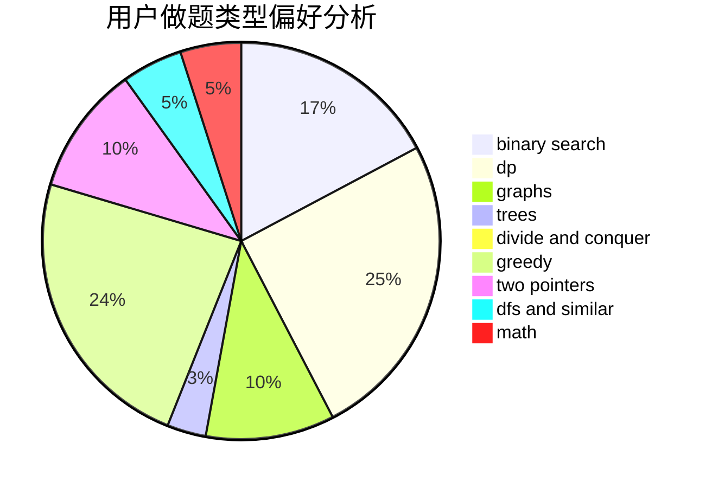

# Dreamfarer

<!-- tabs:start -->

#### **用户提交结果分析**

#### **用户做题类型偏好分析**

<!-- tabs:end -->
# 推荐题目
[809D](https://codeforces.com/contest/809/problem/D)
[638A](https://codeforces.com/contest/638/problem/A)
[19A](https://codeforces.com/contest/19/problem/A)
[1104C](https://codeforces.com/contest/1104/problem/C)
[3C](https://codeforces.com/contest/3/problem/C)
[219D](https://codeforces.com/contest/219/problem/D)
[672B](https://codeforces.com/contest/672/problem/B)
[1032D](https://codeforces.com/contest/1032/problem/D)
[490F](https://codeforces.com/contest/490/problem/F)
[260E](https://codeforces.com/contest/260/problem/E)
