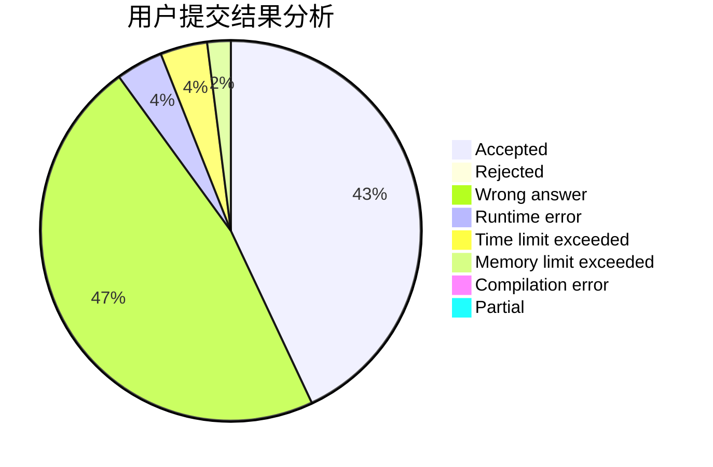
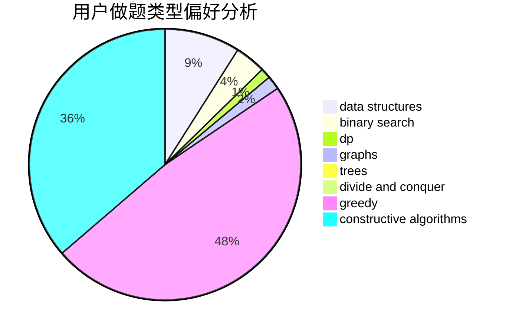
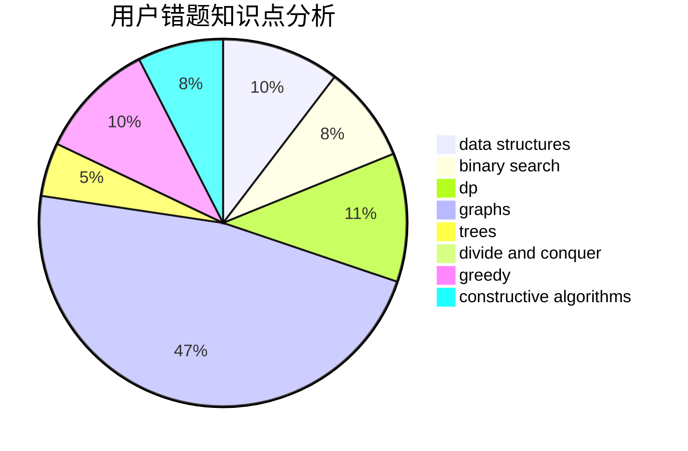

# Dreamfarer

<!-- tabs:start -->

#### **用户提交结果分析**

#### **用户做题类型偏好分析**

#### **用户错题知识点分析**

<!-- tabs:end -->
# 推荐题目
[809D](https://codeforces.com/contest/809/problem/D)		data structures,
                        dp		  
[638A](https://codeforces.com/contest/638/problem/A)		*special problem,
                        constructive algorithms,
                        math		  
[19A](https://codeforces.com/contest/19/problem/A)		implementation		  
[1104C](https://codeforces.com/contest/1104/problem/C)		dsu,graphs,sortings,trees		  
[3C](https://codeforces.com/contest/3/problem/C)		brute force,
                        games,
                        implementation		  
[219D](https://codeforces.com/contest/219/problem/D)		dfs and similar,
                        dp,
                        graphs,
                        trees		  
[672B](https://codeforces.com/contest/672/problem/B)		constructive algorithms,
                        implementation,
                        strings		  
[1032D](https://codeforces.com/contest/1032/problem/D)		geometry,
                        implementation		  
[490F](https://codeforces.com/contest/490/problem/F)		data structures,
                        dfs and similar,
                        dp,
                        trees		  
[260E](https://codeforces.com/contest/260/problem/E)		binary search,
                        brute force,
                        data structures		  
