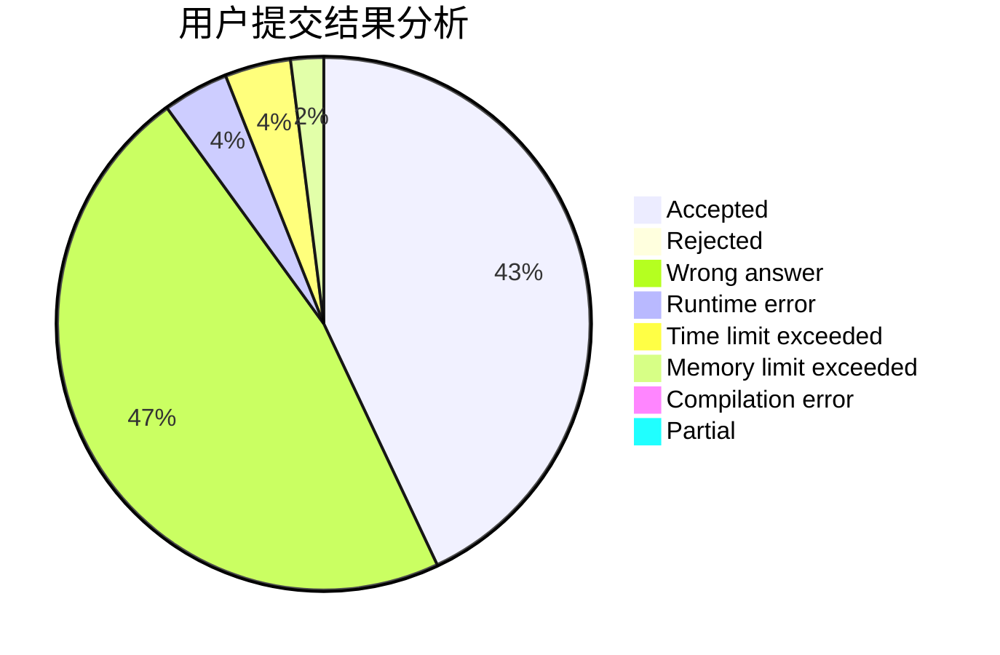
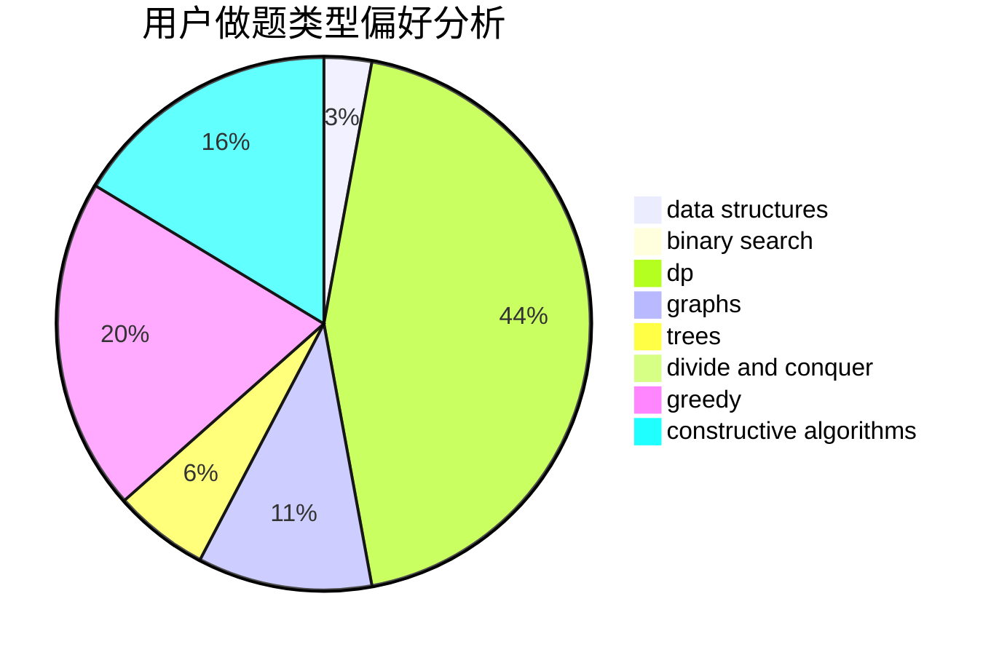
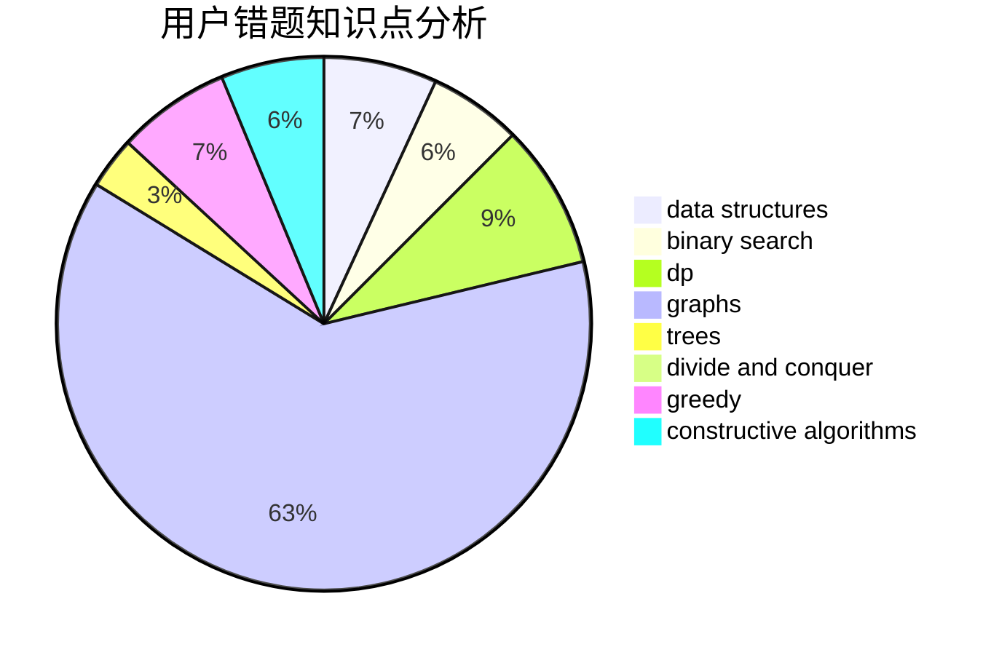

# Dreamfarer

<!-- tabs:start -->

#### **用户提交结果分析**

#### **用户做题类型偏好分析**

#### **用户错题知识点分析**

<!-- tabs:end -->
# 推荐题目
[794C](https://codeforces.com/contest/794/problem/C)		games,
                        greedy,
                        sortings		  
[618B](https://codeforces.com/contest/618/problem/B)		constructive algorithms		  
[171H](https://codeforces.com/contest/171/problem/H)		*special problem,
                        implementation		  
[1103E](https://codeforces.com/contest/1103/problem/E)		fft,
                        math,
                        number theory		  
[370A](https://codeforces.com/contest/370/problem/A)		graphs,
                        math,
                        shortest paths		  
[198B](https://codeforces.com/contest/198/problem/B)		shortest paths		  
[645F](https://codeforces.com/contest/645/problem/F)		combinatorics,
                        math,
                        number theory		  
[1031B](https://codeforces.com/contest/1031/problem/B)		nan		  
[472C](https://codeforces.com/contest/472/problem/C)		greedy		  
[23C](https://codeforces.com/contest/23/problem/C)		constructive algorithms,
                        sortings		  
