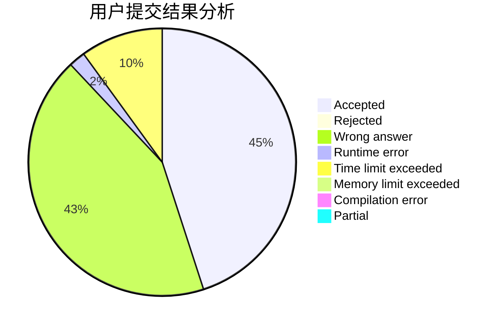
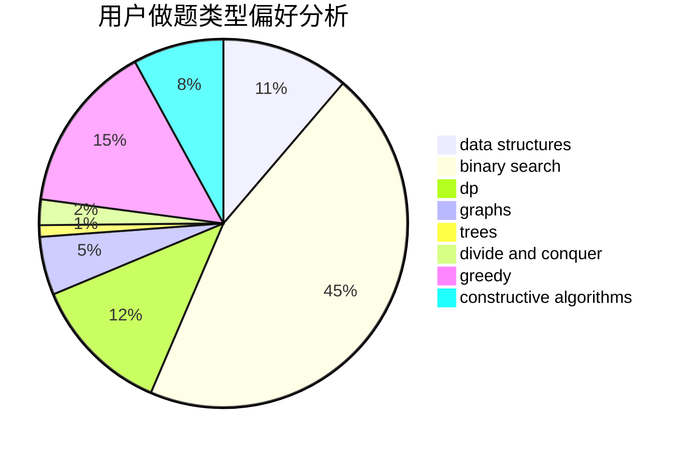
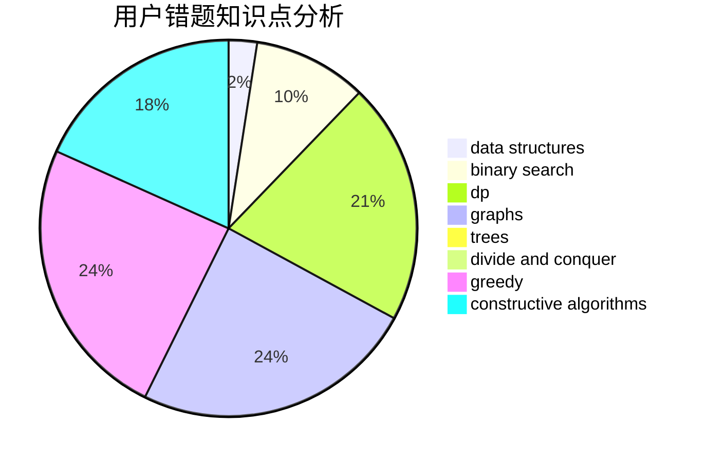

# Dreaminger

<!-- tabs:start -->

#### **用户提交结果分析**

#### **用户做题类型偏好分析**

#### **用户错题知识点分析**

<!-- tabs:end -->
# 推荐题目
[1361A](https://codeforces.com/contest/1361/problem/A)		constructive algorithms,
                        graphs,
                        greedy,
                        sortings		  
[266D](https://codeforces.com/contest/266/problem/D)		graphs,
                        math,
                        shortest paths		  
[1292C](https://codeforces.com/contest/1292/problem/C)		combinatorics,
                        dfs and similar,
                        dp,
                        greedy,
                        trees		  
[672A](https://codeforces.com/contest/672/problem/A)		implementation		  
[510E](https://codeforces.com/contest/510/problem/E)		flows		  
[1251A](https://codeforces.com/contest/1251/problem/A)		brute force,
                        strings,
                        two pointers		  
[797E](https://codeforces.com/contest/797/problem/E)		brute force,
                        data structures,
                        dp		  
[545C](https://codeforces.com/contest/545/problem/C)		dp,
                        greedy		  
[734B](https://codeforces.com/contest/734/problem/B)		brute force,
                        greedy,
                        implementation,
                        math		  
[498C](https://codeforces.com/contest/498/problem/C)		flows,
                        graph matchings,
                        number theory		  
