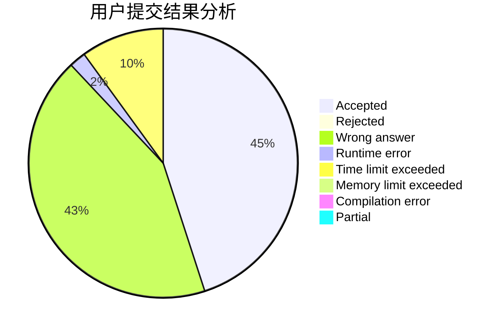
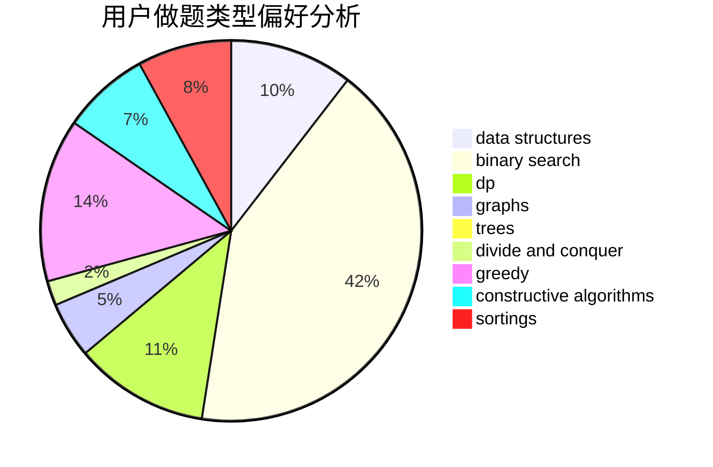
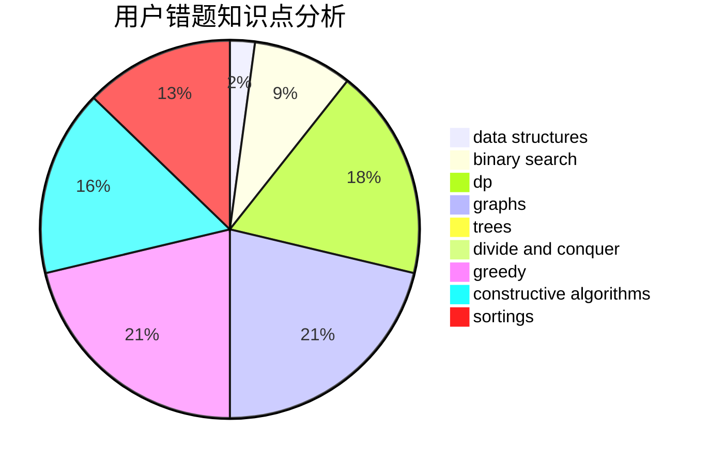

# Dreaminger
<!-- tabs:start -->
#### **用户提交结果分析**

#### **用户做题类型偏好分析**

#### **用户错题知识点分析**

<!-- tabs:end -->
# 推荐题目
[1397B](http://codeforces.com/problemset/problem/1397/B)		brute force,
                        math,
                        number theory,
                        sortings		  
[266D](http://codeforces.com/problemset/problem/266/D)		graphs,
                        math,
                        shortest paths		  
[1152A](http://codeforces.com/problemset/problem/1152/A)		greedy,
                        implementation,
                        math		  
[1361A](http://codeforces.com/problemset/problem/1361/A)		constructive algorithms,
                        graphs,
                        greedy,
                        sortings		  
[1081A](http://codeforces.com/problemset/problem/1081/A)		constructive algorithms,
                        math		  
[1251A](http://codeforces.com/problemset/problem/1251/A)		brute force,
                        strings,
                        two pointers		  
[1085A](http://codeforces.com/problemset/problem/1085/A)		implementation,
                        strings		  
[1403B](http://codeforces.com/problemset/problem/1403/B)		*special problem,
                        data structures,
                        dfs and similar,
                        graphs,
                        trees		  
[122C](https://codeforces.com/contest/122/problem/C)		implementation		  
[797B](http://codeforces.com/problemset/problem/797/B)		dp,
                        greedy,
                        implementation		  
<!-- tabs:start -->
#### **data structures**
[1403B](http://codeforces.com/problemset/problem/1403/B)		*special problem,
                        data structures,
                        dfs and similar,
                        graphs,
                        trees		  
[292D](http://codeforces.com/problemset/problem/292/D)		data structures,
                        dfs and similar,
                        dp,
                        dsu		  
[1403A](http://codeforces.com/problemset/problem/1403/A)		*special problem,
                        2-sat,
                        binary search,
                        data structures,
                        graphs,
                        interactive,
                        sortings,
                        two pointers		  
[1464F](http://codeforces.com/problemset/problem/1464/F)		data structures,
                        trees		  
[1000F](http://codeforces.com/problemset/problem/1000/F)		data structures,
                        divide and conquer		  
[797D](http://codeforces.com/problemset/problem/797/D)		data structures,
                        dfs and similar		  
[797C](http://codeforces.com/problemset/problem/797/C)		data structures,
                        greedy,
                        strings		  
[232D](http://codeforces.com/problemset/problem/232/D)		binary search,
                        data structures,
                        string suffix structures		  
[797E](http://codeforces.com/problemset/problem/797/E)		brute force,
                        data structures,
                        dp		  
[1492C](http://codeforces.com/problemset/problem/1492/C)		binary search,
                        data structures,
                        dp,
                        greedy,
                        two pointers		  
#### **binary search**
[1055E](http://codeforces.com/problemset/problem/1055/E)		binary search,
                        dp		  
[1403A](http://codeforces.com/problemset/problem/1403/A)		*special problem,
                        2-sat,
                        binary search,
                        data structures,
                        graphs,
                        interactive,
                        sortings,
                        two pointers		  
[1166D](http://codeforces.com/problemset/problem/1166/D)		binary search,
                        brute force,
                        greedy,
                        math		  
[1158A](http://codeforces.com/problemset/problem/1158/A)		binary search,
                        constructive algorithms,
                        greedy,
                        implementation,
                        math,
                        sortings,
                        two pointers		  
[232D](http://codeforces.com/problemset/problem/232/D)		binary search,
                        data structures,
                        string suffix structures		  
[1492C](http://codeforces.com/problemset/problem/1492/C)		binary search,
                        data structures,
                        dp,
                        greedy,
                        two pointers		  
[1463D](http://codeforces.com/problemset/problem/1463/D)		binary search,
                        constructive algorithms,
                        greedy,
                        two pointers		  
[1490G](http://codeforces.com/problemset/problem/1490/G)		binary search,
                        data structures,
                        math		  
[1479D](http://codeforces.com/problemset/problem/1479/D)		binary search,
                        bitmasks,
                        brute force,
                        data structures,
                        probabilities,
                        trees		  
[1436E](http://codeforces.com/problemset/problem/1436/E)		binary search,
                        data structures,
                        two pointers		  
#### **dp**
[797B](http://codeforces.com/problemset/problem/797/B)		dp,
                        greedy,
                        implementation		  
[256D](http://codeforces.com/problemset/problem/256/D)		dp		  
[771D](http://codeforces.com/problemset/problem/771/D)		dp		  
[1055E](http://codeforces.com/problemset/problem/1055/E)		binary search,
                        dp		  
[292D](http://codeforces.com/problemset/problem/292/D)		data structures,
                        dfs and similar,
                        dp,
                        dsu		  
[1292C](http://codeforces.com/problemset/problem/1292/C)		combinatorics,
                        dfs and similar,
                        dp,
                        greedy,
                        trees		  
[1392G](http://codeforces.com/problemset/problem/1392/G)		bitmasks,
                        dfs and similar,
                        dp,
                        math,
                        shortest paths		  
[545C](http://codeforces.com/problemset/problem/545/C)		dp,
                        greedy		  
[796D](http://codeforces.com/problemset/problem/796/D)		constructive algorithms,
                        dfs and similar,
                        dp,
                        graphs,
                        shortest paths,
                        trees		  
[1387B1](http://codeforces.com/problemset/problem/1387/B1)		*special problem,
                        dp,
                        greedy,
                        trees		  
#### **graph**
[266D](http://codeforces.com/problemset/problem/266/D)		graphs,
                        math,
                        shortest paths		  
[1361A](http://codeforces.com/problemset/problem/1361/A)		constructive algorithms,
                        graphs,
                        greedy,
                        sortings		  
[1403B](http://codeforces.com/problemset/problem/1403/B)		*special problem,
                        data structures,
                        dfs and similar,
                        graphs,
                        trees		  
[468D](http://codeforces.com/problemset/problem/468/D)		graph matchings		  
[498C](http://codeforces.com/problemset/problem/498/C)		flows,
                        graph matchings,
                        number theory		  
[59E](http://codeforces.com/problemset/problem/59/E)		graphs,
                        shortest paths		  
[1403A](http://codeforces.com/problemset/problem/1403/A)		*special problem,
                        2-sat,
                        binary search,
                        data structures,
                        graphs,
                        interactive,
                        sortings,
                        two pointers		  
[1167C](http://codeforces.com/problemset/problem/1167/C)		dfs and similar,
                        dsu,
                        graphs		  
[796D](http://codeforces.com/problemset/problem/796/D)		constructive algorithms,
                        dfs and similar,
                        dp,
                        graphs,
                        shortest paths,
                        trees		  
[1487C](http://codeforces.com/problemset/problem/1487/C)		brute force,
                        constructive algorithms,
                        dfs and similar,
                        graphs,
                        greedy,
                        implementation,
                        math		  
#### **trees**
[1403B](http://codeforces.com/problemset/problem/1403/B)		*special problem,
                        data structures,
                        dfs and similar,
                        graphs,
                        trees		  
[566A](http://codeforces.com/problemset/problem/566/A)		dfs and similar,
                        strings,
                        trees		  
[1292C](http://codeforces.com/problemset/problem/1292/C)		combinatorics,
                        dfs and similar,
                        dp,
                        greedy,
                        trees		  
[1464F](http://codeforces.com/problemset/problem/1464/F)		data structures,
                        trees		  
[796D](http://codeforces.com/problemset/problem/796/D)		constructive algorithms,
                        dfs and similar,
                        dp,
                        graphs,
                        shortest paths,
                        trees		  
[1387B1](http://codeforces.com/problemset/problem/1387/B1)		*special problem,
                        dp,
                        greedy,
                        trees		  
[1479D](http://codeforces.com/problemset/problem/1479/D)		binary search,
                        bitmasks,
                        brute force,
                        data structures,
                        probabilities,
                        trees		  
[1511C](http://codeforces.com/problemset/problem/1511/C)		brute force,
                        data structures,
                        implementation,
                        trees		  
[1499F](http://codeforces.com/problemset/problem/1499/F)		combinatorics,
                        dfs and similar,
                        dp,
                        trees		  
[1491E](http://codeforces.com/problemset/problem/1491/E)		brute force,
                        dfs and similar,
                        divide and conquer,
                        number theory,
                        trees		  
#### **divide and conquer**
[1000F](http://codeforces.com/problemset/problem/1000/F)		data structures,
                        divide and conquer		  
[1461D](http://codeforces.com/problemset/problem/1461/D)		binary search,
                        brute force,
                        data structures,
                        divide and conquer,
                        implementation,
                        sortings		  
[1466G](http://codeforces.com/problemset/problem/1466/G)		combinatorics,
                        divide and conquer,
                        hashing,
                        math,
                        string suffix structures,
                        strings		  
[1490D](http://codeforces.com/problemset/problem/1490/D)		dfs and similar,
                        divide and conquer,
                        implementation		  
[1483C](https://codeforces.com/contest/1483/problem/C)		data structures,
                        divide and conquer,
                        dp		  
[1491E](http://codeforces.com/problemset/problem/1491/E)		brute force,
                        dfs and similar,
                        divide and conquer,
                        number theory,
                        trees		  
[1303G](http://codeforces.com/problemset/problem/1303/G)		data structures,
                        divide and conquer,
                        geometry,
                        trees		  
[1494D](http://codeforces.com/problemset/problem/1494/D)		constructive algorithms,
                        data structures,
                        dfs and similar,
                        divide and conquer,
                        dsu,
                        greedy,
                        sortings,
                        trees		  
[1482E](http://codeforces.com/problemset/problem/1482/E)		data structures,
                        divide and conquer,
                        dp		  
[566C](http://codeforces.com/problemset/problem/566/C)		dfs and similar,
                        divide and conquer,
                        trees		  
#### **greedy**
[1152A](http://codeforces.com/problemset/problem/1152/A)		greedy,
                        implementation,
                        math		  
[1361A](http://codeforces.com/problemset/problem/1361/A)		constructive algorithms,
                        graphs,
                        greedy,
                        sortings		  
[797B](http://codeforces.com/problemset/problem/797/B)		dp,
                        greedy,
                        implementation		  
[734B](http://codeforces.com/problemset/problem/734/B)		brute force,
                        greedy,
                        implementation,
                        math		  
[1292C](http://codeforces.com/problemset/problem/1292/C)		combinatorics,
                        dfs and similar,
                        dp,
                        greedy,
                        trees		  
[1166D](http://codeforces.com/problemset/problem/1166/D)		binary search,
                        brute force,
                        greedy,
                        math		  
[545C](http://codeforces.com/problemset/problem/545/C)		dp,
                        greedy		  
[797C](http://codeforces.com/problemset/problem/797/C)		data structures,
                        greedy,
                        strings		  
[1464B](https://codeforces.com/contest/1464/problem/B)		brute force,
                        greedy,
                        implementation,
                        strings		  
[1427B](http://codeforces.com/problemset/problem/1427/B)		greedy,
                        implementation,
                        sortings		  
#### **constructive algorithms**
[1361A](http://codeforces.com/problemset/problem/1361/A)		constructive algorithms,
                        graphs,
                        greedy,
                        sortings		  
[1081A](http://codeforces.com/problemset/problem/1081/A)		constructive algorithms,
                        math		  
[796D](http://codeforces.com/problemset/problem/796/D)		constructive algorithms,
                        dfs and similar,
                        dp,
                        graphs,
                        shortest paths,
                        trees		  
[1158A](http://codeforces.com/problemset/problem/1158/A)		binary search,
                        constructive algorithms,
                        greedy,
                        implementation,
                        math,
                        sortings,
                        two pointers		  
[1493A](http://codeforces.com/problemset/problem/1493/A)		constructive algorithms,
                        greedy		  
[1463D](http://codeforces.com/problemset/problem/1463/D)		binary search,
                        constructive algorithms,
                        greedy,
                        two pointers		  
[1456B](https://codeforces.com/contest/1456/problem/B)		bitmasks,
                        brute force,
                        constructive algorithms		  
[1492D](http://codeforces.com/problemset/problem/1492/D)		bitmasks,
                        constructive algorithms,
                        greedy,
                        math		  
[1504D](https://codeforces.com/contest/1504/problem/D)		constructive algorithms,
                        games,
                        interactive		  
[1483A](https://codeforces.com/contest/1483/problem/A)		brute force,
                        constructive algorithms,
                        greedy,
                        implementation		  
#### **sortings**
[1397B](http://codeforces.com/problemset/problem/1397/B)		brute force,
                        math,
                        number theory,
                        sortings		  
[1361A](http://codeforces.com/problemset/problem/1361/A)		constructive algorithms,
                        graphs,
                        greedy,
                        sortings		  
[1403A](http://codeforces.com/problemset/problem/1403/A)		*special problem,
                        2-sat,
                        binary search,
                        data structures,
                        graphs,
                        interactive,
                        sortings,
                        two pointers		  
[1121A](http://codeforces.com/problemset/problem/1121/A)		implementation,
                        sortings		  
[1427B](http://codeforces.com/problemset/problem/1427/B)		greedy,
                        implementation,
                        sortings		  
[1158A](http://codeforces.com/problemset/problem/1158/A)		binary search,
                        constructive algorithms,
                        greedy,
                        implementation,
                        math,
                        sortings,
                        two pointers		  
[1496C](https://codeforces.com/contest/1496/problem/C)		geometry,
                        greedy,
                        math,
                        sortings		  
[1495A](http://codeforces.com/problemset/problem/1495/A)		geometry,
                        greedy,
                        math,
                        sortings		  
[1497A](http://codeforces.com/problemset/problem/1497/A)		brute force,
                        data structures,
                        greedy,
                        sortings		  
[1427A](http://codeforces.com/problemset/problem/1427/A)		math,
                        sortings		  
<!-- tabs:end -->
