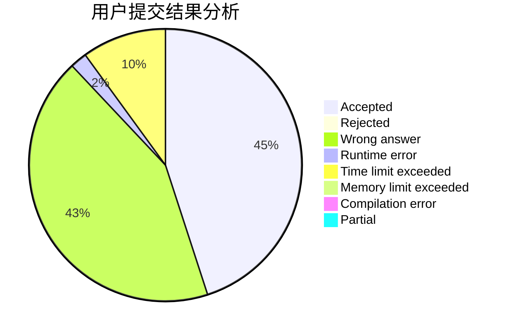
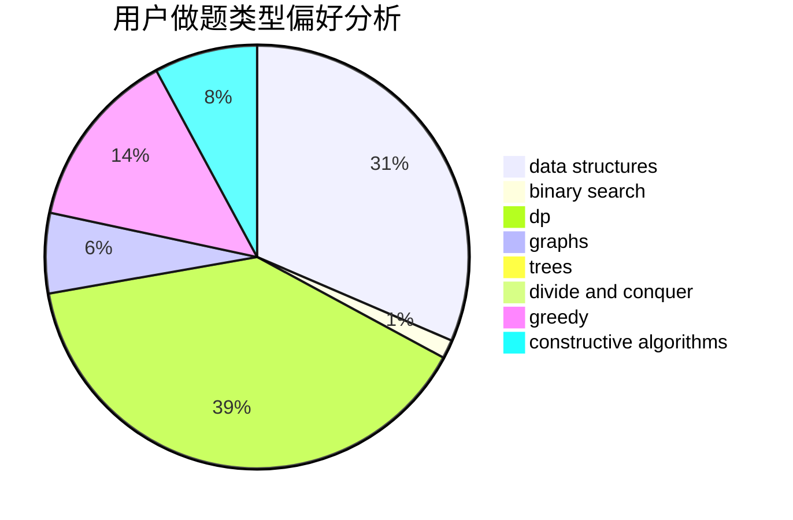

# Dreaminger

<!-- tabs:start -->

#### **用户提交结果分析**

#### **用户做题类型偏好分析**

#### **用户错题知识点分析**

<!-- tabs:end -->
# 推荐题目
[1369A](https://codeforces.com/contest/1369/problem/A)		geometry,
                        math		  
[282C](https://codeforces.com/contest/282/problem/C)		constructive algorithms,
                        implementation,
                        math		  
[1299C](https://codeforces.com/contest/1299/problem/C)		data structures,
                        geometry,
                        greedy		  
[698B](https://codeforces.com/contest/698/problem/B)		constructive algorithms,
                        dfs and similar,
                        dsu,
                        graphs,
                        trees		  
[534F](https://codeforces.com/contest/534/problem/F)		bitmasks,
                        dp,
                        hashing,
                        meet-in-the-middle		  
[1256B](https://codeforces.com/contest/1256/problem/B)		greedy		  
[811D](https://codeforces.com/contest/811/problem/D)		constructive algorithms,
                        dfs and similar,
                        graphs,
                        interactive		  
[56E](https://codeforces.com/contest/56/problem/E)		binary search,
                        data structures,
                        sortings		  
[754D](https://codeforces.com/contest/754/problem/D)		binary search,
                        data structures,
                        greedy,
                        sortings		  
[519B](https://codeforces.com/contest/519/problem/B)		data structures,
                        implementation,
                        sortings		  
