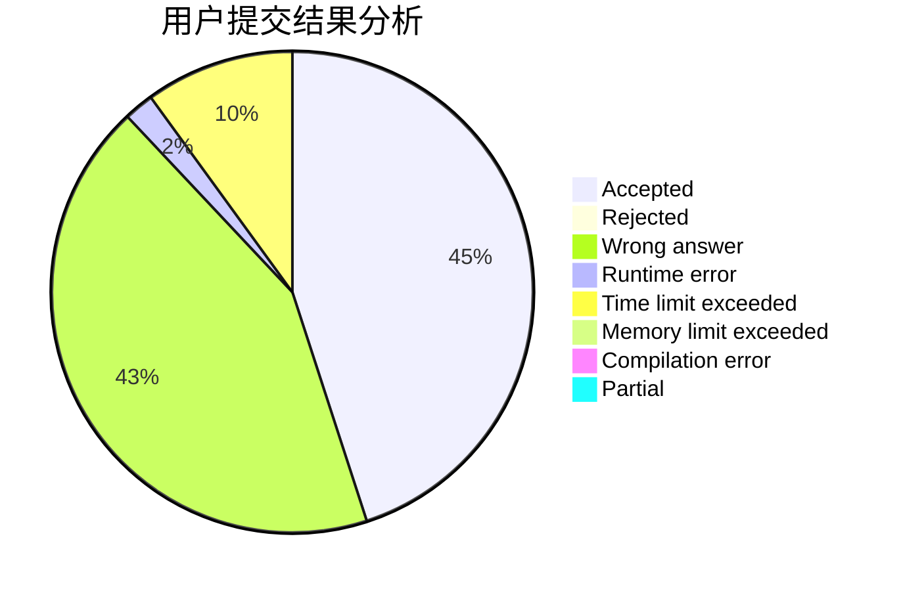
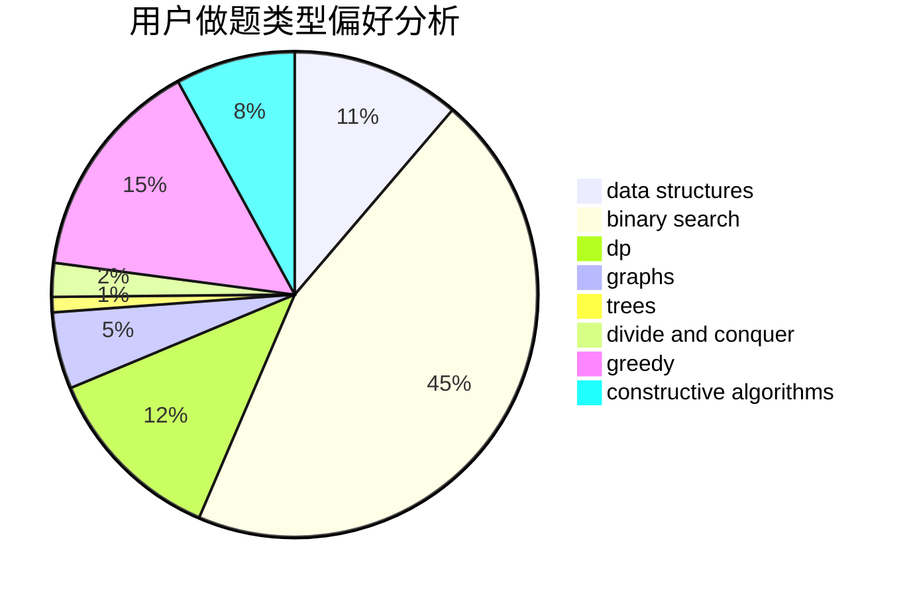
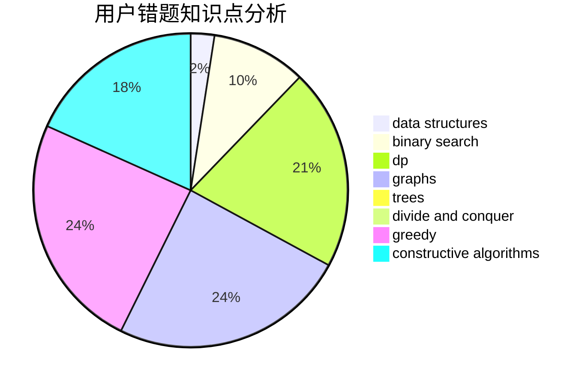

# Dreaminger
<!-- tabs:start -->
#### **用户提交结果分析**

#### **用户做题类型偏好分析**

#### **用户错题知识点分析**

<!-- tabs:end -->
# 推荐题目
[Power Sequence](http://codeforces.com/problemset/problem/1397/B)		brute force,
                        math,
                        number theory,
                        sortings		  
[BerDonalds](http://codeforces.com/problemset/problem/266/D)		graphs,
                        math,
                        shortest paths		  
[Neko Finds Grapes](http://codeforces.com/problemset/problem/1152/A)		greedy,
                        implementation,
                        math		  
[Johnny and Contribution](http://codeforces.com/problemset/problem/1361/A)		constructive algorithms,
                        graphs,
                        greedy,
                        sortings		  
[Definite Game](http://codeforces.com/problemset/problem/1081/A)		constructive algorithms,
                        math		  
[Broken Keyboard](http://codeforces.com/problemset/problem/1251/A)		brute force,
                        strings,
                        two pointers		  
[Right-Left Cipher](http://codeforces.com/problemset/problem/1085/A)		implementation,
                        strings		  
[Spring cleaning](http://codeforces.com/problemset/problem/1403/B)		*special problem,
                        data structures,
                        dfs and similar,
                        graphs,
                        trees		  
[Lucky Sum](https://codeforces.com/contest/122/problem/C)		implementation		  
[Odd sum](http://codeforces.com/problemset/problem/797/B)		dp,
                        greedy,
                        implementation		  
<!-- tabs:start -->
#### **data structures**
[Power Sequence](http://codeforces.com/problemset/problem/1403/B)		*special problem,
                        data structures,
                        dfs and similar,
                        graphs,
                        trees		  
[BerDonalds](http://codeforces.com/problemset/problem/292/D)		data structures,
                        dfs and similar,
                        dp,
                        dsu		  
[Neko Finds Grapes](http://codeforces.com/problemset/problem/1403/A)		*special problem,
                        2-sat,
                        binary search,
                        data structures,
                        graphs,
                        interactive,
                        sortings,
                        two pointers		  
[Johnny and Contribution](http://codeforces.com/problemset/problem/1464/F)		data structures,
                        trees		  
[Definite Game](http://codeforces.com/problemset/problem/1000/F)		data structures,
                        divide and conquer		  
[Broken Keyboard](http://codeforces.com/problemset/problem/797/D)		data structures,
                        dfs and similar		  
[Right-Left Cipher](http://codeforces.com/problemset/problem/797/C)		data structures,
                        greedy,
                        strings		  
[Spring cleaning](http://codeforces.com/problemset/problem/232/D)		binary search,
                        data structures,
                        string suffix structures		  
[Lucky Sum](http://codeforces.com/problemset/problem/797/E)		brute force,
                        data structures,
                        dp		  
[Odd sum](http://codeforces.com/problemset/problem/1492/C)		binary search,
                        data structures,
                        dp,
                        greedy,
                        two pointers		  
#### **binary search**
[Power Sequence](http://codeforces.com/problemset/problem/1055/E)		binary search,
                        dp		  
[BerDonalds](http://codeforces.com/problemset/problem/1403/A)		*special problem,
                        2-sat,
                        binary search,
                        data structures,
                        graphs,
                        interactive,
                        sortings,
                        two pointers		  
[Neko Finds Grapes](http://codeforces.com/problemset/problem/1166/D)		binary search,
                        brute force,
                        greedy,
                        math		  
[Johnny and Contribution](http://codeforces.com/problemset/problem/1158/A)		binary search,
                        constructive algorithms,
                        greedy,
                        implementation,
                        math,
                        sortings,
                        two pointers		  
[Definite Game](http://codeforces.com/problemset/problem/232/D)		binary search,
                        data structures,
                        string suffix structures		  
[Broken Keyboard](http://codeforces.com/problemset/problem/1492/C)		binary search,
                        data structures,
                        dp,
                        greedy,
                        two pointers		  
[Right-Left Cipher](http://codeforces.com/problemset/problem/1463/D)		binary search,
                        constructive algorithms,
                        greedy,
                        two pointers		  
[Spring cleaning](http://codeforces.com/problemset/problem/1490/G)		binary search,
                        data structures,
                        math		  
[Lucky Sum](http://codeforces.com/problemset/problem/1479/D)		binary search,
                        bitmasks,
                        brute force,
                        data structures,
                        probabilities,
                        trees		  
[Odd sum](http://codeforces.com/problemset/problem/1436/E)		binary search,
                        data structures,
                        two pointers		  
#### **dp**
[Power Sequence](http://codeforces.com/problemset/problem/797/B)		dp,
                        greedy,
                        implementation		  
[BerDonalds](http://codeforces.com/problemset/problem/256/D)		dp		  
[Neko Finds Grapes](http://codeforces.com/problemset/problem/771/D)		dp		  
[Johnny and Contribution](http://codeforces.com/problemset/problem/1055/E)		binary search,
                        dp		  
[Definite Game](http://codeforces.com/problemset/problem/292/D)		data structures,
                        dfs and similar,
                        dp,
                        dsu		  
[Broken Keyboard](http://codeforces.com/problemset/problem/1292/C)		combinatorics,
                        dfs and similar,
                        dp,
                        greedy,
                        trees		  
[Right-Left Cipher](http://codeforces.com/problemset/problem/1392/G)		bitmasks,
                        dfs and similar,
                        dp,
                        math,
                        shortest paths		  
[Spring cleaning](http://codeforces.com/problemset/problem/545/C)		dp,
                        greedy		  
[Lucky Sum](http://codeforces.com/problemset/problem/796/D)		constructive algorithms,
                        dfs and similar,
                        dp,
                        graphs,
                        shortest paths,
                        trees		  
[Odd sum](http://codeforces.com/problemset/problem/1387/B1)		*special problem,
                        dp,
                        greedy,
                        trees		  
#### **graph**
[Power Sequence](http://codeforces.com/problemset/problem/266/D)		graphs,
                        math,
                        shortest paths		  
[BerDonalds](http://codeforces.com/problemset/problem/1361/A)		constructive algorithms,
                        graphs,
                        greedy,
                        sortings		  
[Neko Finds Grapes](http://codeforces.com/problemset/problem/1403/B)		*special problem,
                        data structures,
                        dfs and similar,
                        graphs,
                        trees		  
[Johnny and Contribution](http://codeforces.com/problemset/problem/468/D)		graph matchings		  
[Definite Game](http://codeforces.com/problemset/problem/498/C)		flows,
                        graph matchings,
                        number theory		  
[Broken Keyboard](http://codeforces.com/problemset/problem/59/E)		graphs,
                        shortest paths		  
[Right-Left Cipher](http://codeforces.com/problemset/problem/1403/A)		*special problem,
                        2-sat,
                        binary search,
                        data structures,
                        graphs,
                        interactive,
                        sortings,
                        two pointers		  
[Spring cleaning](http://codeforces.com/problemset/problem/1167/C)		dfs and similar,
                        dsu,
                        graphs		  
[Lucky Sum](http://codeforces.com/problemset/problem/796/D)		constructive algorithms,
                        dfs and similar,
                        dp,
                        graphs,
                        shortest paths,
                        trees		  
[Odd sum](http://codeforces.com/problemset/problem/1487/C)		brute force,
                        constructive algorithms,
                        dfs and similar,
                        graphs,
                        greedy,
                        implementation,
                        math		  
#### **trees**
[Power Sequence](http://codeforces.com/problemset/problem/1403/B)		*special problem,
                        data structures,
                        dfs and similar,
                        graphs,
                        trees		  
[BerDonalds](http://codeforces.com/problemset/problem/566/A)		dfs and similar,
                        strings,
                        trees		  
[Neko Finds Grapes](http://codeforces.com/problemset/problem/1292/C)		combinatorics,
                        dfs and similar,
                        dp,
                        greedy,
                        trees		  
[Johnny and Contribution](http://codeforces.com/problemset/problem/1464/F)		data structures,
                        trees		  
[Definite Game](http://codeforces.com/problemset/problem/796/D)		constructive algorithms,
                        dfs and similar,
                        dp,
                        graphs,
                        shortest paths,
                        trees		  
[Broken Keyboard](http://codeforces.com/problemset/problem/1387/B1)		*special problem,
                        dp,
                        greedy,
                        trees		  
[Right-Left Cipher](http://codeforces.com/problemset/problem/1479/D)		binary search,
                        bitmasks,
                        brute force,
                        data structures,
                        probabilities,
                        trees		  
[Spring cleaning](http://codeforces.com/problemset/problem/1511/C)		brute force,
                        data structures,
                        implementation,
                        trees		  
[Lucky Sum](http://codeforces.com/problemset/problem/1499/F)		combinatorics,
                        dfs and similar,
                        dp,
                        trees		  
[Odd sum](http://codeforces.com/problemset/problem/1491/E)		brute force,
                        dfs and similar,
                        divide and conquer,
                        number theory,
                        trees		  
#### **divide and conquer**
[Power Sequence](http://codeforces.com/problemset/problem/1000/F)		data structures,
                        divide and conquer		  
[BerDonalds](http://codeforces.com/problemset/problem/1461/D)		binary search,
                        brute force,
                        data structures,
                        divide and conquer,
                        implementation,
                        sortings		  
[Neko Finds Grapes](http://codeforces.com/problemset/problem/1466/G)		combinatorics,
                        divide and conquer,
                        hashing,
                        math,
                        string suffix structures,
                        strings		  
[Johnny and Contribution](http://codeforces.com/problemset/problem/1490/D)		dfs and similar,
                        divide and conquer,
                        implementation		  
[Definite Game](https://codeforces.com/contest/1483/problem/C)		data structures,
                        divide and conquer,
                        dp		  
[Broken Keyboard](http://codeforces.com/problemset/problem/1491/E)		brute force,
                        dfs and similar,
                        divide and conquer,
                        number theory,
                        trees		  
[Right-Left Cipher](http://codeforces.com/problemset/problem/1303/G)		data structures,
                        divide and conquer,
                        geometry,
                        trees		  
[Spring cleaning](http://codeforces.com/problemset/problem/1494/D)		constructive algorithms,
                        data structures,
                        dfs and similar,
                        divide and conquer,
                        dsu,
                        greedy,
                        sortings,
                        trees		  
[Lucky Sum](http://codeforces.com/problemset/problem/1482/E)		data structures,
                        divide and conquer,
                        dp		  
[Odd sum](http://codeforces.com/problemset/problem/566/C)		dfs and similar,
                        divide and conquer,
                        trees		  
#### **greedy**
[Power Sequence](http://codeforces.com/problemset/problem/1152/A)		greedy,
                        implementation,
                        math		  
[BerDonalds](http://codeforces.com/problemset/problem/1361/A)		constructive algorithms,
                        graphs,
                        greedy,
                        sortings		  
[Neko Finds Grapes](http://codeforces.com/problemset/problem/797/B)		dp,
                        greedy,
                        implementation		  
[Johnny and Contribution](http://codeforces.com/problemset/problem/734/B)		brute force,
                        greedy,
                        implementation,
                        math		  
[Definite Game](http://codeforces.com/problemset/problem/1292/C)		combinatorics,
                        dfs and similar,
                        dp,
                        greedy,
                        trees		  
[Broken Keyboard](http://codeforces.com/problemset/problem/1166/D)		binary search,
                        brute force,
                        greedy,
                        math		  
[Right-Left Cipher](http://codeforces.com/problemset/problem/545/C)		dp,
                        greedy		  
[Spring cleaning](http://codeforces.com/problemset/problem/797/C)		data structures,
                        greedy,
                        strings		  
[Lucky Sum](https://codeforces.com/contest/1464/problem/B)		brute force,
                        greedy,
                        implementation,
                        strings		  
[Odd sum](http://codeforces.com/problemset/problem/1427/B)		greedy,
                        implementation,
                        sortings		  
#### **constructive algorithms**
[Power Sequence](http://codeforces.com/problemset/problem/1361/A)		constructive algorithms,
                        graphs,
                        greedy,
                        sortings		  
[BerDonalds](http://codeforces.com/problemset/problem/1081/A)		constructive algorithms,
                        math		  
[Neko Finds Grapes](http://codeforces.com/problemset/problem/796/D)		constructive algorithms,
                        dfs and similar,
                        dp,
                        graphs,
                        shortest paths,
                        trees		  
[Johnny and Contribution](http://codeforces.com/problemset/problem/1158/A)		binary search,
                        constructive algorithms,
                        greedy,
                        implementation,
                        math,
                        sortings,
                        two pointers		  
[Definite Game](http://codeforces.com/problemset/problem/1493/A)		constructive algorithms,
                        greedy		  
[Broken Keyboard](http://codeforces.com/problemset/problem/1463/D)		binary search,
                        constructive algorithms,
                        greedy,
                        two pointers		  
[Right-Left Cipher](https://codeforces.com/contest/1456/problem/B)		bitmasks,
                        brute force,
                        constructive algorithms		  
[Spring cleaning](http://codeforces.com/problemset/problem/1492/D)		bitmasks,
                        constructive algorithms,
                        greedy,
                        math		  
[Lucky Sum](https://codeforces.com/contest/1504/problem/D)		constructive algorithms,
                        games,
                        interactive		  
[Odd sum](https://codeforces.com/contest/1483/problem/A)		brute force,
                        constructive algorithms,
                        greedy,
                        implementation		  
#### **sortings**
[Power Sequence](http://codeforces.com/problemset/problem/1397/B)		brute force,
                        math,
                        number theory,
                        sortings		  
[BerDonalds](http://codeforces.com/problemset/problem/1361/A)		constructive algorithms,
                        graphs,
                        greedy,
                        sortings		  
[Neko Finds Grapes](http://codeforces.com/problemset/problem/1403/A)		*special problem,
                        2-sat,
                        binary search,
                        data structures,
                        graphs,
                        interactive,
                        sortings,
                        two pointers		  
[Johnny and Contribution](http://codeforces.com/problemset/problem/1121/A)		implementation,
                        sortings		  
[Definite Game](http://codeforces.com/problemset/problem/1427/B)		greedy,
                        implementation,
                        sortings		  
[Broken Keyboard](http://codeforces.com/problemset/problem/1158/A)		binary search,
                        constructive algorithms,
                        greedy,
                        implementation,
                        math,
                        sortings,
                        two pointers		  
[Right-Left Cipher](https://codeforces.com/contest/1496/problem/C)		geometry,
                        greedy,
                        math,
                        sortings		  
[Spring cleaning](http://codeforces.com/problemset/problem/1495/A)		geometry,
                        greedy,
                        math,
                        sortings		  
[Lucky Sum](http://codeforces.com/problemset/problem/1497/A)		brute force,
                        data structures,
                        greedy,
                        sortings		  
[Odd sum](http://codeforces.com/problemset/problem/1427/A)		math,
                        sortings		  
<!-- tabs:end -->
