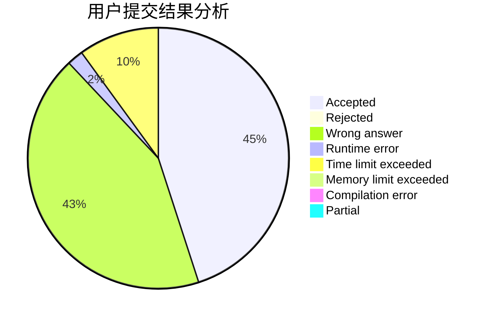
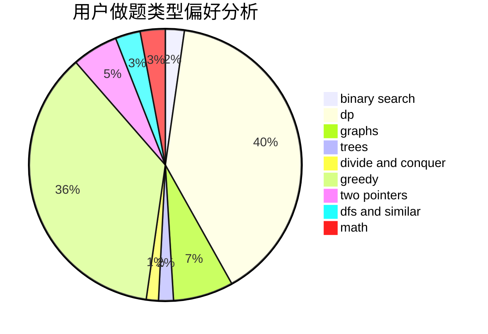

# Dreaminger

<!-- tabs:start -->

#### **用户提交结果分析**

#### **用户做题类型偏好分析**

<!-- tabs:end -->
# 推荐题目
[1369A](https://codeforces.com/contest/1369/problem/A)
[282C](https://codeforces.com/contest/282/problem/C)
[1299C](https://codeforces.com/contest/1299/problem/C)
[698B](https://codeforces.com/contest/698/problem/B)
[534F](https://codeforces.com/contest/534/problem/F)
[1256B](https://codeforces.com/contest/1256/problem/B)
[811D](https://codeforces.com/contest/811/problem/D)
[56E](https://codeforces.com/contest/56/problem/E)
[754D](https://codeforces.com/contest/754/problem/D)
[519B](https://codeforces.com/contest/519/problem/B)
