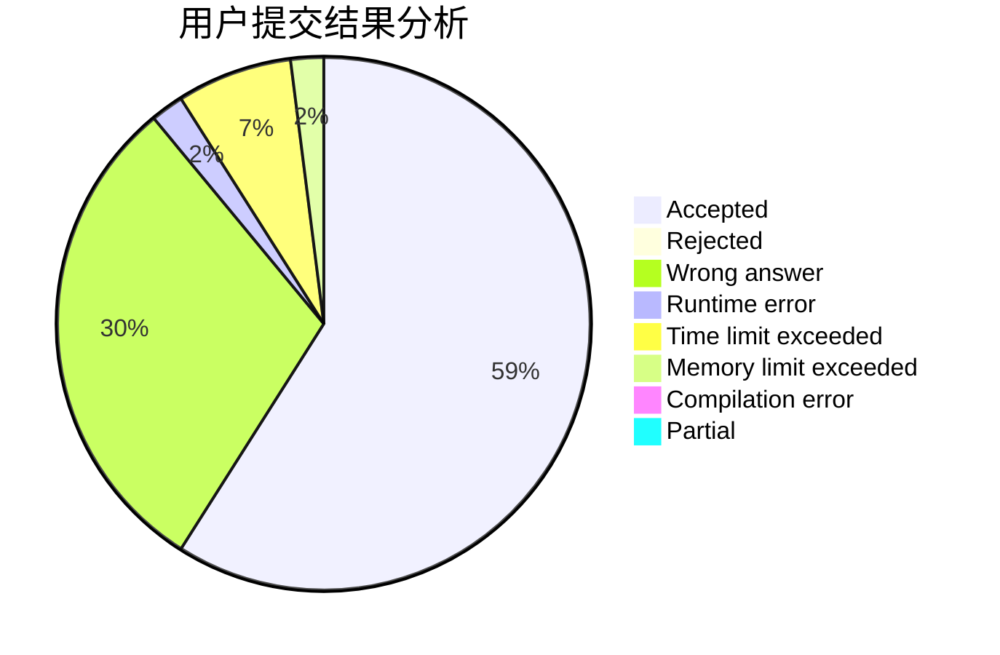
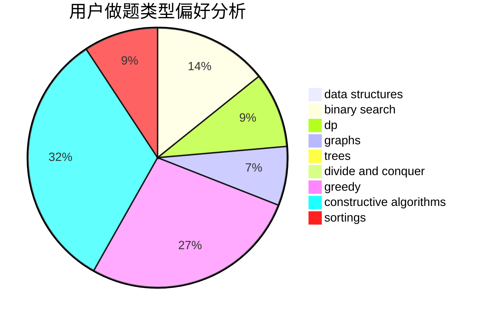
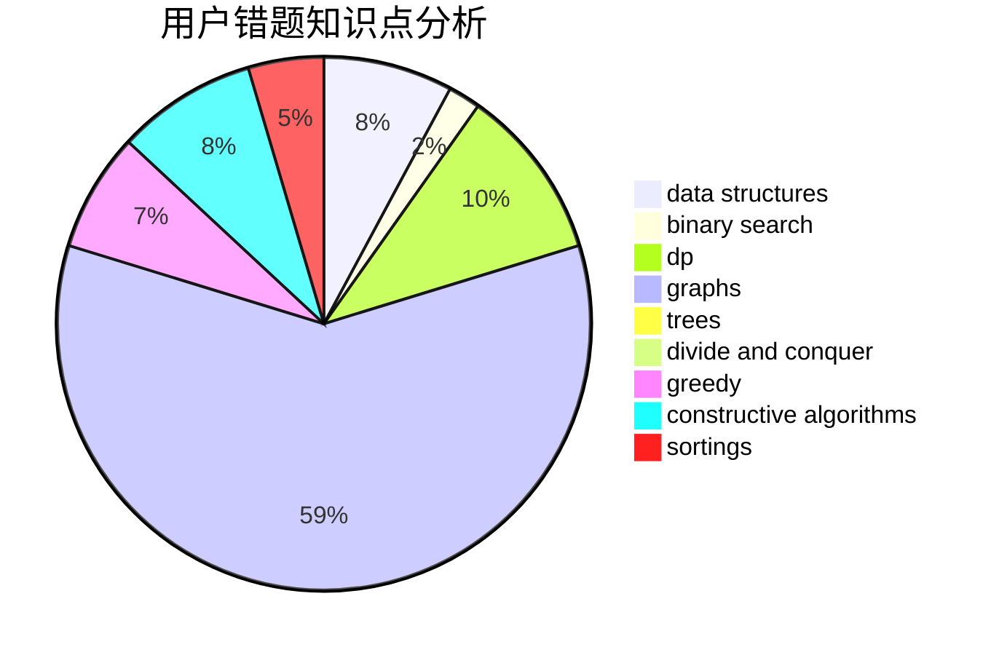

# Drice
<!-- tabs:start -->
#### **用户提交结果分析**

#### **用户做题类型偏好分析**

#### **用户错题知识点分析**

<!-- tabs:end -->
# 推荐题目
[1421A](http://codeforces.com/problemset/problem/1421/A)		bitmasks,
                        greedy,
                        math		  
[476D](http://codeforces.com/problemset/problem/476/D)		constructive algorithms,
                        greedy,
                        math		  
[1408A](http://codeforces.com/problemset/problem/1408/A)		constructive algorithms		  
[1404E](http://codeforces.com/problemset/problem/1404/E)		flows,
                        graph matchings,
                        graphs		  
[1425E](http://codeforces.com/problemset/problem/1425/E)		greedy,
                        implementation		  
[1002C2](http://codeforces.com/problemset/problem/1002/C2)		nan		  
[312C](https://codeforces.com/contest/312/problem/C)		constructive algorithms,
                        implementation		  
[1095E](http://codeforces.com/problemset/problem/1095/E)		implementation		  
[633B](http://codeforces.com/problemset/problem/633/B)		brute force,
                        constructive algorithms,
                        math,
                        number theory		  
[369B](http://codeforces.com/problemset/problem/369/B)		constructive algorithms,
                        implementation,
                        math		  
<!-- tabs:start -->
#### **data structures**
[474E](http://codeforces.com/problemset/problem/474/E)		binary search,
                        data structures,
                        dp,
                        sortings,
                        trees		  
[1458F](http://codeforces.com/problemset/problem/1458/F)		data structures,
                        trees		  
[121E](http://codeforces.com/problemset/problem/121/E)		data structures		  
[701B](http://codeforces.com/problemset/problem/701/B)		data structures,
                        math		  
[635E](https://codeforces.com/contest/635/problem/E)		data structures,
                        divide and conquer,
                        greedy		  
[1373F](http://codeforces.com/problemset/problem/1373/F)		binary search,
                        constructive algorithms,
                        data structures,
                        greedy		  
[797F](http://codeforces.com/problemset/problem/797/F)		data structures,
                        dp,
                        greedy,
                        sortings		  
[1408D](http://codeforces.com/problemset/problem/1408/D)		binary search,
                        brute force,
                        data structures,
                        dp,
                        implementation,
                        sortings,
                        two pointers		  
[1349A](http://codeforces.com/problemset/problem/1349/A)		data structures,
                        math,
                        number theory		  
[487E](http://codeforces.com/problemset/problem/487/E)		data structures,
                        dfs and similar,
                        graphs,
                        trees		  
#### **binary search**
[474E](http://codeforces.com/problemset/problem/474/E)		binary search,
                        data structures,
                        dp,
                        sortings,
                        trees		  
[1373F](http://codeforces.com/problemset/problem/1373/F)		binary search,
                        constructive algorithms,
                        data structures,
                        greedy		  
[233C](https://codeforces.com/contest/233/problem/C)		binary search,
                        constructive algorithms,
                        graphs,
                        greedy		  
[1408D](http://codeforces.com/problemset/problem/1408/D)		binary search,
                        brute force,
                        data structures,
                        dp,
                        implementation,
                        sortings,
                        two pointers		  
[1010B](http://codeforces.com/problemset/problem/1010/B)		binary search,
                        interactive		  
[1492C](http://codeforces.com/problemset/problem/1492/C)		binary search,
                        data structures,
                        dp,
                        greedy,
                        two pointers		  
[1463D](http://codeforces.com/problemset/problem/1463/D)		binary search,
                        constructive algorithms,
                        greedy,
                        two pointers		  
[1490G](http://codeforces.com/problemset/problem/1490/G)		binary search,
                        data structures,
                        math		  
[1479D](http://codeforces.com/problemset/problem/1479/D)		binary search,
                        bitmasks,
                        brute force,
                        data structures,
                        probabilities,
                        trees		  
[1436E](http://codeforces.com/problemset/problem/1436/E)		binary search,
                        data structures,
                        two pointers		  
#### **dp**
[766C](http://codeforces.com/problemset/problem/766/C)		brute force,
                        dp,
                        greedy,
                        strings		  
[691F](http://codeforces.com/problemset/problem/691/F)		brute force,
                        dp,
                        number theory		  
[474E](http://codeforces.com/problemset/problem/474/E)		binary search,
                        data structures,
                        dp,
                        sortings,
                        trees		  
[798B](http://codeforces.com/problemset/problem/798/B)		brute force,
                        dp,
                        strings		  
[1070G](http://codeforces.com/problemset/problem/1070/G)		brute force,
                        dp,
                        greedy,
                        implementation		  
[797F](http://codeforces.com/problemset/problem/797/F)		data structures,
                        dp,
                        greedy,
                        sortings		  
[1225G](http://codeforces.com/problemset/problem/1225/G)		bitmasks,
                        constructive algorithms,
                        dp,
                        greedy,
                        number theory		  
[1408D](http://codeforces.com/problemset/problem/1408/D)		binary search,
                        brute force,
                        data structures,
                        dp,
                        implementation,
                        sortings,
                        two pointers		  
[1137C](http://codeforces.com/problemset/problem/1137/C)		dp,
                        graphs,
                        implementation		  
[1466B](http://codeforces.com/problemset/problem/1466/B)		dp,
                        greedy		  
#### **graph**
[1404E](http://codeforces.com/problemset/problem/1404/E)		flows,
                        graph matchings,
                        graphs		  
[1450E](http://codeforces.com/problemset/problem/1450/E)		constructive algorithms,
                        dfs and similar,
                        graphs,
                        shortest paths		  
[1033A](http://codeforces.com/problemset/problem/1033/A)		dfs and similar,
                        graphs,
                        implementation		  
[233C](https://codeforces.com/contest/233/problem/C)		binary search,
                        constructive algorithms,
                        graphs,
                        greedy		  
[487E](http://codeforces.com/problemset/problem/487/E)		data structures,
                        dfs and similar,
                        graphs,
                        trees		  
[1137C](http://codeforces.com/problemset/problem/1137/C)		dp,
                        graphs,
                        implementation		  
[1487C](http://codeforces.com/problemset/problem/1487/C)		brute force,
                        constructive algorithms,
                        dfs and similar,
                        graphs,
                        greedy,
                        implementation,
                        math		  
[1437C](http://codeforces.com/problemset/problem/1437/C)		dp,
                        flows,
                        graph matchings,
                        greedy,
                        math,
                        sortings		  
[1470D](http://codeforces.com/problemset/problem/1470/D)		constructive algorithms,
                        dfs and similar,
                        graph matchings,
                        graphs,
                        greedy		  
[1476C](http://codeforces.com/problemset/problem/1476/C)		dp,
                        graphs,
                        greedy		  
#### **trees**
[474E](http://codeforces.com/problemset/problem/474/E)		binary search,
                        data structures,
                        dp,
                        sortings,
                        trees		  
[1458F](http://codeforces.com/problemset/problem/1458/F)		data structures,
                        trees		  
[487E](http://codeforces.com/problemset/problem/487/E)		data structures,
                        dfs and similar,
                        graphs,
                        trees		  
[1479D](http://codeforces.com/problemset/problem/1479/D)		binary search,
                        bitmasks,
                        brute force,
                        data structures,
                        probabilities,
                        trees		  
[1511C](http://codeforces.com/problemset/problem/1511/C)		brute force,
                        data structures,
                        implementation,
                        trees		  
[1499F](http://codeforces.com/problemset/problem/1499/F)		combinatorics,
                        dfs and similar,
                        dp,
                        trees		  
[1491E](http://codeforces.com/problemset/problem/1491/E)		brute force,
                        dfs and similar,
                        divide and conquer,
                        number theory,
                        trees		  
[1466D](http://codeforces.com/problemset/problem/1466/D)		data structures,
                        greedy,
                        sortings,
                        trees		  
[1495D](http://codeforces.com/problemset/problem/1495/D)		combinatorics,
                        dfs and similar,
                        graphs,
                        math,
                        shortest paths,
                        trees		  
[1303G](http://codeforces.com/problemset/problem/1303/G)		data structures,
                        divide and conquer,
                        geometry,
                        trees		  
#### **divide and conquer**
[635E](https://codeforces.com/contest/635/problem/E)		data structures,
                        divide and conquer,
                        greedy		  
[1461D](http://codeforces.com/problemset/problem/1461/D)		binary search,
                        brute force,
                        data structures,
                        divide and conquer,
                        implementation,
                        sortings		  
[1466G](http://codeforces.com/problemset/problem/1466/G)		combinatorics,
                        divide and conquer,
                        hashing,
                        math,
                        string suffix structures,
                        strings		  
[1490D](http://codeforces.com/problemset/problem/1490/D)		dfs and similar,
                        divide and conquer,
                        implementation		  
[1483C](https://codeforces.com/contest/1483/problem/C)		data structures,
                        divide and conquer,
                        dp		  
[1491E](http://codeforces.com/problemset/problem/1491/E)		brute force,
                        dfs and similar,
                        divide and conquer,
                        number theory,
                        trees		  
[1303G](http://codeforces.com/problemset/problem/1303/G)		data structures,
                        divide and conquer,
                        geometry,
                        trees		  
[1494D](http://codeforces.com/problemset/problem/1494/D)		constructive algorithms,
                        data structures,
                        dfs and similar,
                        divide and conquer,
                        dsu,
                        greedy,
                        sortings,
                        trees		  
[1482E](http://codeforces.com/problemset/problem/1482/E)		data structures,
                        divide and conquer,
                        dp		  
[566C](http://codeforces.com/problemset/problem/566/C)		dfs and similar,
                        divide and conquer,
                        trees		  
#### **greedy**
[476D](http://codeforces.com/problemset/problem/476/D)		constructive algorithms,
                        greedy,
                        math		  
[1421A](http://codeforces.com/problemset/problem/1421/A)		bitmasks,
                        greedy,
                        math		  
[1425E](http://codeforces.com/problemset/problem/1425/E)		greedy,
                        implementation		  
[766C](http://codeforces.com/problemset/problem/766/C)		brute force,
                        dp,
                        greedy,
                        strings		  
[1101B](http://codeforces.com/problemset/problem/1101/B)		greedy,
                        implementation		  
[1070G](http://codeforces.com/problemset/problem/1070/G)		brute force,
                        dp,
                        greedy,
                        implementation		  
[635E](https://codeforces.com/contest/635/problem/E)		data structures,
                        divide and conquer,
                        greedy		  
[1373F](http://codeforces.com/problemset/problem/1373/F)		binary search,
                        constructive algorithms,
                        data structures,
                        greedy		  
[797F](http://codeforces.com/problemset/problem/797/F)		data structures,
                        dp,
                        greedy,
                        sortings		  
[1225G](http://codeforces.com/problemset/problem/1225/G)		bitmasks,
                        constructive algorithms,
                        dp,
                        greedy,
                        number theory		  
#### **constructive algorithms**
[476D](http://codeforces.com/problemset/problem/476/D)		constructive algorithms,
                        greedy,
                        math		  
[1408A](http://codeforces.com/problemset/problem/1408/A)		constructive algorithms		  
[312C](https://codeforces.com/contest/312/problem/C)		constructive algorithms,
                        implementation		  
[633B](http://codeforces.com/problemset/problem/633/B)		brute force,
                        constructive algorithms,
                        math,
                        number theory		  
[369B](http://codeforces.com/problemset/problem/369/B)		constructive algorithms,
                        implementation,
                        math		  
[1450E](http://codeforces.com/problemset/problem/1450/E)		constructive algorithms,
                        dfs and similar,
                        graphs,
                        shortest paths		  
[1373F](http://codeforces.com/problemset/problem/1373/F)		binary search,
                        constructive algorithms,
                        data structures,
                        greedy		  
[1225G](http://codeforces.com/problemset/problem/1225/G)		bitmasks,
                        constructive algorithms,
                        dp,
                        greedy,
                        number theory		  
[1028E](http://codeforces.com/problemset/problem/1028/E)		constructive algorithms		  
[233C](https://codeforces.com/contest/233/problem/C)		binary search,
                        constructive algorithms,
                        graphs,
                        greedy		  
#### **sortings**
[474E](http://codeforces.com/problemset/problem/474/E)		binary search,
                        data structures,
                        dp,
                        sortings,
                        trees		  
[797F](http://codeforces.com/problemset/problem/797/F)		data structures,
                        dp,
                        greedy,
                        sortings		  
[1408D](http://codeforces.com/problemset/problem/1408/D)		binary search,
                        brute force,
                        data structures,
                        dp,
                        implementation,
                        sortings,
                        two pointers		  
[558E](http://codeforces.com/problemset/problem/558/E)		data structures,
                        sortings,
                        strings		  
[1496C](https://codeforces.com/contest/1496/problem/C)		geometry,
                        greedy,
                        math,
                        sortings		  
[1495A](http://codeforces.com/problemset/problem/1495/A)		geometry,
                        greedy,
                        math,
                        sortings		  
[1497A](http://codeforces.com/problemset/problem/1497/A)		brute force,
                        data structures,
                        greedy,
                        sortings		  
[1427A](http://codeforces.com/problemset/problem/1427/A)		math,
                        sortings		  
[1461D](http://codeforces.com/problemset/problem/1461/D)		binary search,
                        brute force,
                        data structures,
                        divide and conquer,
                        implementation,
                        sortings		  
[1437C](http://codeforces.com/problemset/problem/1437/C)		dp,
                        flows,
                        graph matchings,
                        greedy,
                        math,
                        sortings		  
<!-- tabs:end -->
