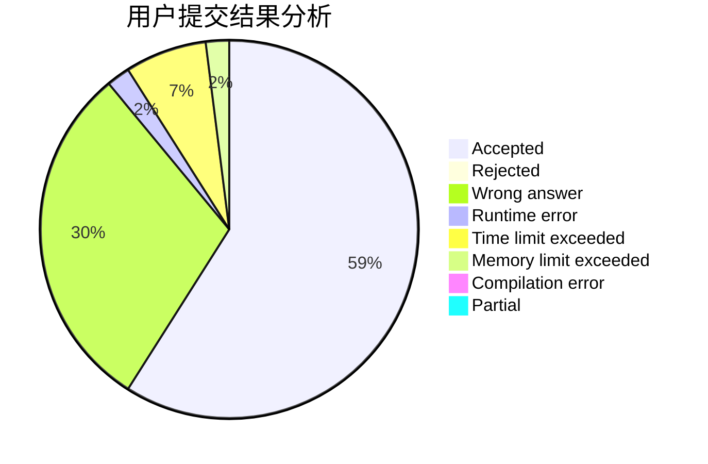
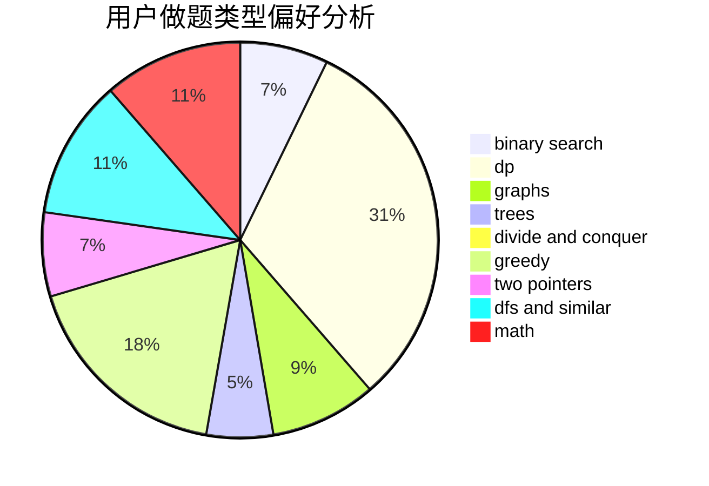

# Drice

<!-- tabs:start -->

#### **用户提交结果分析**

#### **用户做题类型偏好分析**

<!-- tabs:end -->
# 推荐题目
[1428D](https://codeforces.com/contest/1428/problem/D)
[1416A](https://codeforces.com/contest/1416/problem/A)
[10024](https://codeforces.com/contest/1002/problem/4)
[496B](https://codeforces.com/contest/496/problem/B)
[665D](https://codeforces.com/contest/665/problem/D)
[493D](https://codeforces.com/contest/493/problem/D)
[1101E](https://codeforces.com/contest/1101/problem/E)
[1139D](https://codeforces.com/contest/1139/problem/D)
[758B](https://codeforces.com/contest/758/problem/B)
[667E](https://codeforces.com/contest/667/problem/E)
