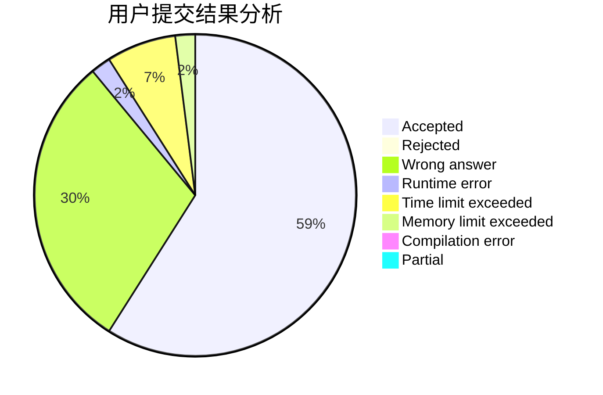
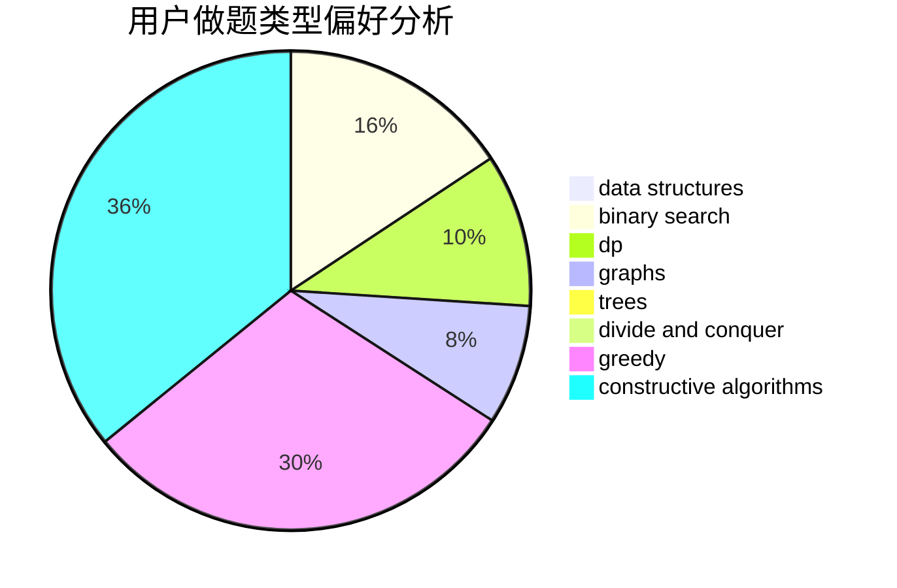
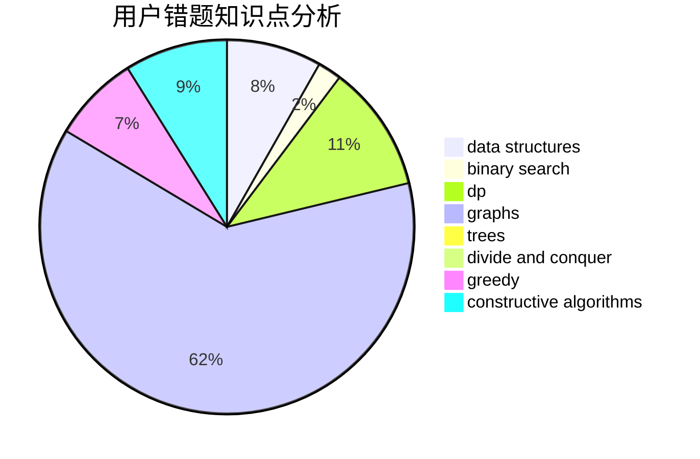

# Drice

<!-- tabs:start -->

#### **用户提交结果分析**

#### **用户做题类型偏好分析**

#### **用户错题知识点分析**

<!-- tabs:end -->
# 推荐题目
[1421A](https://codeforces.com/contest/1421/problem/A)		bitmasks,
                        greedy,
                        math		  
[1404E](https://codeforces.com/contest/1404/problem/E)		flows,
                        graph matchings,
                        graphs		  
[1002C2](https://codeforces.com/contest/1002C/problem/2)		nan		  
[476D](https://codeforces.com/contest/476/problem/D)		constructive algorithms,
                        greedy,
                        math		  
[633B](https://codeforces.com/contest/633/problem/B)		brute force,
                        constructive algorithms,
                        math,
                        number theory		  
[474E](https://codeforces.com/contest/474/problem/E)		binary search,
                        data structures,
                        dp,
                        sortings,
                        trees		  
[1101B](https://codeforces.com/contest/1101/problem/B)		greedy,
                        implementation		  
[1137C](https://codeforces.com/contest/1137/problem/C)		dp,
                        graphs,
                        implementation		  
[736D](https://codeforces.com/contest/736/problem/D)		math,
                        matrices		  
[635E](https://codeforces.com/contest/635/problem/E)		dsu,graphs,sortings,trees		  
