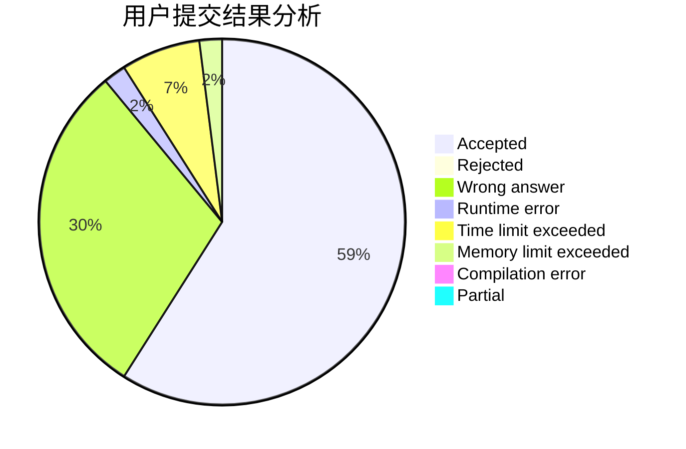
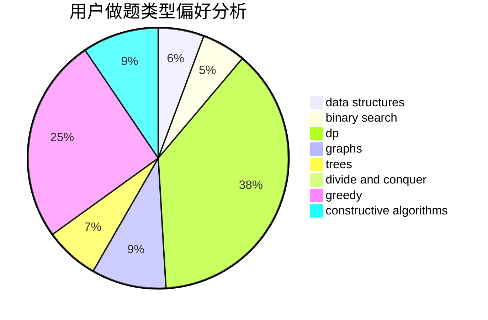
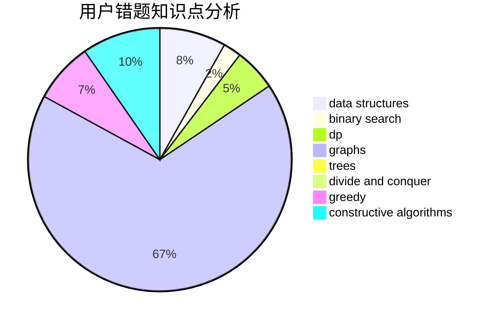

# Drice

<!-- tabs:start -->

#### **用户提交结果分析**

#### **用户做题类型偏好分析**

#### **用户错题知识点分析**

<!-- tabs:end -->
# 推荐题目
[1428D](https://codeforces.com/contest/1428/problem/D)		constructive algorithms,
                        greedy,
                        implementation		  
[1416A](https://codeforces.com/contest/1416/problem/A)		binary search,
                        data structures,
                        implementation,
                        two pointers		  
[10024](https://codeforces.com/contest/1002/problem/4)		dsu,graphs,sortings,trees		  
[496B](https://codeforces.com/contest/496/problem/B)		brute force,
                        constructive algorithms,
                        implementation		  
[665D](https://codeforces.com/contest/665/problem/D)		constructive algorithms,
                        greedy,
                        number theory		  
[493D](https://codeforces.com/contest/493/problem/D)		constructive algorithms,
                        games,
                        math		  
[1101E](https://codeforces.com/contest/1101/problem/E)		implementation		  
[1139D](https://codeforces.com/contest/1139/problem/D)		dp,
                        math,
                        number theory,
                        probabilities		  
[758B](https://codeforces.com/contest/758/problem/B)		brute force,
                        implementation,
                        number theory		  
[667E](https://codeforces.com/contest/667/problem/E)		dsu,graphs,sortings,trees		  
